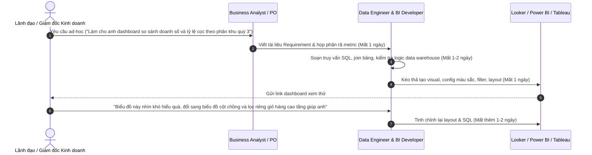
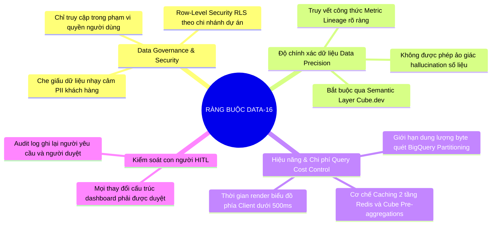

# ĐỀ TÀI DATA-16: AI AGENT TỰ SINH DASHBOARD TỪ YÊU CẦU NGÔN NGỮ TỰ NHIÊN
## BUSINESS REQUIREMENTS DOCUMENT (BRD) & PHÂN TÍCH ĐỀ TÀI CHI TIẾT

---

## 1. THÔNG TIN CHUNG ĐỀ TÀI

- **Mã đề tài:** `DATA-16`
- **Tên đề tài:** AI Agent tự sinh Dashboard từ yêu cầu ngôn ngữ tự nhiên (Natural Language to Interactive Dashboard AI Agent)
- **Khối / Đơn vị phụ trách:** Khối Dữ liệu tập trung (VSF) - Tập đoàn Vingroup / Doanh nghiệp Bất động sản Vinhomes
- **Đối tượng thụ hưởng chính:** Lãnh đạo cấp cao (C-Level, Ban Giám đốc), Quản lý vùng / Khối kinh doanh bất động sản, Chuyên viên phân tích dữ liệu & End-users nghiệp vụ (Viewer / Builder).
- **Mục tiêu sản phẩm:** Rút ngắn thời gian từ ý tưởng phân tích KPI đến dashboard trực quan hoàn chỉnh từ **vài ngày (3 - 5 ngày làm việc của BI team)** xuống còn **dưới 60 giây**, đảm bảo 100% tính chính xác của số liệu, tuân thủ quản trị bảo mật dữ liệu (Data Governance) và cung cấp khả năng tinh chỉnh hội thoại đa vòng (Multi-turn Conversational Refinement).

---

## 2. BỐI CẢNH DOANH NGHIỆP & NỖI ĐAU THỰC TẾ (PROBLEM STATEMENT)

### 2.1. Thực trạng vận hành BI truyền thống tại Doanh nghiệp Bất động sản
Tại các doanh nghiệp quy mô lớn với khối lượng giao dịch khổng lồ như Vinhomes / Vingroup, việc ra quyết định kinh doanh phụ thuộc sống còn vào tốc độ nắm bắt dữ liệu:
- Doanh số bán hàng thực tế theo từng phân khu, dự án (Grand Park, Smart City, Ocean Park 1-2-3...).
- Tỷ lệ hấp thụ nguồn hàng, tiến độ thanh toán, dòng tiền thu hồi theo các đợt mở bán.
- Hiệu suất bán hàng của các sàn đại lý, đội ngũ tư vấn viên theo tháng/quý.
- Chi phí marketing/CSKH trên từng hợp đồng thành công.

Tuy nhiên, quy trình khai thác dữ liệu hiện tại gặp nút thắt cổ chai nghiêm trọng:

### 2.2. Điểm nghẽn cốt lõi (Core Pain Points)
1. **Thời gian phản hồi chậm (High Lead Time):** Mất từ 3 đến 7 ngày cho một dashboard mới. Cơ hội kinh doanh biến động theo từng giờ trong các chiến dịch mở bán có thể bị bỏ lỡ.
2. **Nghịch lý BI Team quá tải (BI Bottleneck):** Đội ngũ kỹ sư dữ liệu và BI dành 70% thời gian phục vụ các báo cáo ad-hoc lặp đi lặp lại thay vì xây dựng các mô hình phân tích sâu hoặc tối ưu hóa hạ tầng data lakehouse.
3. **Rào cản kỹ thuật với người dùng nghiệp vụ:** Các công cụ BI hiện nay (Power BI, Tableau, Looker) đòi hỏi tư duy về cấu trúc bảng (Fact/Dimension), tính toán DAX/LookML, lựa chọn trục biểu đồ (X/Y axis, Series) phức tạp, gây trở ngại cho lãnh đạo và chuyên viên nghiệp vụ.
4. **Vấn đề "Ảo giác số liệu" của Generative AI thông thường:** Nếu để LLM thuần túy sinh trực tiếp mã SQL thô (Text-to-SQL truyền thống), mô hình dễ sinh sai logic nghiệp vụ (ví dụ: cộng gộp doanh số tính cả hợp đồng hủy cọc, nhầm lẫn giữa doanh số ghi nhận kế toán và giá trị hợp đồng mua bán M&A).
5. **Rủi ro rò rỉ dữ liệu & Vi phạm Governance:** Lãnh đạo chi nhánh miền Bắc không được phép xem số liệu chi tiết chiết khấu bảo mật của miền Nam. Mô hình Text-to-Dashboard tự do nếu không có cơ chế phân quyền Row-Level Security (RLS) và Column-Level Security (CLS) sẽ vi phạm nghiêm trọng chính sách bảo mật nội bộ.

---

## 3. MỤC TIÊU DỰ ÁN & CHỈ SỐ ĐO LƯỜNG THÀNH CÔNG (KPIs & OKRs)

### 3.1. Mục tiêu định lượng (Quantitative Metrics)
| Chỉ số (Metric) | Hiện trạng (Baseline) | Mục tiêu với AI Agent (Target) |
| :--- | :--- | :--- |
| **Thời gian tạo Dashboard hoàn chỉnh** | 3 - 5 ngày làm việc | **< 45 - 60 giây** |
| **Độ chính xác dữ liệu (Data Accuracy)** | Phụ thuộc manual review | **100%** (nhờ lớp Semantic Layer kiểm soát metric) |
| **Tỷ lệ truy vấn SQL sinh hợp lệ (Valid Execution Rate)** | N/A | **> 95%** ngay lượt prompt đầu tiên |
| **Độ phù hợp của biểu đồ được gợi ý (Chart Suitability)** | Phụ thuộc gu cá nhân Dev | **> 90%** theo chuẩn Data-to-Viz principles |
| **Số lượt trao đổi để hoàn thiện (Turn-to-finalization)** | 3 - 5 cuộc họp trao đổi | **1 - 2 lượt chat tinh chỉnh trực tiếp** |
| **Độ trễ phản hồi Agent (P95 Latency)** | N/A | **< 8 giây** cho bước sinh layout & truy vấn |

### 3.2. Mục tiêu định tính (Qualitative Metrics)
- Trải nghiệm đàm thoại tự nhiên hoàn toàn bằng tiếng Việt chuyên ngành bất động sản (phân khu, quỹ căn, cọc thiện chí, hợp đồng mua bán, tỷ lệ hấp thụ...).
- Tương tác kéo-thả, zoom-in, cross-filtering mượt mà giữa các biểu đồ trên cùng dashboard.
- Quy trình phê duyệt có người giám sát (Human-in-the-Loop - HITL) minh bạch: người dùng luôn được xem trước bản vẽ cấu trúc (wireframe), câu lệnh SQL giải thích rõ ràng và có quyền bấm "Duyệt & Lưu" hoặc "Yêu cầu chỉnh sửa".

---

## 4. PHÂN TÍCH VAI TRÒ NGƯỜI DÙNG (USER PERSONAS & ROLES)

Hệ thống được thiết kế phân định rõ 2 vai trò truy cập chính theo yêu cầu đề tài:

### 4.1. Vai trò Builder (Power User / Manager / Analyst)
- **Hành vi sử dụng:**
  - Nhập yêu cầu bằng tiếng Việt: *"Dựng cho tôi dashboard theo dõi doanh số dự án Ocean Park theo từng tháng trong năm 2025, kèm theo tỷ lệ đóng tiền theo tiến độ và top 5 sàn phân phối xuất sắc nhất"*.
  - Nhận bản phác thảo Dashboard gồm nhiều widget (KPI cards, Bar charts, Line charts, Data tables).
  - Tinh chỉnh qua chat: *"Đổi biểu đồ doanh số từ dạng cột sang dạng đường tích lũy, thêm bộ lọc khu vực cho cả trang"*.
  - Kiểm tra giải trình logic tính toán, công thức metric và câu truy vấn.
  - Phê duyệt (HITL Approve) và lưu dashboard vào không gian làm việc chung của phòng ban.
  - Cấu hình chia sẻ (Public / Private / Theo Role) và thiết lập lịch gửi báo cáo định kỳ tự động.

### 4.2. Vai trò Viewer (Executive / Operational Staff)
- **Hành vi sử dụng:**
  - Truy cập thư viện dashboard đã được Builder duyệt và xuất bản.
  - Tương tác với dashboard: click vào cột "Tháng 8" trên biểu đồ doanh số để tự động lọc dữ liệu của toàn bộ bảng danh sách đại lý và biểu đồ dòng tiền tương ứng (Cross-filtering).
  - Tải xuống báo cáo dạng PDF / Excel / PNG.
  - Xem các Insight tóm tắt tự động do AI sinh ra (AI Auto-generated Narrative Insights): *"Doanh số phân khu Sapphire tháng này tăng đột biến 35% nhờ chính sách hỗ trợ lãi suất 0% được áp dụng từ ngày 15"*.
  - Đặt câu hỏi nhanh trên dashboard đang xem: *"Tháng nào có tỷ lệ hủy cọc cao nhất?"* mà không làm thay đổi bố cục gốc.

---

## 5. BẢNG PHẠM VI TÍNH NĂNG (FEATURE SCOPE & MOSCOW PRIORITIZATION)

### 5.1. Nhóm tính năng Bắt buộc (Must-Have - Mức Cơ bản theo đề bài)
1. **Giao diện Web Responsive hoàn chỉnh (Next.js):**
   - Đăng nhập, phân quyền chuẩn RBAC (Viewer vs. Builder).
   - Khung hội thoại AI Copilot song song với màn hình trực quan hóa canvas.
   - Grid layout linh hoạt (responsive grid) hiển thị đồng thời từ 3 đến 6 biểu đồ/widget số liệu.
2. **LangGraph Pipeline chuyển dịch Ngôn ngữ tự nhiên sang Dashboard:**
   - Phân tích ngữ định (Intent Parsing) & Trích xuất thực thể (Metric, Dimension, Filter, Time-grain).
   - Tương tác Semantic Layer (Cube.dev) để lấy định nghĩa metric chuẩn hóa thay vì sinh SQL tự do vào DB.
   - Trình sinh truy vấn và thực thi an toàn trên Warehouse (BigQuery / Snowflake).
3. **Cơ chế HITL (Human-in-the-Loop) Duyệt & Lưu:**
   - Chế độ "Preview Draft Dashboard" với watermark.
   - Modal hiển thị tóm tắt: Danh sách nguồn dữ liệu, công thức đo lường, cấu trúc bố cục đề xuất.
   - Nút xác nhận "Phê duyệt & Lưu vào thư viện" hoặc "Từ chối / Yêu cầu chỉnh sửa".
4. **Hội thoại đa vòng (Multi-turn conversational refinement):**
   - Lưu trữ ngữ cảnh hội thoại (Session Memory) để tiếp tục chỉnh sửa dashboard hiện tại mà không phải mô tả lại từ đầu.

### 5.2. Nhóm tính năng Nâng cao (Should-Have & Could-Have - Mức Nâng cao theo đề bài)
1. **Multi-Agent Architecture với Chuyên gia Trực quan hóa (Chart Advisor Agent):**
   - Tách biệt Agent hiểu dữ liệu và Agent chuyên sâu về thiết kế dữ liệu (Data-to-Viz Expert).
   - Thuật toán tự động đánh giá tính phân bố dữ liệu (độ rời rạc, số lượng category, chuỗi thời gian, tỷ trọng phần trăm) để chọn biểu đồ tối ưu nhất (ví dụ: từ chối Pie Chart nếu có >7 categories, đề xuất Bar chart nằm ngang nếu tên label dài).
2. **Hệ thống Đánh giá Tự động (Automated Evaluation Suite):**
   - Chấm điểm độ phù hợp của biểu đồ (Chart Suitability Score: 0 - 100).
   - Kiểm tra tính toàn vẹn số liệu (Data Consistency Check) so với Ground Truth.
3. **Tự động sinh Insight & Annotation (AI Narrative Insights):**
   - Phân tích phát hiện xu hướng (Trend), điểm bất thường (Anomaly detection: ví dụ đỉnh bán hàng bất thường, điểm tụt doanh số).
   - Viết các đoạn giải trình kinh doanh ngắn gọn ghim trực tiếp lên đầu mỗi biểu đồ.
4. **Chia sẻ & Lập lịch cập nhật tự động (Sharing & Scheduled Refresh):**
   - Sinh link chia sẻ kèm Token có thời hạn và RBAC.
   - Thiết lập lịch làm mới dữ liệu (Refresh cron-job: Hàng ngày lúc 07:00 AM) và tự động đẩy thông báo báo cáo tóm tắt qua Email / Slack / Microsoft Teams.

---

## 6. MA TRẬN RÀNG BUỘC KỸ THUẬT & PHÁP LÝ (CONSTRAINTS MATRIX)

---
*Tài liệu BRD này là cơ sở nền tảng để triển khai Kiến trúc Kỹ thuật (Technical Architecture), Thiết kế Agent Workflow (LangGraph) và Kế hoạch Đánh giá (Evaluation Framework) ở các tài liệu tiếp theo.*
