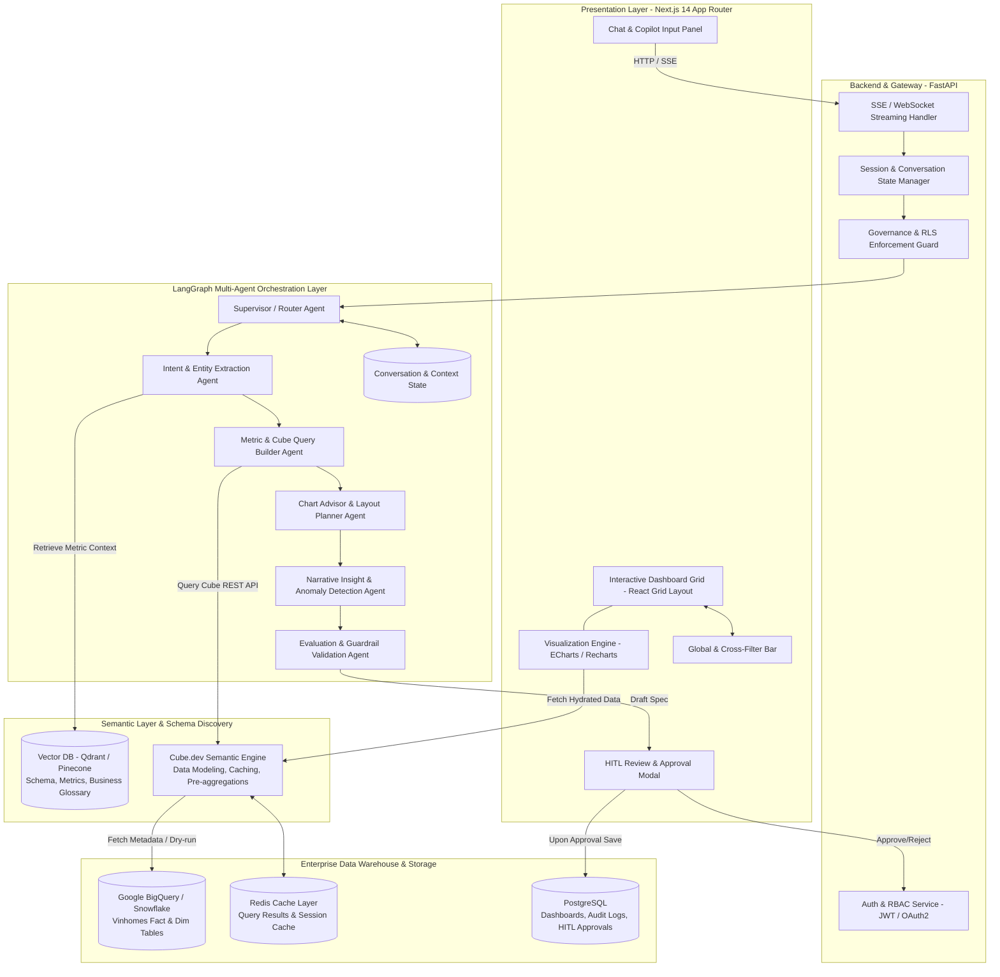
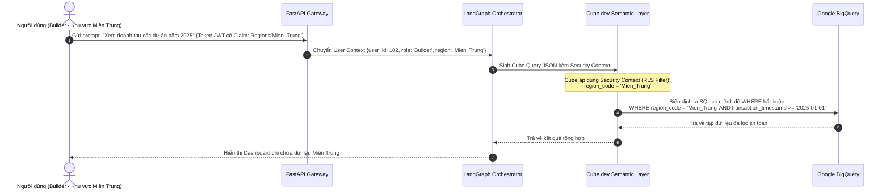

# ĐỀ TÀI DATA-16: AI AGENT TỰ SINH DASHBOARD TỪ YÊU CẦU NGÔN NGỮ TỰ NHIÊN
## SYSTEM ARCHITECTURE & TECHNICAL SPECIFICATION

---

## 1. TỔNG QUAN KIẾN TRÚC HỆ THỐNG (HIGH-LEVEL ARCHITECTURE)

Hệ thống được thiết kế theo mô hình **Modern Data Stack kết hợp Autonomous Multi-Agent System**, áp dụng nguyên lý phân tách rõ ràng giữa:
1. **Lớp Giao diện & Trực quan hóa (Interactive Presentation Layer)**
2. **Lớp Điều phối Trí tuệ Nhân tạo (LangGraph Multi-Agent Orchestrator)**
3. **Lớp Ngữ nghĩa Dữ liệu Chuẩn hóa (Semantic Layer - Cube.dev)**
4. **Lớp Kho Dữ liệu Tập trung (Data Warehouse - BigQuery / Snowflake)**



---

## 2. CHI TIẾT TỪNG PHÂN HỆ KỸ THUẬT (SUBSYSTEM DEEP-DIVE)

### 2.1. Phân hệ Giao diện Người dùng (Frontend Layer - Next.js 14)
- **Công nghệ nền tảng:**
  - Next.js 14 (App Router, Server Components kết hợp Client Components linh hoạt).
  - Ngôn ngữ: TypeScript (Strict mode).
  - Styling: Tailwind CSS kết hợp Shadcn/UI (thẩm mỹ doanh nghiệp hiện đại, Dark/Light mode chuẩn Vingroup Corporate palette).
- **Trực quan hóa Dữ liệu (Visualization Engine):**
  - **Apache ECharts:** Lựa chọn ưu tiên cho các biểu đồ phức tạp cần hiệu năng render cao (biểu đồ chuỗi thời gian hàng nghìn điểm, bản đồ địa lý phân bố dự án bất động sản, biểu đồ nhiệt Heatmap phân tích giá bán).
  - **Recharts:** Sử dụng cho các widget KPI cards, mini sparklines, biểu đồ cột/đường đơn giản có độ tương tác mượt mà.
  - **React-Grid-Layout:** Cho phép kéo thả, thay đổi kích thước widget linh hoạt trên canvas.
- **Quản lý Trạng thái & Tương tác (State Management):**
  - **Zustand:** Quản lý Global Filter State, Active Dashboard Schema, Cross-filtering State (khi người dùng nhấp vào một cột ở Biểu đồ A, toàn bộ Biểu đồ B, C sẽ tự động bắt sự kiện lọc theo giá trị tương ứng).
  - **Server-Sent Events (SSE):** Tiếp nhận tiến trình suy nghĩ của Agent theo thời gian thực (ví dụ: *"Đang phân tích yêu cầu..." -> "Đã tìm thấy 3 metric doanh số..." -> "Đang lựa chọn biểu đồ tối ưu..."*).

### 2.2. Phân hệ Backend & API Gateway (FastAPI)
- **Công nghệ:** Python 3.11+, FastAPI, Pydantic v2, Uvicorn, AsyncIO.
- **Nhiệm vụ cốt lõi:**
  - Tiếp nhận prompt từ người dùng, kèm theo User Context (User ID, Role: `Viewer` / `Builder`, Department: `Vinhomes_MienBac`, Allowed_Projects: `["OceanPark1", "OceanPark2"]`).
  - Đóng gói Security Context vào mọi payload gửi tới LangGraph và Cube.dev.
  - Quản trị vòng đời Dashboard: Lưu trữ schema JSON vào PostgreSQL, phân trang, versioning, gắn thẻ chia sẻ.

### 2.3. Lớp Ngữ nghĩa Chuẩn hóa (Semantic Layer - Cube.dev)
> **TẠI SAO PHẢI DÙNG CUBE.DEV THAY VÌ SINH TRỰC TIẾP SQL (TEXT-TO-SQL)?**
> Trong môi trường doanh nghiệp lớn như Vinhomes/VSF, nếu để LLM tự do sinh mã SQL (`SELECT ... FROM ... JOIN ...`):
> 1. LLM không thể nhớ hàng trăm quy tắc join phức tạp giữa bảng Khách hàng, Hợp đồng, Tiến độ thanh toán, Tiền cọc.
> 2. Dễ xảy ra lỗi logic "cộng đúp" (Fan-out problem do phép JOIN 1-N).
> 3. Rủi ro SQL Injection hoặc truy vấn quét toàn bộ bảng (Full Table Scan) tiêu tốn hàng nghìn USD trên BigQuery.
> 
> **Giải pháp Cube.dev:** Cube đóng vai trò là "người bảo vệ dữ liệu" (Semantic Boundary). LLM chỉ cần sinh truy vấn dưới dạng **JSON Query chuẩn hóa** (measures, dimensions, filters, timeDimensions), sau đó Cube tự biên dịch thành câu lệnh SQL tối ưu nhất cho BigQuery / Snowflake.

#### Minh họa Định nghĩa Data Model trong Cube.dev (`cube/model/sales.js`):
```javascript
cube(`RealEstateSales`, {
  sql: `SELECT * FROM vhomes_dwh.fact_real_estate_transactions`,

  measures: {
    totalRevenue: {
      sql: `transaction_value`,
      type: `sum`,
      title: `Tổng Doanh Số Bán Hàng`,
      format: `currency`
    },
    totalDeals: {
      type: `count`,
      title: `Số Lượng Giao Dịch Thành Công`
    },
    avgPricePerM2: {
      sql: `transaction_value / NULLIF(apartment_area, 0)`,
      type: `avg`,
      title: `Đơn Giá Trung Bình / m2`
    },
    depositAbsorptionRate: {
      sql: `COUNT(CASE WHEN status = 'HOAN_TAT_HOP_DONG' THEN 1 END) * 100.0 / NULLIF(COUNT(id), 0)`,
      type: `number`,
      title: `Tỷ Lệ Chuyển Đổi Hợp Đồng (%)`
    }
  },

  dimensions: {
    projectName: {
      sql: `project_name`,
      type: `string`,
      title: `Tên Dự Án`
    },
    subdivision: {
      sql: `subdivision_code`,
      type: `string`,
      title: `Phân Khu`
    },
    region: {
      sql: `region_code`,
      type: `string`,
      title: `Vùng Miền`
    },
    propertyType: {
      sql: `property_type`,
      type: `string`,
      title: `Loại Hình Bất Động Sản`
    },
    transactionDate: {
      sql: `transaction_timestamp`,
      type: `time`,
      title: `Thời Gian Giao Dịch`
    }
  },

  preAggregations: {
    mainMonthlySales: {
      measures: [totalRevenue, totalDeals],
      dimensions: [projectName, subdivision, region],
      timeDimension: transactionDate,
      granularity: `month`,
      refreshKey: {
        every: `1 hour`
      }
    }
  }
});
```

### 2.4. Phân hệ Cơ sở Dữ liệu Vector (Vector DB - Semantic Search & Discovery)
- **Công nghệ:** Qdrant hoặc pgvector.
- **Nội dung nhúng (Embeddings - text-embedding-3-small):**
  - Danh mục toàn bộ các Measures, Dimensions trong Cube.dev kèm theo mô tả nghiệp vụ bằng tiếng Việt.
  - Từ điển đồng nghĩa bất động sản (Business Synonym Dictionary): ví dụ *"doanh thu"* $\approx$ *"doanh số"*, *"tiền về"* $\approx$ *"dòng tiền thanh toán"*, *"vinhomes gia lâm"* $\approx$ *"Vinhomes Ocean Park 1"*.
  - Các mẫu cấu hình Dashboard chuẩn (Few-shot Dashboard Layout Templates).
- **Cơ chế hoạt động:** Khi người dùng nhập *"Xem tỷ lệ cọc theo phân khu quý này"*, Vector DB tìm thấy các metric liên quan (`RealEstateSales.depositAbsorptionRate`), dimension (`RealEstateSales.subdivision`) với độ tương đồng cosine $> 0.85$, cung cấp ngữ cảnh chính xác cho LLM Agent.

### 2.5. Lớp Kho Dữ liệu (Warehouse Layer - BigQuery / Snowflake)
- **Tối ưu hóa Chi phí (FinOps & Cost Control):**
  - Toàn bộ bảng Fact giao dịch đều được phân vùng theo thời gian (Partitioned by `transaction_date`) và phân cụm (Clustered by `project_name, subdivision, property_type`).
  - Hạn chế tối đa truy vấn vượt quá định mức: Mọi truy vấn từ Cube đều được cấu hình hạn mức quét tối đa (ví dụ: `maximum_bytes_billed = 10 GB/query`).
  - Tận dụng triệt để Cube Pre-aggregations: 85% các câu hỏi tổng hợp theo tháng/quý được đọc trực tiếp từ bảng tính toán sẵn (Rollup tables) trong Cube store, không quét trực tiếp vào BigQuery.

---

## 3. CƠ CHẾ BẢO MẬT & QUẢN TRỊ DỮ LIỆU (DATA GOVERNANCE & RBAC)



### 3.1. Phân quyền cấp dòng (Row-Level Security - RLS)
- Cube.dev hỗ trợ tính năng **Security Context** tích hợp sẵn:
```javascript
// cube/model/security.js
module.exports = {
  contextToApp: ({ securityContext }) => {
    return {
      securityContext: {
        userId: securityContext.userId,
        region: securityContext.region,
        allowedProjects: securityContext.allowedProjects
      }
    };
  }
};
```
- Mọi câu truy vấn gửi đến Cube tự động được chèn các điều kiện lọc bắt buộc:
  - Nếu `role != 'SuperAdmin'`, bắt buộc lọc `projectName IN (allowedProjects)`.
  - Không người dùng nào có thể vượt rào xem được dữ liệu ngoài phạm vi ủy quyền nghiệp vụ.

### 3.2. Che giấu Dữ liệu Nhạy cảm (Data Masking & PII Protection)
- Các trường định danh cá nhân (PII) như: Số CCCD, Họ tên khách hàng, Số điện thoại, Số tài khoản ngân hàng tuyệt đối không được đưa vào Semantic Layer Dimensions để AI Agent có thể truy cập được.

---

## 4. ĐẶC TẢ GIAO THỨC API (REST & SSE SPECIFICATION)

### 4.1. Endpoint Khởi tạo Yêu cầu Sinh Dashboard (Stream SSE)
- **URL:** `POST /api/v1/dashboard/generate-stream`
- **Headers:** `Authorization: Bearer <JWT_TOKEN>`
- **Request Body:**
```json
{
  "prompt": "Tạo dashboard theo dõi doanh số dự án Ocean Park 2 theo từng tháng năm 2025, phân rã theo loại hình căn hộ (biệt thự, liền kề, chung cư) và top 5 sàn phân phối",
  "dashboard_id": null,
  "conversation_id": "conv-98834a-bc12",
  "theme": "corporate-dark"
}
```
- **Response Stream (Server-Sent Events):**
```text
event: thinking
data: {"step": "intent_extraction", "message": "Đang phân rã ý định: Metric Doanh số, Dự án Ocean Park 2, Năm 2025"}

event: thinking
data: {"step": "semantic_discovery", "message": "Đã định vị Cube Measures: [RealEstateSales.totalRevenue], Dimensions: [transactionDate, propertyType, distributorAgency]"}

event: thinking
data: {"step": "viz_advisor", "message": "Đề xuất biểu đồ: 1 KPI Card, 1 Biểu đồ Cột chồng theo thời gian, 1 Biểu đồ Thanh ngang Top 5"}

event: preview_ready
data: {
  "dashboard_id": "dash_temp_7731",
  "status": "DRAFT_PENDING_HITL",
  "layout": [
    {"id": "widget_1", "type": "kpi_card", "w": 4, "h": 2, "x": 0, "y": 0, "title": "Tổng Doanh Số Năm 2025"},
    {"id": "widget_2", "type": "stacked_bar_chart", "w": 8, "h": 4, "x": 4, "y": 0, "title": "Doanh Số Theo Tháng & Loại Hình"},
    {"id": "widget_3", "type": "horizontal_bar_chart", "w": 12, "h": 4, "x": 0, "y": 4, "title": "Top 5 Sàn Phân Phối Doanh Thu Cao Nhất"}
  ],
  "hitl_required": true
}
```

### 4.2. Endpoint Phê duyệt HITL (Human-in-the-Loop Approval)
- **URL:** `POST /api/v1/dashboard/{dashboard_id}/approve`
- **Request Body:**
```json
{
  "approved": true,
  "feedback": "Bố cục rất hợp lý, lưu vào không gian làm việc Khối Bán Hàng",
  "visibility": "TEAM",
  "schedule_refresh": {
    "enabled": true,
    "cron": "0 7 * * *"
  }
}
```
- **Response:**
```json
{
  "status": "PUBLISHED",
  "dashboard_id": "dash_live_7731",
  "share_url": "https://bi.vinhomes.vn/d/dash_live_7731",
  "published_at": "2026-09-19T11:30:00Z"
}
```

---
*Tài liệu này định hình toàn bộ chuẩn kết nối kỹ thuật, cấu hình Semantic Layer và các giao thức bảo mật. Tiếp theo là tài liệu Chi tiết Thiết kế Multi-Agent LangGraph Workflow và Bộ Đánh giá Kiểm thử.*
