# ĐỀ TÀI DATA-16: AI AGENT TỰ SINH DASHBOARD TỪ YÊU CẦU NGÔN NGỮ TỰ NHIÊN
## LANGGRAPH AGENT WORKFLOW & PROMPT ENGINEERING DESIGN

---

## 1. MÔ HÌNH TRẠNG THÁI LANGGRAPH (LANGGRAPH STATEGRAPH SPECIFICATION)

LangGraph được sử dụng làm bộ điều phối lõi (Core Multi-Agent Orchestrator), quản lý luồng tính toán qua đồ thị có chu trình (Cyclic State Graph), hỗ trợ tự sửa lỗi (Self-Correction Loop) và điểm ngắt có sự tham gia của con người (**Human-in-the-Loop Interrupt**).

```mermaid
stateDiagram-v2
    [*] --> IntentParser: Nhận yêu cầu NL từ người dùng
    
    state IntentParser {
        [*] --> ExtractEntities: Phân rã Metric, Dimension, Filter, Time-grain
        ExtractEntities --> SemanticRetrieval: Tra cứu Vector DB để ánh xạ vào Cube
    }

    IntentParser --> CheckQueryType: Phân loại thao tác

    CheckQueryType --> CubeQueryBuilder: Tạo Dashboard mới (New Dashboard)
    CheckQueryType --> ConversationalRefiner: Tinh chỉnh Dashboard hiện có (Refine/Edit)

    state CubeQueryBuilder {
        [*] --> GenCubeJSON: Sinh Cube.dev JSON Query
        GenCubeJSON --> DryRunValidation: Dry-run kiểm tra tính hợp lệ trên Cube
        DryRunValidation --> SelfCorrect: Nếu lỗi cú pháp / schema không khớp
        SelfCorrect --> GenCubeJSON: Thử lại tối đa 3 lần
    }

    CubeQueryBuilder --> ChartAdvisor: Truy vấn thành công

    state ChartAdvisor {
        [*] --> InspectDataShape: Phân tích phân bố dữ liệu (Cardinality, Time, Ratio)
        InspectDataShape --> RecommendChart: Gợi ý loại biểu đồ tối ưu (Bar, Line, KPI, Heatmap)
    }

    ChartAdvisor --> LayoutEngine: Đóng gói vị trí các widget trên lưới Grid
    LayoutEngine --> NarrativeInsight: Tự động phân tích điểm bất thường & xu hướng
    NarrativeInsight --> GuardrailEval: Chấm điểm chất lượng & kiểm tra bảo mật

    state GuardrailEval {
        [*] --> CheckRBAC: Đảm bảo không lộ dữ liệu ngoài quyền
        CheckRBAC --> CheckCost: Ước tính kích thước dữ liệu & thời gian render
    }

    GuardrailEval --> HITL_Breakpoint: Tạo bản nháp (Draft Dashboard)

    state HITL_Breakpoint {
        <<choice>>
        [*] --> AwaitUserAction: Tạm dừng tiến trình (interrupt) chờ Builder
        AwaitUserAction --> Approved: Builder bấm "Duyệt & Lưu"
        AwaitUserAction --> Rejected: Builder yêu cầu chỉnh sửa / từ chối
    }

    HITL_Breakpoint --> ConversationalRefiner: Người dùng nhập phản hồi chỉnh sửa
    ConversationalRefiner --> CubeQueryBuilder: Tái tạo hoặc cập nhật một phần widget
    HITL_Breakpoint --> Published: Người dùng phê duyệt thành công
    Published --> [*]
```



---

## 2. ĐỊNH NGHĨA TRẠNG THÁI TỔNG THỂ (AGENT STATE DEFINITION)

Mã nguồn Python Pydantic & TypedDict định nghĩa cấu trúc trạng thái luồng làm việc:

```python
from typing import List, Dict, Any, Optional, Literal
from typing_extensions import TypedDict
from pydantic import BaseModel, Field

class UserSecurityContext(BaseModel):
    user_id: str
    username: str
    role: Literal["Viewer", "Builder", "Admin"]
    department: str
    allowed_regions: List[str]
    allowed_projects: List[str]

class ExtractedIntent(BaseModel):
    is_new_dashboard: bool
    business_goal: str
    target_domains: List[str]  # e.g., ["Sales", "CashFlow", "CustomerService"]
    raw_metrics: List[str]
    raw_dimensions: List[str]
    raw_filters: Dict[str, Any]
    time_grain: Optional[str] = "month"

class WidgetDefinition(BaseModel):
    widget_id: str
    title: str
    chart_type: Literal[
        "kpi_card", 
        "bar_chart", 
        "stacked_bar_chart", 
        "line_chart", 
        "area_chart", 
        "scatter_plot", 
        "heatmap", 
        "table"
    ]
    description: str
    grid_layout: Dict[str, int]  # {"x": 0, "y": 0, "w": 6, "h": 4}
    cube_query: Dict[str, Any]    # JSON format for Cube REST API
    chart_options: Dict[str, Any] # ECharts / Recharts configuration options
    narrative_insight: Optional[str] = None
    suitability_score: float = 0.0
    suitability_reasoning: str = ""

class DashboardDraft(BaseModel):
    dashboard_id: str
    title: str
    description: str
    theme: str = "corporate-slate"
    global_filters: List[Dict[str, Any]] = []
    widgets: List[WidgetDefinition] = []
    status: Literal["DRAFT_PENDING_APPROVAL", "APPROVED", "REJECTED"] = "DRAFT_PENDING_APPROVAL"
    created_by: str
    created_at: str

class AgentState(TypedDict):
    """Trạng thái chia sẻ xuyên suốt các Node trong LangGraph"""
    messages: List[Dict[str, Any]]
    user_context: UserSecurityContext
    current_intent: Optional[ExtractedIntent]
    matched_cube_schema: Dict[str, Any]
    current_draft: Optional[DashboardDraft]
    active_widget_id: Optional[str]
    error_count: int
    last_error: Optional[str]
    eval_passed: bool
    eval_feedback: Optional[str]
    hitl_approved: bool
    user_feedback_comment: Optional[str]
```

---

## 3. THIẾT KẾ CÁC SUB-AGENT CHUYÊN TRÁCH & PROMPT SYSTEM

### 3.1. Intent & Entity Extraction Agent
- **Mục tiêu:** Đọc hiểu câu lệnh tiếng Việt tự nhiên phức tạp, phân rã chính xác các thành phần dữ liệu bất động sản và loại bỏ nhiễu ngữ nghĩa.
- **System Prompt:**
```text
Bạn là AI Business Analyst hàng đầu chuyên về hệ thống phân tích dữ liệu Bất Động Sản tại Vinhomes.
Nhiệm vụ của bạn là nhận diện chính xác các mục tiêu kinh doanh, metric, dimension, bộ lọc và chu kỳ thời gian từ yêu cầu của người dùng.

DANH MỤC THUẬT NGỮ CHUYÊN NGÀNH QUY ĐỔI:
- "doanh số", "tiền bán được", "doanh thu" -> Metric: totalRevenue
- "số căn bán được", "số deal", "lượng giao dịch" -> Metric: totalDeals
- "tỷ lệ cọc", "tỷ lệ chuyển đổi", "hấp thụ" -> Metric: depositAbsorptionRate
- "phân khu", "tiểu khu" -> Dimension: subdivision
- "dự án", "đại đô thị" -> Dimension: projectName
- "loại hình căn", "biệt thự / shophouse / chung cư" -> Dimension: propertyType
- "sàn phân phối", "đại lý" -> Dimension: distributorAgency

RÀNG BUỘC BẮT BUỘC:
1. Luôn xác định xem đây là yêu cầu TẠO MỚI DASHBOARD hay TINH CHỈNH DASHBOARD ĐANG CÓ.
2. Nếu người dùng không nêu rõ khoảng thời gian, mặc định lấy năm hiện tại (2025-2026) theo tháng.
3. Trả về kết quả dưới định dạng JSON tuân thủ schema ExtractedIntent.
```

### 3.2. Cube Query Builder Agent (Có cơ chế Self-Correction)
- **Mục tiêu:** Sinh truy vấn JSON hợp lệ cho Cube.dev REST API. Không sinh SQL trực tiếp để tránh hallucination và lỗi bảo mật.
- **System Prompt:**
```text
Bạn là Chuyên gia Semantic Layer Cube.dev cho Data Warehouse BigQuery.
Bạn nhận danh sách Metric & Dimension từ Intent Agent và danh mục Schema Cube được cung cấp.

CẤU TRÚC TRUY VẤN CUBE.DEV BẮT BUỘC:
{
  "measures": ["RealEstateSales.totalRevenue"],
  "dimensions": ["RealEstateSales.propertyType"],
  "timeDimensions": [
    {
      "dimension": "RealEstateSales.transactionDate",
      "granularity": "month",
      "dateRange": ["2025-01-01", "2025-12-31"]
    }
  ],
  "filters": [
    {
      "member": "RealEstateSales.projectName",
      "operator": "equals",
      "values": ["Vinhomes Ocean Park 2"]
    }
  ],
  "order": {
    "RealEstateSales.totalRevenue": "desc"
  },
  "limit": 50
}

RÀNG BUỘC BẢO MẬT:
Tuyệt đối KHÔNG gỡ bỏ các điều kiện lọc liên quan đến quyền truy cập vùng miền / dự án của User Security Context.
```

### 3.3. Chart Advisor Agent (Chuyên gia Lựa chọn Biểu đồ Tối ưu)
> **TÍNH NĂNG NÂNG CAO:** Multi-agent chuyên trách đánh giá tính phân bố dữ liệu theo nguyên lý **Data-to-Viz** và tâm lý học nhận thức người dùng (Gestalt Principles).

- **Quy tắc gợi ý biểu đồ (Heuristic & Decision Tree Rules):**
  1. **Dữ liệu có yếu tố thời gian liên tục:** Ưu tiên **Line Chart** hoặc **Area Chart** (theo dõi xu hướng tăng trưởng doanh số, tỷ lệ cọc theo tuần/tháng).
  2. **So sánh tỷ trọng thành phần (Part-to-whole):**
     - Nếu $\le 4$ categories: Sử dụng **Donut Chart** (ví dụ: tỷ trọng 3 loại hình: Chung cư, Shophouse, Biệt thự).
     - Nếu $> 4$ categories: **TUYỆT ĐỐI KHÔNG DÙNG PIE/DONUT CHART** vì gây khó đọc, bắt buộc chuyển sang **Stacked Bar Chart** hoặc **Treemap**.
  3. **Xếp hạng Top N danh mục:**
     - Nếu tên danh mục dài (ví dụ: Tên sàn phân phối, tên phân khu): Sử dụng **Horizontal Bar Chart** (Biểu đồ thanh ngang) để không bị cắt xén nhãn text.
  4. **Chỉ số đơn lẻ cốt lõi (Single KPI):** Sử dụng **KPI Card** kèm theo tỷ lệ tăng trưởng so với cùng kỳ (MoM / YoY growth badge).
  5. **Mối tương quan giữa 2 biến liên tục (Correlation):** Sử dụng **Scatter Plot** (ví dụ: Tương quan giữa Diện tích căn hộ và Đơn giá/m2).
  6. **Phân tích mật độ nhiều chiều (2 categorical dimensions + 1 metric):** Sử dụng **Heatmap** (ví dụ: Ma trận Doanh số giữa Phân khu và Loại hình căn hộ).

- **System Prompt của Chart Advisor:**
```text
Bạn là Chuyên gia Cao Cấp về Trực quan hóa Dữ liệu (Data Visualization Architect) tuân thủ tiêu chuẩn Edward Tufte và Storytelling with Data.
Nhiệm vụ của bạn là nhận dữ liệu trả về từ Cube.dev và chọn ra loại biểu đồ hoàn hảo nhất cho widget.

VỚI MỖI BIỂU ĐỒ ĐỀ XUẤT, BẠN PHẢI TÍNH TOÁN:
1. "suitability_score": Điểm từ 0 đến 100 phản ánh mức độ phù hợp về mặt hình ảnh.
2. "suitability_reasoning": Giải thích ngắn gọn bằng 1-2 câu tiếng Việt tại sao lại chọn loại biểu đồ này thay vì các loại khác.
3. Cấu hình trục (X-axis, Y-axis, Series, Tooltip, Palette màu sắc chuẩn doanh nghiệp cao cấp).
```

### 3.4. Narrative Insight & Anomaly Detection Agent
- **Mục tiêu:** Tự động phát hiện các bước nhảy vọt (spikes), sụt giảm đột ngột (drops), hoặc phân kỳ tỷ trọng để viết lời bình luận phân tích kinh doanh (Executive Summary) gắn ngay trên tiêu đề biểu đồ.
- **System Prompt:**
```text
Bạn là Giám đốc Phân tích Dữ liệu Kinh doanh (Head of Commercial Analytics) tại Vinhomes.
Nhiệm vụ của bạn là nhìn vào số liệu thực tế được truy vấn về và viết 1 đoạn INSIGHT CÔ ĐỌNG (từ 2 đến 4 câu) mang tính hành động kinh doanh:
- Chỉ rõ tháng/vùng/phân khu có biến động lớn nhất.
- Nêu tỷ lệ % thay đổi cụ thể.
- Đưa ra khuyến nghị định hướng ngắn gọn cho ban lãnh đạo.

VÍ DỤ TỐT:
"Doanh số Phân khu The Empire đạt đỉnh 420 tỷ VNĐ vào tháng 6/2025 (+48% MoM), đóng góp 62% tổng doanh thu toàn dự án. Ngược lại, phân khu Cọ Xanh có tỷ lệ cọc suy giảm 12% do hạn chế về chính sách hỗ trợ lãi suất ngân hàng. Cần tập trung thúc đẩy rổ hàng thấp tầng trong quý 3."
```

---

## 4. HIỆN THỰC HÓA MÃ NGUỒN LANGGRAPH BẰNG PYTHON

Dưới đây là mã nguồn lõi cấu hình đồ thị LangGraph với điểm ngắt **HITL Interrupt**:

```python
import os
from typing import Dict, Any
from langgraph.graph import StateGraph, END
from langgraph.checkpoint.memory import MemorySaver

# 1. Định nghĩa các Node chức năng
async def intent_parser_node(state: AgentState) -> Dict[str, Any]:
    """Phân tích ý định & tìm kiếm schema Cube tương ứng"""
    user_prompt = state["messages"][-1]["content"]
    # Gọi LLM với Structured Output
    # ... logic trích xuất Intent và truy vấn Vector DB ...
    return {
        "current_intent": parsed_intent,
        "matched_cube_schema": retrieved_schema
    }

async def cube_query_builder_node(state: AgentState) -> Dict[str, Any]:
    """Xây dựng Cube Query JSON và chạy thử nghiệm (dry-run)"""
    intent = state["current_intent"]
    security_ctx = state["user_context"]
    # Sinh Cube Query kèm RLS bảo mật
    # ... logic gọi Cube.dev REST API /load dry-run ...
    return {"current_draft": generated_widgets}

async def chart_advisor_node(state: AgentState) -> Dict[str, Any]:
    """Tư vấn loại biểu đồ tối ưu dựa trên dữ liệu thật"""
    draft = state["current_draft"]
    # Duyệt qua từng widget và áp dụng Decision Matrix
    # ... tính toán suitability_score và ECharts option ...
    return {"current_draft": draft}

async def narrative_insight_node(state: AgentState) -> Dict[str, Any]:
    """Sinh lời bình phân tích kinh doanh tự động"""
    draft = state["current_draft"]
    # Phân tích số liệu và thêm narrative_insight vào từng widget
    return {"current_draft": draft}

async def guardrail_eval_node(state: AgentState) -> Dict[str, Any]:
    """Kiểm tra độ an toàn bảo mật, chi phí quét và tính toàn vẹn dữ liệu"""
    # Đánh giá tiêu chuẩn trước khi đưa ra bản nháp cho người dùng
    return {"eval_passed": True}

async def conversational_refiner_node(state: AgentState) -> Dict[str, Any]:
    """Xử lý yêu cầu tinh chỉnh từ người dùng qua hội thoại đa vòng"""
    latest_feedback = state["messages"][-1]["content"]
    # Tinh chỉnh lại widget cụ thể theo yêu cầu (ví dụ: đổi màu, đổi loại biểu đồ)
    return {"current_draft": updated_draft}

# 2. Xây dựng StateGraph
workflow = StateGraph(AgentState)

# Thêm các Nodes
workflow.add_node("intent_parser", intent_parser_node)
workflow.add_node("cube_query_builder", cube_query_builder_node)
workflow.add_node("chart_advisor", chart_advisor_node)
workflow.add_node("narrative_insight", narrative_insight_node)
workflow.add_node("guardrail_eval", guardrail_eval_node)
workflow.add_node("conversational_refiner", conversational_refiner_node)

# Điều kiện rẽ nhánh (Conditional Edges)
def route_after_intent(state: AgentState) -> str:
    if state.get("current_draft") and not state["current_intent"].is_new_dashboard:
        return "conversational_refiner"
    return "cube_query_builder"

workflow.set_entry_point("intent_parser")

workflow.add_conditional_edges(
    "intent_parser",
    route_after_intent,
    {
        "conversational_refiner": "conversational_refiner",
        "cube_query_builder": "cube_query_builder"
    }
)

workflow.add_edge("cube_query_builder", "chart_advisor")
workflow.add_edge("chart_advisor", "narrative_insight")
workflow.add_edge("narrative_insight", "guardrail_eval")
workflow.add_edge("conversational_refiner", "chart_advisor")

# Điểm kết thúc của tiến trình tự động trước khi nhường quyền cho HITL
workflow.add_edge("guardrail_eval", END)

# 3. Kích hoạt Checkpointer và thiết lập Human-in-the-Loop
memory = MemorySaver()
app = workflow.compile(
    checkpointer=memory,
    interrupt_before=[] # Có thể cấu hình tạm dừng trước node lưu chính thức
)
```

---
*Tài liệu này cung cấp toàn bộ logic thiết kế Agent, các prompt template chuyên dụng và cơ chế đồ thị trạng thái LangGraph. Tiếp theo là tài liệu về Khung Đánh giá (Evaluation), Quản trị và Lộ trình Triển khai.*
