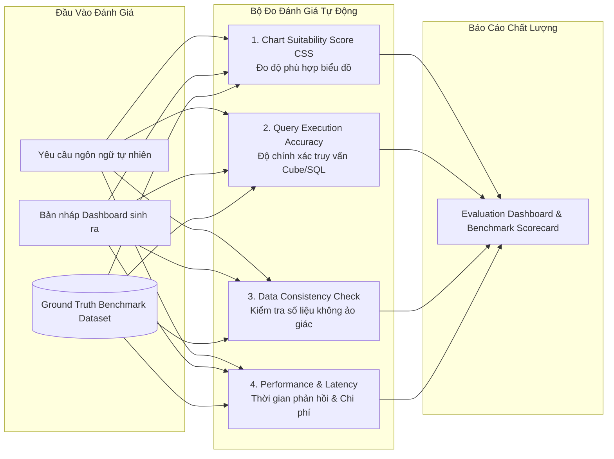
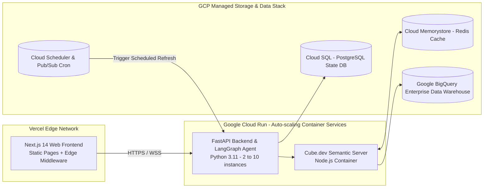
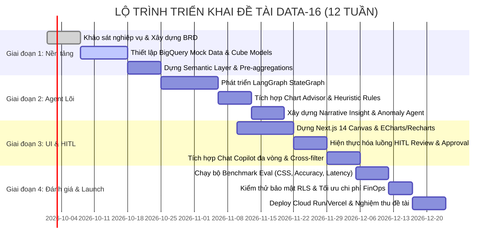

# ĐỀ TÀI DATA-16: AI AGENT TỰ SINH DASHBOARD TỪ YÊU CẦU NGÔN NGỮ TỰ NHIÊN
## EVALUATION FRAMEWORK, GOVERNANCE & DEPLOYMENT ROADMAP

---

## 1. KHUNG ĐÁNH GIÁ ĐỘ CHÍNH XÁC & HIỆU NĂNG (EVALUATION FRAMEWORK)

Theo yêu cầu nâng cao của đề bài: **"eval đo độ phù hợp chart & độ chính xác số liệu, tự sinh insight/annotation"**, hệ thống thiết lập bộ chỉ số đánh giá đa chiều (Evaluation Benchmark Suite) tự động hóa.



### 1.1. Thước đo Độ phù hợp Biểu đồ (Chart Suitability Score - CSS)
- **Định nghĩa:** Đánh giá xem loại biểu đồ được Agent lựa chọn có phải là hình thức trực quan hóa tối ưu nhất cho tập dữ liệu và ý định người dùng hay không (thang điểm 0 - 100).
- **Công thức tính điểm (Heuristic Rubric):**
$$CSS = w_1 \cdot S_{\text{type}} + w_2 \cdot S_{\text{cardinality}} + w_3 \cdot S_{\text{legibility}} + w_4 \cdot S_{\text{cognitive}}$$
  - $S_{\text{type}}$ (Trọng số 0.35): Loại biểu đồ khớp với bản chất dữ liệu (ví dụ: Chuỗi thời gian $\rightarrow$ Line/Area chart = 100đ; Pie chart cho chuỗi thời gian = 0đ).
  - $S_{\text{cardinality}}$ (Trọng số 0.25): Số lượng phần tử phân loại (Nếu Pie/Donut có $>5$ phần tử $\rightarrow$ trừ 50đ; Nếu Bar chart ngang cho $>20$ phần tử có thanh cuộn $\rightarrow$ 100đ).
  - $S_{\text{legibility}}$ (Trọng số 0.20): Độ dễ đọc của nhãn text (Nhãn dài không bị xoay chéo quá $45^\circ$ hoặc bị cắt xén dấu ba chấm).
  - $S_{\text{cognitive}}$ (Trọng số 0.20): Tải thức nhận thức (Cognitive Load - Không dùng biểu đồ 3D, không lạm dụng quá 7 màu sắc trên cùng một canvas).
- **Phương pháp chấm:** Kết hợp thuật toán quy tắc (Rule-based Validator) và mô hình **LLM-as-a-Judge** (sử dụng GPT-4o / Claude 3.5 Sonnet với Few-shot rubric chuẩn).

### 1.2. Độ chính xác Truy vấn Dữ liệu (Query Execution Accuracy)
- **Tỷ lệ truy vấn thực thi thành công (Valid Execution Rate):**
$$\text{VER} = \frac{\text{Số truy vấn Cube.dev thực thi thành công}}{\text{Tổng số truy vấn được Agent sinh ra}} \times 100\% \quad (\text{Mục tiêu } \ge 98\%)$$
- **Độ chính xác ngữ nghĩa số liệu (Semantic Value Equivalence):**
  - So sánh tập kết quả trả về từ Cube.dev với tập kết quả của câu lệnh SQL chuẩn mực (Ground Truth Query) do chuyên viên BI cấp cao soạn thảo cho cùng một đề bài.
  - Phải đạt **100% khớp giá trị số học** trên cùng khoảng thời gian và điều kiện lọc.

### 1.3. Kiểm tra Tính Nhất Quán & Chống Ảo Giác Số Liệu (Hallucination Checker)
- **Mục tiêu:** Đảm bảo toàn bộ các con số xuất hiện trong đoạn văn tóm tắt **Narrative Insights** (ví dụ: *"Doanh số đạt 420 tỷ..."*) hoàn toàn trùng khớp với dữ liệu thực tế trả về từ Warehouse:
```python
def verify_narrative_consistency(insight_text: str, query_result_df) -> bool:
    """Trích xuất toàn bộ số liệu và tỷ lệ % trong insight và đối chiếu với DataFrame"""
    import re
    numbers_in_text = re.findall(r'(\d+[\.,]?\d*)\s*(tỷ|triệu|%|căn)?', insight_text)
    # Đối soát từng con số với min/max/sum/pct_change trong query_result_df
    # Nếu phát hiện con số không tồn tại trong dữ liệu -> Đánh dấu Hallucination Alert!
    return is_consistent
```

---

## 2. QUẢN TRỊ BẢO MẬT & TỐI ƯU CHI PHÍ (DATA GOVERNANCE & FINOPS)

### 2.1. Ma trận Phân quyền & Giám sát Truy cập (RBAC & Audit Trail)
| Vai trò (Role) | Tạo mới Dashboard | Tinh chỉnh qua Chat | Xem Dashboard | Duyệt & Xuất bản (HITL) | Chia sẻ & Lập lịch |
| :--- | :---: | :---: | :---: | :---: | :---: |
| **Viewer** | ❌ | ❌ | ✅ (Theo RLS) | ❌ | ❌ |
| **Builder** | ✅ | ✅ | ✅ | ✅ | ✅ |
| **Admin / Head of BI**| ✅ | ✅ | ✅ (Toàn quyền) | ✅ | ✅ (Toàn hệ thống) |

- **Nhật ký Kiểm toán (Audit Logging):** Mọi hành động từ câu prompt người dùng gõ vào, câu lệnh JSON gửi tới Cube, thời gian người dùng bấm nút Duyệt HITL, cho đến danh sách người nhận link chia sẻ đều được ghi vết bất biến vào bảng `audit_event_logs` trong PostgreSQL để phục vụ thanh tra bảo mật ISO/IEC 27001.

### 2.2. Kiểm soát Chi phí Truy vấn Warehouse (FinOps Guardrails)
- Doanh nghiệp bất động sản có thể tốn hàng chục nghìn USD tiền quét BigQuery nếu để người dùng tự do truy vấn bảng lớn.
- **Giải pháp 3 lớp của hệ thống:**
  1. **Lớp 1 - Cube Pre-aggregations:** Lưu trữ các bảng tổng hợp sẵn theo ngày/tháng trên bộ nhớ đệm tốc độ cao. Giảm 80 - 90% số lượng truy vấn phải chạm vào BigQuery.
  2. **Lớp 2 - BigQuery Maximum Billed Bytes:** Thiết lập ngắt tự động nếu một truy vấn dự kiến quét $> 5 \text{ GB}$ dữ liệu:
     `job_config.maximum_bytes_billed = 5 * 1024 * 1024 * 1024`
  3. **Lớp 3 - Partition Enforcer:** Cube Data Model bắt buộc mọi truy vấn liên quan đến bảng Fact giao dịch phải có điều kiện `timeDimensions` (không cho phép truy vấn không giới hạn thời gian).

---

## 3. KIẾN TRÚC TRIỂN KHAI CLOUD & CI/CD (DEPLOYMENT ARCHITECTURE)

Hệ thống được đóng gói và vận hành trên nền tảng đám mây Google Cloud Platform (GCP) kết hợp Vercel:



### 3.1. Cấu hình Docker & Dịch vụ Đám mây
1. **Frontend:** Triển khai tự động qua Vercel GitHub Integration, kích hoạt ISR (Incremental Static Regeneration) cho các trang template và SSR cho canvas dashboard.
2. **FastAPI & LangGraph Service:** 
   - Đóng gói Docker container tối ưu dung lượng (`python:3.11-slim`).
   - Triển khai trên **Cloud Run** với cấu hình: 2 vCPU, 4GB RAM, Concurrency = 80, Tự động mở rộng từ 1 đến 10 instances khi tải cao.
3. **Cube.dev Server:**
   - Triển khai độc lập trên Cloud Run, kết nối trực tiếp với Cloud Memorystore (Redis) để chia sẻ cache truy vấn và pre-aggregations.

### 3.2. Tính năng Chia sẻ & Lập lịch Cập nhật (Scheduled Refresh & Sharing)
- **Lập lịch tự động (Scheduled Refresh):**
  - Người dùng có thể chọn: *"Gửi báo cáo này vào 8h sáng mỗi thứ Hai hàng tuần qua Email/Slack"*.
  - Hệ thống sử dụng **GCP Cloud Scheduler** gửi HTTP trigger định kỳ đến FastAPI.
  - Backend thực thi lại các truy vấn Cube, cập nhật số liệu mới nhất, tự sinh lại đoạn **Narrative Insights** cập nhật và xuất bản file PDF/ảnh chụp gửi qua SendGrid Email API hoặc Slack Webhook.
- **Cơ chế Chia sẻ An toàn (Secure Link Sharing):**
  - Sinh đường dẫn bí mật: `https://bi.vinhomes.vn/share/{token}`.
  - Token được mã hóa AES-256 chứa hạn dùng (Expiry Date) và cấu hình quyền (Chỉ cho phép xem `Viewer Mode`, không cho phép sửa hoặc xem câu lệnh truy vấn).

---

## 4. LỘ TRÌNH TRIỂN KHAI DỰ ÁN (PROJECT ROADMAP & MILESTONES)

Kế hoạch triển khai dự kiến trong 12 tuần (3 tháng) theo các cột mốc chuẩn mực kỹ thuật công nghệ thông tin:



---
*Tài liệu này hoàn tất bộ 4 tài liệu đặc tả toàn diện cho đề tài DATA-16, sẵn sàng cho việc trình bày báo cáo hội đồng, thiết kế kiến trúc kỹ thuật và lập trình mã nguồn thực tế.*
