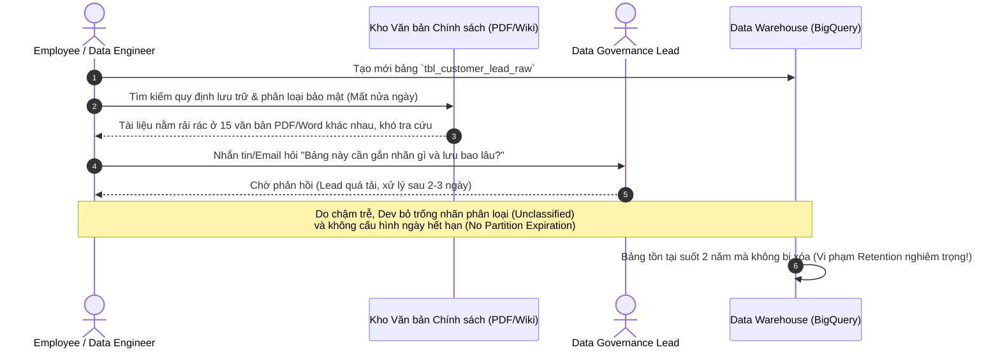
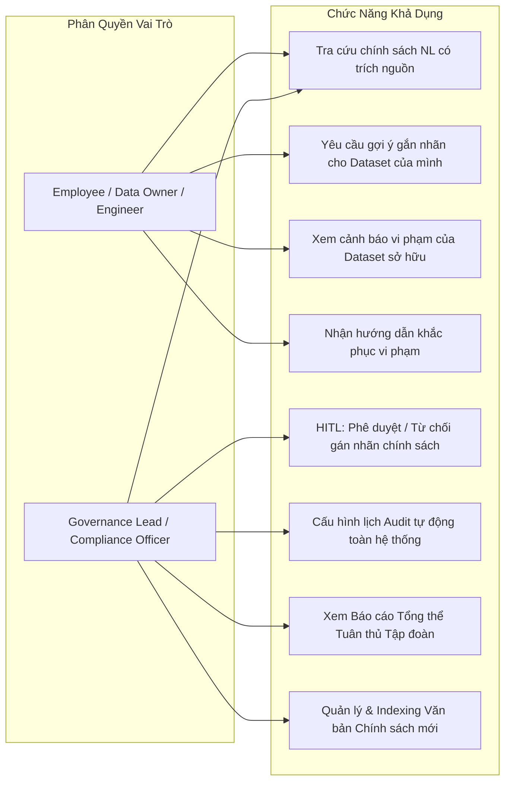

# ĐỀ TÀI DATA-19: AI AGENT TRỢ LÝ DATA GOVERNANCE & TRA CỨU CHÍNH SÁCH DỮ LIỆU
## BUSINESS REQUIREMENTS DOCUMENT (BRD) & PHÂN TÍCH ĐỀ TÀI CHI TIẾT

---

## 1. THÔNG TIN CHUNG ĐỀ TÀI

- **Mã đề tài:** `DATA-19`
- **Tên đề tài:** AI Agent trợ lý Data Governance & tra cứu chính sách dữ liệu (AI-Powered Data Governance Assistant & Policy Search Agent)
- **Khối / Đơn vị phụ trách:** Khối Dữ liệu tập trung (VSF) – Tập đoàn Vingroup
- **Đối tượng thụ hưởng chính:** 
  - **Data Governance Lead & Compliance Officers:** Đội ngũ chuyên trách quản trị dữ liệu tập đoàn, chịu trách nhiệm ban hành quy chế, giám sát việc tuân thủ dữ liệu và phê duyệt các nhãn chính sách.
  - **Employee (Data Producers, Data Owners, Data Engineers, Business Analysts):** Các nhân viên, kỹ sư dữ liệu và chuyên viên nghiệp vụ đang trực tiếp khởi tạo, sở hữu, lưu trữ và khai thác các tập dữ liệu (dataset) trên toàn hệ thống hạ tầng dữ liệu của tập đoàn.
- **Mục tiêu sản phẩm:** 
  - Xây dựng trợ lý AI thông minh giải quyết triệt để nút thắt cổ chai trong quản trị dữ liệu: hỗ trợ tra cứu các văn bản chính sách dữ liệu phức tạp bằng ngôn ngữ tự nhiên (Natural Language) với trích dẫn điều khoản chính xác tuyệt đối (Zero Hallucination).
  - Tự động phân tích kho siêu dữ liệu (warehouse metadata) để gợi ý gắn chính sách bảo mật, thời hạn lưu trữ (retention) phù hợp cho từng bảng dữ liệu.
  - Tự động rà soát mức độ tuân thủ, phát hiện sớm các vi phạm nghiêm trọng (lưu trữ quá hạn, thiếu phân loại mức độ nhạy cảm dữ liệu) và đưa ra kế hoạch khắc phục (remediation guide) từng bước.
  - Tích hợp cơ chế có con người kiểm soát (Human-in-the-Loop - HITL) để Governance Lead phê duyệt các nhãn chính sách trước khi áp dụng vào Data Catalog chính thức.

---

## 2. BỐI CẢNH DOANH NGHIỆP & NỖI ĐAU THỰC TẾ (PROBLEM STATEMENT)

### 2.1. Thực trạng quản trị dữ liệu tại Khối Dữ liệu tập trung (VSF)
Khối Dữ liệu tập trung (VSF) quản lý hạ tầng Enterprise Data Warehouse và Data Lakehouse khổng lồ (với hàng nghìn bảng dữ liệu phân tán trên Google BigQuery, PostgreSQL, Hive/MinIO/Iceberg) phục vụ nhiều công ty thành viên (Vinhomes, VinFast, Vinmec, Vinschool, VinWonders...). 

Hệ sinh thái chính sách quản trị dữ liệu tại đây rất đồ sộ và nghiêm ngặt:
1. **Quy định phân loại dữ liệu (Data Classification Policy):** Phân cấp 4 mức nhạy cảm (`Public`, `Internal`, `Confidential`, `Restricted`), nhận diện trường thông tin định danh cá nhân (Personally Identifiable Information - PII), thông tin thẻ thanh toán (PCI-DSS), hồ sơ bệnh án hoặc giao dịch tài chính.
2. **Chính sách lưu trữ & hủy dữ liệu (Data Retention & Archival Policy):** Quy định chặt chẽ thời gian được phép lưu trữ cho từng loại dữ liệu (ví dụ: Log truy cập lưu 6 tháng, Giao dịch thanh toán lưu 5 năm, Dữ liệu khách hàng tiềm năng không tương tác lưu tối đa 12 tháng, Dữ liệu nháp/staging tạm thời tối đa 30 ngày).
3. **Quy chế tuân thủ an toàn thông tin & Pháp lý (Compliance & Regulatory Mandates):** Tuân thủ Nghị định 13/2023/NĐ-CP về Bảo vệ dữ liệu cá nhân, các tiêu chuẩn ISO/IEC 27001 và chính sách bảo mật nội bộ của Vingroup.

### 2.2. Các điểm nghẽn và rủi ro cốt lõi (Core Pain Points & Risks)
1. **Chính sách phân mảnh, khó tiếp cận (Siloed & Scattered Policies):** Các quy định nằm rải rác trong hàng chục thông tư, quy chế nội bộ, tài liệu PDF dài hàng trăm trang. Nhân viên không biết phải tìm ở đâu và áp dụng điều khoản nào cho dataset cụ thể của mình.
2. **Dataset "vô danh" và thiếu nhãn phân loại (Unclassified Data Sprawl):** Hơn 40% dataset trong Data Warehouse thiếu nhãn phân loại bảo mật hoặc không rõ Data Owner, dẫn đến nguy cơ rò rỉ dữ liệu hoặc cấp quyền truy cập sai đối tượng.
3. **Vi phạm thời hạn lưu trữ (Data Retention Violations):** Dữ liệu tạm, bảng sao lưu ad-hoc, dữ liệu thử nghiệm chứa PII được tạo ra nhưng không bao giờ bị xóa, dẫn đến:
   - **Rủi ro pháp lý:** Bị xử phạt theo Nghị định 13 nếu lưu trữ dữ liệu cá nhân quá thời gian cần thiết đã công bố với khách hàng.
   - **Lãng phí chi phí lưu trữ (Cloud Storage Waste):** Dung lượng BigQuery/GCS phình to vô ích, gây tốn kém hàng trăm triệu đồng mỗi tháng.
4. **Governance Lead trở thành nút thắt cổ chai (Governance Bottleneck):** Đội ngũ Governance ít người phải liên tục trả lời thủ công các câu hỏi lặp đi lặp lại và rà soát thủ công từng dataset, không có thời gian cho việc kiểm toán an ninh chiến lược.
5. **Thiếu cơ chế phê duyệt minh bạch và tự động:** Không có quy trình chuẩn cho phép nhân viên đề xuất gắn nhãn chính sách và Lead phê duyệt tập trung có lưu vết (Audit Trail).

---

## 3. MỤC TIÊU DỰ ÁN & CHỈ SỐ ĐO LƯỜNG THÀNH CÔNG (KPIs & OKRs)

### 3.1. Mục tiêu định lượng (Quantitative Metrics)

| Chỉ số đo lường (Metric) | Hiện trạng (Baseline) | Mục tiêu với AI Agent (Target) |
| :--- | :--- | :--- |
| **Thời gian tra cứu chính sách dữ liệu** | 2 - 4 giờ đọc tài liệu | **< 5 giây** (hỏi đáp ngôn ngữ tự nhiên) |
| **Độ chính xác trích dẫn nguồn (Citation Accuracy)** | Thường nhầm lẫn hoặc nhớ sai | **> 98%** (chính xác số điều khoản, số văn bản) |
| **Tỷ lệ ảo giác thông tin chính sách (Hallucination Rate)** | Không kiểm soát khi đọc lướt | **< 1%** (áp dụng cơ chế Strict Retrieval Grounding) |
| **Độ chính xác ánh xạ chính sách cho Dataset (Mapping Accuracy)** | Manual mapping (~60% đúng) | **> 92%** (dựa trên schema, tên cột, mẫu dữ liệu) |
| **Tỷ lệ phát hiện vi phạm lưu trữ (Retention Violation Detection)** | Kiểm tra thủ công định kỳ năm (~30%) | **> 95%** (quét tự động liên tục theo lịch) |
| **Thời gian phê duyệt nhãn chính sách qua HITL** | 3 - 5 ngày qua email/Jira | **< 2 phút** (Lead review & approve 1-click) |
| **Chi phí truy vấn & vận hành RAG** | N/A | **< 0.02 USD / lượt tra cứu** (tối ưu Hybrid Cache) |

### 3.2. Mục tiêu định tính (Qualitative Metrics)
- Cung cấp trải nghiệm hỏi đáp hoàn toàn bằng tiếng Việt tự nhiên với khả năng trích dẫn minh bạch (kèm trích đoạn gốc, tên tài liệu, số trang và ngày có hiệu lực).
- Trao quyền cho nhân viên (Employee) chủ động hiểu và tự chịu trách nhiệm về dữ liệu họ quản lý.
- Đảm bảo cơ chế kiểm soát tối cao cho Governance Lead (Human-in-the-Loop) - AI chỉ đóng vai trò khuyến nghị, quyết định cuối cùng luôn thuộc về con người.
- Xây dựng văn hóa quản trị dữ liệu tuân thủ (Data Compliance by Design) tại tập đoàn.

---

## 4. PHÂN TÍCH VAI TRÒ NGƯỜI DÙNG (USER PERSONAS & PERMISSIONS)

Hệ thống được thiết kế phân định chặt chẽ theo 2 vai trò truy cập chính (Role-Based Access Control - RBAC):

### 4.1. Vai trò Employee (Data Producer, Engineer, Analyst, Owner)
- **Mục tiêu sử dụng:**
  - Tra cứu nhanh các chính sách: *"Dữ liệu số điện thoại và địa chỉ khách hàng của Vinhomes cần mã hóa thế nào và ai được quyền truy cập?"*.
  - Nhập tên hoặc ID của một dataset trên BigQuery/Warehouse (ví dụ: `vhm_sales.tbl_leads_2024`) để AI phân tích metadata, schema và tự động đề xuất chính sách phân loại nhãn và thời hạn lưu trữ.
  - Xem kết quả rà soát vi phạm của các bảng mình sở hữu (ví dụ: bảng đã quá hạn 90 ngày nhưng chưa chuyển sang cold storage/xóa, cột `cccd` chưa gắn nhãn PII).
  - Nhận hướng dẫn khắc phục từng bước (step-by-step remediation guide) kèm câu lệnh DDL/SQL mẫu để sửa chữa.
  - Gửi yêu cầu gán nhãn chính sách lên hệ thống để chờ Governance Lead phê duyệt.

### 4.2. Vai trò Governance Lead (Data Governance Officer, Compliance Manager)
- **Mục tiêu sử dụng:**
  - Quản lý danh mục văn bản chính sách dữ liệu tập đoàn: Tải lên các quy chế, chính sách mới dạng PDF/DOCX; hệ thống tự động trích xuất và tạo vector index trên Qdrant.
  - Hàng chờ phê duyệt HITL (HITL Review Queue): Xem danh sách các đề xuất gắn nhãn chính sách do AI sinh ra hoặc do Employee đệ trình, bấm "Duyệt" (Approve) để cập nhật thẳng vào Data Catalog, hoặc bấm "Từ chối / Yêu cầu điều chỉnh".
  - Quản trị vi phạm: Theo dõi bức tranh toàn cảnh tuân thủ của toàn tập đoàn (Dashboard tổng quan: tỷ lệ bảng đã phân loại, danh sách bảng vi phạm retention nguy cấp).
  - Cấu hình & kích hoạt tác vụ kiểm tra tuân thủ tự động theo lịch (Scheduled Compliance Audit).
  - Tải xuống và xem các báo cáo kiểm toán tuân thủ định kỳ (Periodic Compliance Report).

---

## 5. BẢNG PHẠM VI TÍNH NĂNG (FEATURE SCOPE & MOSCOW MATRIX)

### 5.1. Nhóm tính năng Cốt lõi (Must-Have – Yêu cầu Cơ bản)
1. **Web Interface Responsive hoàn chỉnh (Next.js + Tailwind + Shadcn/UI):**
   - Hỗ trợ xác thực người dùng, chuyển đổi và phân định rõ 2 vai trò (`Governance Lead` và `Employee`).
   - Giao diện tra cứu chính sách thông minh dạng hội thoại, hiển thị song song trích dẫn văn bản gốc (Document Drawer / Citation Panel).
   - Giao diện tra cứu và gán chính sách cho Dataset (Dataset Inspector & Policy Mapper).
2. **Bộ máy RAG tra cứu chính sách có trích nguồn chính xác (LlamaIndex + Qdrant):**
   - Phân tích và đánh chỉ mục tài liệu chính sách PDF/Docx.
   - Tìm kiếm kết hợp (Hybrid Search: Dense Vector + Sparse/BM25) chống bỏ sót thuật ngữ pháp lý.
   - Trả lời bằng ngôn ngữ tự nhiên kèm đầy đủ metadata nguồn: Số hiệu văn bản, tên quy định, điều khoản, số trang và đoạn trích nguyên văn.
3. **Ánh xạ chính sách cho Dataset dựa trên Metadata (Dataset Policy Mapping):**
   - Kết nối tới siêu dữ liệu Warehouse (tên bảng, mô tả, danh sách cột, kiểu dữ liệu, thời gian tạo, phân vùng).
   - Phân tích và gợi ý: Phân loại dữ liệu (`Public`, `Internal`, `Confidential`, `Restricted`), Nhãn PII (`PII_Phone`, `PII_Email`, `PII_NationalID`...), Thời hạn lưu trữ cho phép (Retention Window).
4. **Kiểm tra mức tuân thủ hiện tại & Hướng dẫn khắc phục:**
   - So sánh trạng thái thực tế của bảng với chính sách tương ứng (kiểm tra có nhãn hay chưa, thời gian tồn tại của dữ liệu so với Retention Limit).
   - Đưa ra cảnh báo vi phạm cụ thể và bản hướng dẫn khắc phục kèm mã lệnh kỹ thuật.
5. **Quy trình Phê duyệt có con người kiểm soát (Human-in-the-Loop - HITL):**
   - Màn hình phê duyệt chuyên dụng cho Governance Lead: So sánh trạng thái trước/sau khi gán nhãn, lý do đề xuất của AI.
   - Thao tác 1-click: "Phê duyệt gán nhãn" -> tự động cập nhật Data Catalog; hoặc "Từ chối" kèm ghi chú phản hồi cho Employee.

### 5.2. Nhóm tính năng Nâng cao (Should-Have & Could-Have – Yêu cầu Nâng cao)
1. **Hệ thống Multi-Agent Kiểm tra Tuân thủ Tự động theo Lịch (Scheduled Compliance Audit Multi-Agent):**
   - Tác vụ định kỳ (Cron/Cloud Scheduler) tự động kích hoạt Agent quét toàn bộ kho dữ liệu Data Warehouse.
   - Tự động phát hiện các dataset vừa vượt ngưỡng lưu trữ (Data Retention Expiration) trong 24 giờ qua.
   - Tự động phát hiện các bảng mới tạo trong tuần chưa được gán nhãn phân loại.
2. **Khung Đánh giá Tự động (Automated Evaluation Framework):**
   - Bộ chỉ số đo lường độ chính xác trả lời có trích nguồn: Faithfulness (độ trung thực), Citation Precision, Citation Recall (sử dụng Ragas / TruLens).
   - Đo lường độ chính xác ánh xạ chính sách (Policy Mapping Accuracy) trên tập Golden Dataset Test Cases.
3. **Phát hiện Dataset Quá hạn Lưu trữ & Đề xuất Kế hoạch Lưu trữ lạnh (Retention Violation & Cold Storage Archival):**
   - Tính toán chi phí lãng phí hàng tháng đối với các dataset vi phạm lưu trữ.
   - Đề xuất câu lệnh tự động di chuyển dữ liệu sang Google Cloud Storage Archive/Coldline hoặc lệnh DROP an toàn có xác nhận.
4. **Tự động sinh Báo cáo Tuân thủ Định kỳ (Periodic Compliance Audit Report Generation):**
   - Tự động tổng hợp dữ liệu kiểm toán hàng tuần / hàng tháng thành báo cáo chuyên nghiệp định dạng Markdown / PDF gửi đến Governance Lead và Ban Giám đốc.

---

## 6. MA TRẬN YÊU CẦU PHI CHỨC NĂNG (NON-FUNCTIONAL REQUIREMENTS)

1. **Tính chính xác & Không ảo giác (Zero-Hallucination on Citations):**
   - Tỷ lệ trích dẫn sai số điều khoản hoặc sai tên văn bản chính sách phải < 1%. Nếu tài liệu không đề cập, AI bắt buộc phải phản hồi "Không tìm thấy quy định trong kho tài liệu hiện tại", tuyệt đối không tự suy diễn.
2. **Hiệu năng & Độ trễ (Performance & Latency):**
   - Độ trễ trả lời câu hỏi tra cứu chính sách (P95 Latency): < 4 giây cho token đầu tiên qua SSE Streaming.
   - Thời gian phân tích metadata và ánh xạ chính sách cho một dataset < 8 giây.
   - Thời gian quét toàn bộ kho 1,000 bảng dữ liệu trong phiên Audit định kỳ < 15 phút.
3. **Bảo mật & Phân quyền (Security & Compliance):**
   - Toàn bộ kết nối API sử dụng HTTPS/TLS 1.3, xác thực JWT Bearer Token.
   - Employee chỉ được xem metadata và yêu cầu gán nhãn cho các dataset thuộc phạm vi phòng ban/dự án của mình.
   - Ghi nhận Audit Log toàn bộ hành vi: ai hỏi chính sách gì, ai yêu cầu gán nhãn, Lead nào phê duyệt vào thời điểm nào.
4. **Khả năng mở rộng (Scalability):**
   - Hệ thống sẵn sàng index hàng chục nghìn trang tài liệu chính sách mà không làm suy giảm tốc độ tìm kiếm (nhờ Vector Index HNSW trên Qdrant).
   - Kiến trúc Backend Stateless trên Cloud Run tự động co giãn (Autoscaling) từ 0 đến 50 instances tùy tải.
