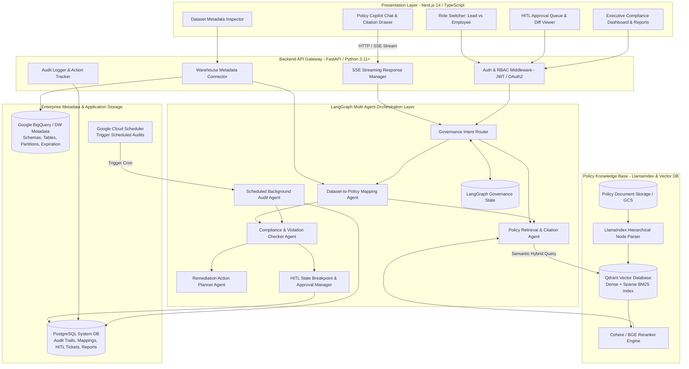
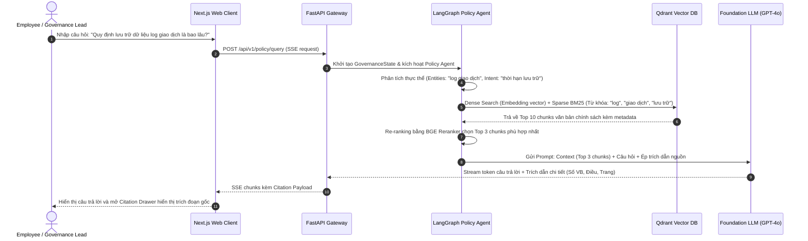
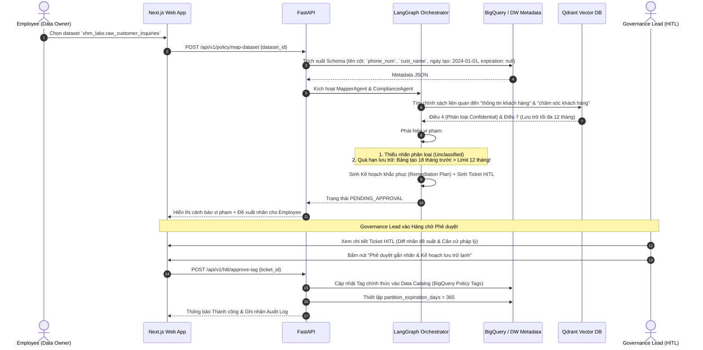
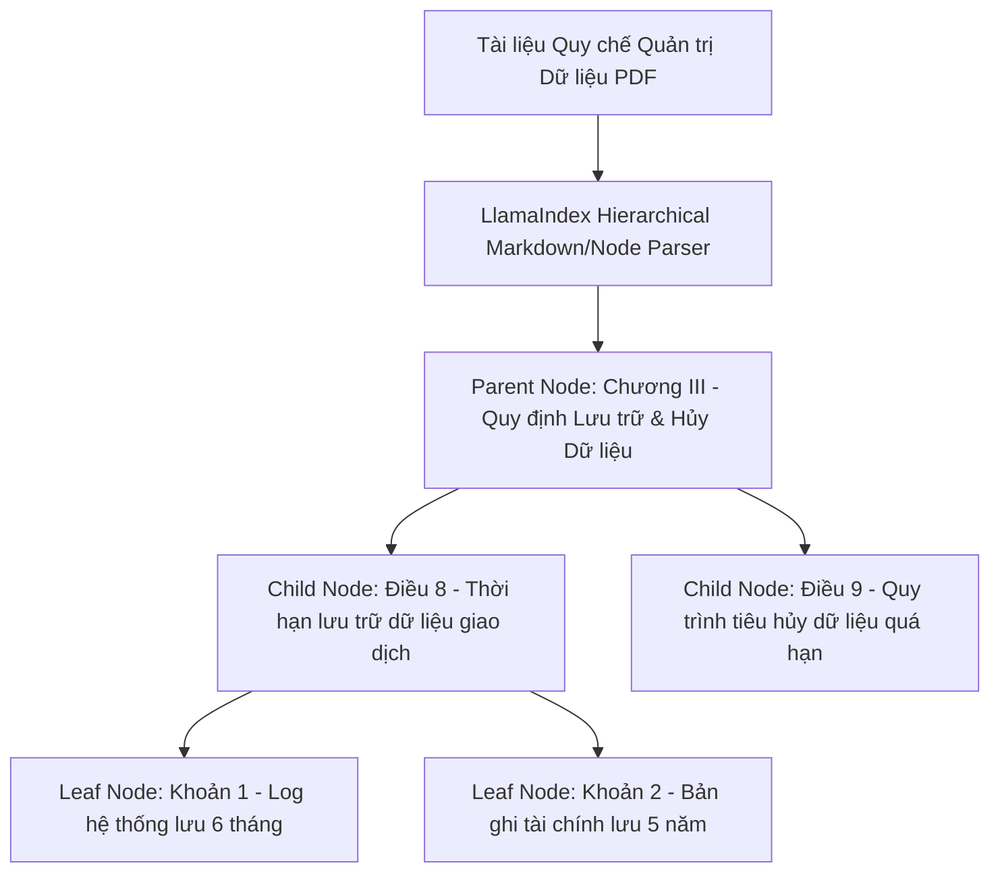
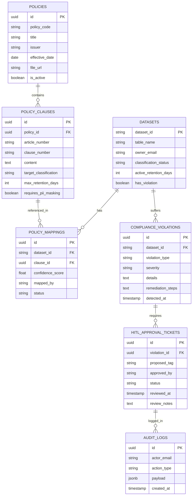

# ĐỀ TÀI DATA-19: AI AGENT TRỢ LÝ DATA GOVERNANCE & TRA CỨU CHÍNH SÁCH DỮ LIỆU
## SYSTEM ARCHITECTURE & TECHNICAL SPECIFICATION

---

## 1. TỔNG QUAN KIẾN TRÚC HỆ THỐNG (HIGH-LEVEL ARCHITECTURE)

Hệ thống **DATA-19: AI-Powered Data Governance Assistant** được thiết kế theo kiến trúc vi dịch vụ kết hợp hệ thống đa tác tử tự hành (**Autonomous Multi-Agent System**), vận hành trên 5 tầng kiến trúc độc lập và chuẩn hóa:

1. **Lớp Giao diện Người dùng (Presentation Layer - Next.js 14):** Giao diện tương tác kép phục vụ 2 nhóm vai trò (`Governance Lead` và `Employee`), cung cấp bảng điều khiển tra cứu chính sách, bảng phân tích dataset, luồng phê duyệt HITL và trung tâm báo cáo tuân thủ.
2. **Lớp Backend & Cổng Điều phối API (API Gateway & Middleware - FastAPI):** Đảm nhiệm xác thực phân quyền (RBAC), kiểm soát kết nối Server-Sent Events (SSE) cho streaming token, và điều phối tương tác với tầng Agent.
3. **Lớp Điều phối Đa Tác tử (LangGraph Multi-Agent Orchestration Layer):** Quản lý luồng xử lý trạng thái (Stateful Graph), tự động phân rã tác vụ giữa các agent chuyên trách: Tra cứu chính sách, Ánh xạ dataset, Kiểm tra vi phạm tuân thủ, Hướng dẫn khắc phục và Kiểm soát điểm dừng HITL (Human-in-the-Loop Interrupt).
4. **Lớp Tri thức & Tìm kiếm Ngữ nghĩa (Policy Knowledge & Vector Search Layer - LlamaIndex + Qdrant):** Quản lý toàn bộ kho văn bản quy chế, chính sách dữ liệu với cấu trúc phân đoạn phân cấp (Hierarchical Chunking) kết hợp tìm kiếm lai (Hybrid Search: Dense Vector + Sparse BM25).
5. **Lớp Kho Dữ liệu Doanh nghiệp & Quản trị (Data Warehouse & Catalog Metadata Layer):** Tích hợp thông tin schema, metadata của BigQuery / PostgreSQL / Cloud Storage và cơ sở dữ liệu PostgreSQL lưu trữ vết kiểm toán (Audit Logs) cùng trạng thái phê duyệt.



---

## 2. QUY TRÌNH LUỒNG DỮ LIỆU CHI TIẾT (DETAILED DATA FLOWS)

### 2.1. Luồng 1: Tra cứu chính sách bằng ngôn ngữ tự nhiên có trích nguồn chính xác


### 2.2. Luồng 2: Phân tích Metadata Dataset, Ánh xạ Chính sách, Kiểm tra Tuân thủ & Duyệt HITL


---

## 3. KIẾN TRÚC TRÍ THỨC CHÍNH SÁCH (LLAMAINDEX + QDRANT PIPELINE)

Để giải quyết triệt để yêu cầu **"Trích dẫn chính xác, không bịa đặt (Zero Hallucination)"** và **"Hiệu năng RAG trên kho tài liệu lớn"**, kiến trúc xử lý tài liệu được thiết kế theo tiêu chuẩn công nghiệp:

### 3.1. Chiến lược Phân tích & Phân đoạn Phân cấp (Hierarchical Chunking)
Các tài liệu chính sách của VSF thường có cấu trúc pháp lý phân cấp chặt chẽ:
`Bộ Quy chế` ➔ `Chương` ➔ `Điều` ➔ `Khoản` ➔ `Điểm`.
Nếu cắt chunk cố định theo số lượng ký tự (Fixed Token Chunking), văn bản sẽ bị đứt gãy ngữ cảnh của điều khoản.



Mỗi chunk (Leaf Node) khi đưa vào Vector DB sẽ được đính kèm toàn bộ Metadata ngữ cảnh phong phú:
```json
{
  "document_id": "QC-VSF-DATA-2024-01",
  "document_name": "Quy chế Quản trị & Bảo mật Dữ liệu Khối VSF",
  "issuer": "Ban Công nghệ Thông tin - Tập đoàn Vingroup",
  "effective_date": "2024-01-15",
  "chapter_number": "III",
  "chapter_title": "Quy định Lưu trữ & Tiêu hủy Dữ liệu",
  "article_number": "8",
  "article_title": "Thời hạn lưu trữ dữ liệu giao dịch",
  "clause_number": "2",
  "classification_scope": ["Financial", "Transaction"],
  "retention_period_days": 1825,
  "requires_hitl": true,
  "page_number": 24,
  "chunk_text": "Khoản 2: Tất cả các bản ghi giao dịch thanh toán, hợp đồng mua bán bất động sản và lịch sử thanh toán qua cổng trung gian phải được lưu trữ tối thiểu 05 (năm) năm kể từ ngày hợp đồng tất toán. Sau thời hạn này, dữ liệu phải được chuyển vào kho lưu trữ lạnh (Cold Storage) hoặc tiêu hủy theo quyết định của Hội đồng Quản trị Dữ liệu."
}
```

### 3.2. Cơ chế Tìm kiếm Lai (Hybrid Search) & Tái xếp hạng (Reranking)
- **Dense Vector Search:** Sử dụng model `text-embedding-3-large` (hoặc `bge-large-vi`) tạo vector 1536 chiều, lưu trữ trên Qdrant với chỉ mục HNSW (Hierarchical Navigable Small World) cho tốc độ tìm kiếm dưới 10ms trên 100,000 chunks.
- **Sparse BM25 Search:** Qdrant hỗ trợ Sparse Vectors giúp bắt trọn vẹn các từ khóa mã hiệu văn bản chính xác như: *"NĐ-13"*, *"Điều 8 Khoản 2"*, *"CCCD"*, *"PII_Phone"*.
- **Reciprocal Rank Fusion (RRF) & Reranking:** Kết hợp điểm số của Dense + Sparse, sau đó đưa Top 20 ứng viên qua model `Cohere Rerank v3` hoặc `BGE-Reranker-Large` để chọn lọc ra 3-5 trích đoạn có độ liên quan ngữ cảnh cao nhất gửi vào LLM.

---

## 4. MÔ HÌNH DỮ LIỆU HỆ THỐNG & METADATA WAREHOUSE

### 4.1. Metadata Catalog Model (Warehouse Schemas)
Hệ thống kết nối trực tiếp với `INFORMATION_SCHEMA` của BigQuery / PostgreSQL để thu thập thông tin dataset:

```sql
-- Cấu trúc bảng ảo trích xuất từ Enterprise Data Warehouse
CREATE TABLE warehouse_dataset_metadata (
    dataset_id VARCHAR(255) PRIMARY KEY,     -- e.g. "vhm_lakehouse.sales_contracts"
    project_id VARCHAR(100) NOT NULL,        -- e.g. "vingroup-data-prod"
    database_name VARCHAR(100) NOT NULL,
    schema_name VARCHAR(100) NOT NULL,
    table_name VARCHAR(100) NOT NULL,
    table_type VARCHAR(50),                  -- TABLE, VIEW, MATERIALIZED VIEW
    row_count BIGINT,
    size_bytes BIGINT,
    created_at TIMESTAMP WITH TIME ZONE,
    last_modified_at TIMESTAMP WITH TIME ZONE,
    partition_column VARCHAR(100),
    partition_expiration_days INT,          -- NULL nếu chưa cấu hình (nguy cơ vi phạm)
    current_classification_tag VARCHAR(50),  -- NULL hoặc PUBLIC, INTERNAL, CONFIDENTIAL, RESTRICTED
    owner_email VARCHAR(255),
    columns_json JSONB                       -- Danh sách cột, kiểu dữ liệu, mô tả
);
```

### 4.2. Cơ sở Dữ liệu Ứng dụng Quản trị (PostgreSQL System DB)



---

## 5. ĐẶC TẢ GIAO DIỆN LẬP TRÌNH (API SPECIFICATIONS)

Toàn bộ backend FastAPI cung cấp chuẩn OpenAPI 3.1, hỗ trợ xác thực JWT và streaming:

### 5.1. Tra cứu chính sách bằng ngôn ngữ tự nhiên (SSE Streaming)
- **Endpoint:** `POST /api/v1/policy/query`
- **Mô tả:** Nhận câu hỏi, tìm kiếm trên Qdrant, truyền ngữ cảnh vào LLM và stream câu trả lời kèm thông tin trích dẫn chi tiết về frontend.
- **Request Body:**
```json
{
  "query": "Quy định lưu trữ dữ liệu CCCD và số điện thoại khách hàng được quy định tại văn bản nào?",
  "top_k": 3,
  "filter_issuer": "Khối VSF"
}
```
- **SSE Stream Output:**
```
event: citation
data: {"citations": [{"doc_code": "QC-VSF-2024-01", "article": "Điều 5", "clause": "Khoản 1", "page": 12, "source_title": "Quy chế Bảo mật PII Khách hàng VSF", "exact_quote": "Thông tin CCCD và Số điện thoại thuộc nhóm Bí mật (Confidential), bắt buộc mã hóa AES-256 khi lưu trữ và hủy sau 2 năm không phát sinh giao dịch."}]}

event: delta
data: {"text": "Theo "}

event: delta
data: {"text": "**Điều 5, Khoản 1** thuộc **Quy chế Bảo mật PII Khách hàng VSF** (QC-VSF-2024-01, Trang 12), "}

event: delta
data: {"text": "dữ liệu CCCD và số điện thoại thuộc nhóm thông tin Bí mật (Confidential). Thời hạn lưu trữ tối đa là **2 năm** kể từ ngày phát sinh giao dịch cuối cùng..."}

event: done
data: {"finish_reason": "stop"}
```

### 5.2. Yêu cầu gợi ý gắn chính sách cho Dataset
- **Endpoint:** `POST /api/v1/policy/map-dataset`
- **Request Body:**
```json
{
  "dataset_id": "vhm_prod_lakehouse.tbl_customer_survey_raw"
}
```
- **Response:**
```json
{
  "dataset_id": "vhm_prod_lakehouse.tbl_customer_survey_raw",
  "suggested_classification": "CONFIDENTIAL",
  "suggested_retention_days": 365,
  "confidence_score": 0.94,
  "detected_pii_columns": ["phone_number", "customer_full_name", "home_address"],
  "matched_policies": [
    {
      "policy_code": "QC-VSF-2024-01",
      "clause": "Điều 5 Khoản 1",
      "reason": "Phát hiện 3 cột PII nhạy cảm trùng khớp định nghĩa dữ liệu định danh khách hàng."
    },
    {
      "policy_code": "QC-VSF-2024-03",
      "clause": "Điều 8 Khoản 3",
      "reason": "Dữ liệu khảo sát thị trường thuộc nhóm dữ liệu chiến dịch tạm thời, thời hạn tối đa 12 tháng."
    }
  ],
  "compliance_status": {
    "is_compliant": false,
    "violations": [
      {
        "type": "MISSING_CLASSIFICATION_TAG",
        "severity": "HIGH",
        "message": "Bảng đang ở trạng thái Unclassified, chưa gắn nhãn bảo mật."
      },
      {
        "type": "RETENTION_EXCEEDED",
        "severity": "CRITICAL",
        "message": "Bảng được tạo từ 450 ngày trước, đã vượt quá ngưỡng cho phép 365 ngày (quá hạn 85 ngày)."
      }
    ]
  },
  "remediation_plan": {
    "ticket_id": "HITL-2026-00918",
    "status": "PENDING_LEAD_APPROVAL",
    "recommended_sql": "ALTER TABLE `vhm_prod_lakehouse.tbl_customer_survey_raw` SET OPTIONS (labels=[('data_classification', 'confidential'), ('retention_tier', 'temp_campaign')]);",
    "action_required": "Di chuyển các bản ghi > 365 ngày sang Cold Storage `gs://vhm-archive-coldline/survey_2025/` hoặc thực hiện DROP phân vùng cũ."
  }
}
```

### 5.3. API Phê duyệt HITL dành cho Governance Lead
- **Endpoint:** `POST /api/v1/hitl/approve-tag`
- **Header:** `Authorization: Bearer <JWT_GOVERNANCE_LEAD>`
- **Request Body:**
```json
{
  "ticket_id": "HITL-2026-00918",
  "action": "APPROVE",
  "adjusted_classification": "CONFIDENTIAL",
  "adjusted_retention_days": 365,
  "reviewer_notes": "Đã xác nhận với Data Owner. Phê duyệt gắn nhãn Confidential và áp dụng thời hạn lưu trữ 1 năm."
}
```
- **Response:**
```json
{
  "status": "SUCCESS",
  "ticket_id": "HITL-2026-00918",
  "applied_at": "2026-09-19T12:35:00Z",
  "catalog_updated": true,
  "audit_log_id": "AUD-2026-88129"
}
```

### 5.4. Kích hoạt quét kiểm toán tuân thủ tự động theo lịch (Scheduled Run)
- **Endpoint:** `POST /api/v1/audit/scheduled-run`
- **Header:** `X-Cloud-Scheduler-Secret: <SECRET_TOKEN>`
- **Response:**
```json
{
  "audit_job_id": "AUDIT-JOB-2026-W38",
  "status": "STARTED",
  "scanned_tables_count": 1420,
  "estimated_duration_seconds": 320
}
```

---

## 6. HẠ TẦNG TRIỂN KHAI CLOUD RUN & NGUYÊN TẮC BẢO MẬT

### 6.1. Kiến trúc Triển khai Google Cloud Run (Containerized Microservices)
1. **Frontend Service:** Container Next.js 14 chạy trên Cloud Run (Min instances: 1, Concurrency: 80, CPU: 1 vCPU, RAM: 1 GiB).
2. **Backend & Agent Service:** Container FastAPI + LangGraph chạy trên Cloud Run (Min instances: 1, Max instances: 20, Concurrency: 40, CPU: 2 vCPU, RAM: 4 GiB).
3. **Vector DB (Qdrant):** Triển khai Qdrant Managed Cloud hoặc Qdrant Cluster trên Google Kubernetes Engine (GKE) / Compute Engine có gắn Persistent Disk SSD để tối ưu IOPS.
4. **Scheduled Trigger:** Google Cloud Scheduler gọi định kỳ hàng đêm (ví dụ: `0 2 * * *` - 2h sáng mỗi ngày) tới endpoint `/api/v1/audit/scheduled-run` để thực hiện tác vụ rà soát toàn bộ Data Warehouse.

### 6.2. Kiểm soát Bảo mật Dữ liệu & FinOps
- **Zero Raw Data Exposure:** AI Agent tuyệt đối **không đọc dữ liệu thô (raw data rows)** của khách hàng trong kho dữ liệu, mà **chỉ đọc thông tin lược đồ (Metadata & Schema: tên cột, kiểu dữ liệu, thống kê số dòng)** để đảm bảo an toàn bí mật dữ liệu theo chuẩn ISO 27001.
- **Cache Semantic trên Redis:** 40% câu hỏi tra cứu chính sách thường có nội dung tương tự nhau giữa các nhân viên. Cấu hình Redis Semantic Cache với Cosine Similarity > 0.95 giúp trả lời tức thì (< 50ms) và tiết kiệm 60% chi phí gọi LLM API.
