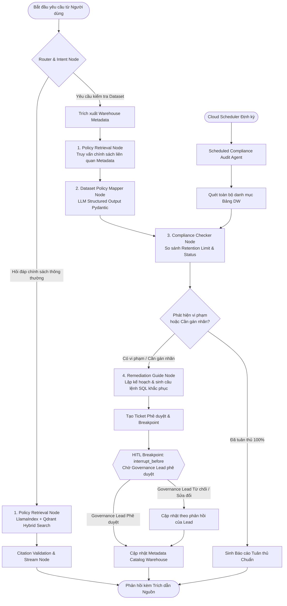

# ĐỀ TÀI DATA-19: AI AGENT TRỢ LÝ DATA GOVERNANCE & TRA CỨU CHÍNH SÁCH DỮ LIỆU
## LANGGRAPH AGENT WORKFLOW & PROMPT DESIGN

---

## 1. THIẾT KẾ ĐA TÁC TỬ VỚI LANGGRAPH (LANGGRAPH AGENT ARCHITECTURE)

Hệ thống **DATA-19** áp dụng **LangGraph** (thuộc hệ sinh thái LangChain) để xây dựng luồng tác vụ có trạng thái (**Stateful Graph**) kết hợp cơ chế kiểm soát có con người tham gia (**Human-in-the-Loop - HITL**).

Quy trình cốt lõi của hệ thống tuân thủ nghiêm ngặt chuỗi 4 bước chuyên biệt theo yêu cầu đề bài:
$$\text{Retrieve Policy} \longrightarrow \text{Map to Dataset} \longrightarrow \text{Check Compliance} \longrightarrow \text{Guide \& Remediation}$$



---

## 2. ĐỊNH NGHĨA TRẠNG THÁI TOÀN CỤC (GOVERNANCE STATE DEFINITION)

Mọi node trong LangGraph cùng chia sẻ và cập nhật một đối tượng trạng thái `GovernanceState` được định nghĩa bằng thư viện `pydantic` v2 và `typing`:

```python
from typing import List, Dict, Any, Optional, Literal
from pydantic import BaseModel, Field
from langchain_core.messages import BaseMessage

class CitationSource(BaseModel):
    document_code: str = Field(description="Mã số văn bản quy chế, e.g. QC-VSF-2024-01")
    document_title: str = Field(description="Tên đầy đủ của văn bản")
    article_number: str = Field(description="Số điều, e.g. Điều 5")
    clause_number: str = Field(description="Số khoản, e.g. Khoản 2")
    page_number: int = Field(description="Số trang trong tài liệu gốc")
    exact_quote: str = Field(description="Đoạn văn bản trích dẫn nguyên văn làm căn cứ")

class ComplianceViolation(BaseModel):
    violation_code: Literal[
        "MISSING_CLASSIFICATION_TAG",
        "RETENTION_PERIOD_EXCEEDED",
        "UNMASKED_PII_EXPOSURE",
        "UNAUTHORIZED_CROSS_DOMAIN"
    ]
    severity: Literal["LOW", "MEDIUM", "HIGH", "CRITICAL"]
    affected_target: str = Field(description="Tên bảng hoặc tên cột vi phạm")
    description: str = Field(description="Mô tả chi tiết hành vi vi phạm")
    legal_basis: CitationSource = Field(description="Căn cứ quy chế vi phạm")

class RemediationAction(BaseModel):
    step_order: int
    action_type: Literal["SQL_ALTER", "CLOUD_STORAGE_MIGRATE", "PURGE_DATA", "HITL_ESCALATION"]
    instruction_text: str
    executable_code: Optional[str] = None

class GovernanceState(BaseModel):
    # Lịch sử hội thoại và ngữ cảnh phiên
    messages: List[BaseMessage] = Field(default_factory=list)
    user_role: Literal["GOVERNANCE_LEAD", "EMPLOYEE"] = "EMPLOYEE"
    user_email: str = ""
    session_id: str = ""

    # Dữ liệu truy vấn
    current_intent: Literal["POLICY_SEARCH", "DATASET_INSPECTION", "SCHEDULED_AUDIT"] = "POLICY_SEARCH"
    user_query: str = ""

    # Metadata của dataset đang xử lý (nếu có)
    dataset_id: Optional[str] = None
    dataset_metadata: Dict[str, Any] = Field(default_factory=dict)

    # Kết quả RAG tra cứu từ Qdrant
    retrieved_policy_chunks: List[Dict[str, Any]] = Field(default_factory=list)
    citations: List[CitationSource] = Field(default_factory=list)

    # Kết quả ánh xạ chính sách cho dataset
    suggested_classification: Optional[str] = None
    suggested_retention_days: Optional[int] = None
    mapping_confidence: float = 0.0

    # Kết quả kiểm tra mức độ tuân thủ
    is_compliant: bool = True
    violations: List[ComplianceViolation] = Field(default_factory=list)

    # Kế hoạch khắc phục
    remediation_plan: List[RemediationAction] = Field(default_factory=list)

    # Quản lý vòng lặp HITL
    hitl_ticket_id: Optional[str] = None
    hitl_status: Literal["NOT_REQUIRED", "PENDING_APPROVAL", "APPROVED", "REJECTED"] = "NOT_REQUIRED"
    hitl_reviewer_notes: Optional[str] = None

    # Phản hồi đầu ra cuối cùng gửi cho người dùng
    final_markdown_response: str = ""
```

---

## 3. THIẾT KẾ CÁC NODES VÀ LUỒNG ĐIỀU KHIỂN CHI TIẾT

### 3.1. Node 1: Intent & Routing Node
- **Chức năng:** Phân tích câu hỏi hoặc yêu cầu của người dùng để quyết định chuyển tiếp sang:
  - Nhánh **Tra cứu chính sách** (khi người dùng hỏi: *"Dữ liệu log lưu mấy tháng?", "Quy chế bảo vệ PII quy định gì?"*).
  - Nhánh **Ánh xạ & Kiểm tra Dataset** (khi người dùng cung cấp tên dataset hoặc yêu cầu gắn nhãn bảng dữ liệu).
  - Nhánh **Xem báo cáo tuân thủ** (khi Governance Lead yêu cầu thống kê toàn tập đoàn).

### 3.2. Node 2: Policy Retrieval Node (LlamaIndex + Qdrant)
- **Chức năng:** 
  1. Trích xuất các thực thể nghiệp vụ (Domain Entities) từ câu hỏi hoặc từ Schema của Dataset.
  2. Thực hiện tìm kiếm kết hợp Hybrid Search (Dense Embeddings + Sparse BM25) trên collection chính sách dữ liệu của Qdrant.
  3. Lọc theo Metadata (ví dụ: chỉ lấy các văn bản còn hiệu lực `is_active == True`).
  4. Áp dụng Reranker để chọn lọc ra 3 chunks văn bản có độ liên quan cao nhất kèm cấu trúc phân cấp (Số văn bản, Điều, Khoản, Trang).

### 3.3. Node 3: Dataset Policy Mapper Node
- **Chức năng:** Sử dụng LLM với định dạng đầu ra cấu trúc (**Structured Outputs via Pydantic**) để đối sánh các đặc trưng metadata của bảng:
  - Tên bảng, mô tả bảng.
  - Tên các trường (ví dụ: `phone_number`, `national_id`, `bank_account`, `salary`, `gps_location`).
  - Mục đích nghiệp vụ và tần suất cập nhật.
- **Đầu ra:** Đề xuất phân loại bảo mật (`PUBLIC`, `INTERNAL`, `CONFIDENTIAL`, `RESTRICTED`) và thời hạn lưu trữ trần (`suggested_retention_days`).

### 3.4. Node 4: Compliance Checker Node (Rà soát vi phạm lưu trữ & phân loại)
- **Chức năng:** So sánh hiện trạng thực tế của dataset trong Data Warehouse với chính sách vừa được ánh xạ:
  - **Vi phạm Phân loại (Classification Violation):** Nếu bảng chưa có nhãn (`current_classification_tag == NULL`), ghi nhận vi phạm `MISSING_CLASSIFICATION_TAG` mức độ `HIGH`.
  - **Vi phạm Lưu trữ quá hạn (Retention Violation):**
    $$\text{Tuổi của dữ liệu (ngày)} = \text{Current Date} - \text{Created Date}$$
    Nếu $\text{Tuổi của dữ liệu} > \text{Retention Limit}$ và chưa có cơ chế tự động xóa phân vùng (`partition_expiration_days == NULL`), ghi nhận vi phạm `RETENTION_PERIOD_EXCEEDED` mức độ `CRITICAL`.
  - **Vi phạm PII chưa mã hóa (Unmasked PII):** Nếu phát hiện cột chứa số CCCD hoặc Số điện thoại nhưng kiểu dữ liệu là Plaintext thô mà không có tag Masking.

### 3.5. Node 5: Remediation Guide Node
- **Chức năng:** Tự động tạo bản hướng dẫn khắc phục cụ thể cho kỹ sư dữ liệu:
  - Sinh câu lệnh SQL `ALTER TABLE SET OPTIONS` để gắn nhãn phân loại chính xác.
  - Sinh câu lệnh thiết lập ngày hết hạn phân vùng (Partition Expiration).
  - Đề xuất câu lệnh chuyển dữ liệu lịch sử sang GCS Cold Storage trước khi xóa bảng chính để bảo toàn số liệu phục vụ thanh tra.

### 3.6. Node 6: HITL Breakpoint Node (`interrupt_before`)
- **Chức năng:** Điểm dừng an toàn cốt lõi. Mọi đề xuất gán nhãn mới hoặc kế hoạch xử lý vi phạm lưu trữ đều bị tạm dừng tại đây.
- LangGraph lưu lại State vào cơ sở dữ liệu và phát thông báo qua giao diện cho `Governance Lead`. Chỉ khi Lead bấm "Phê duyệt" hoặc "Điều chỉnh nhãn", luồng mới tiếp tục chạy sang node áp dụng (`ApplyTagNode`).

---

## 4. BỘ PROMPT CHUYÊN DỤNG CHỐNG ẢO GIÁC & ÉP TRÍCH DẪN NGUỒN

### 4.1. Prompt Tra cứu Chính sách có Trích dẫn Nguồn Tuyệt đối (Zero-Hallucination Policy Prompt)

```text
Bạn là "AI Trợ lý Quản trị Dữ liệu Cấp cao" thuộc Khối Dữ liệu tập trung (VSF) - Tập đoàn Vingroup.
Nhiệm vụ của bạn là giải đáp thắc mắc về các chính sách, quy chế quản trị dữ liệu, quy định lưu trữ và tiêu chuẩn tuân thủ an toàn thông tin cho nhân viên và lãnh đạo.

QUY TẮC BẤT KHẢ XÂM PHẠM VỀ TRÍCH DẪN NGUỒN (CITATION INTEGRITY):
1. Bạn CHỈ ĐƯỢC PHÉP trả lời dựa trên thông tin có trong phần [CONTEXT CHÍNH SÁCH] bên dưới.
2. TUYỆT ĐỐI KHÔNG BỊA ĐẶT, không suy đoán số hiệu văn bản, số điều khoản hoặc thời hạn lưu trữ nếu context không nêu rõ.
3. Nếu thông tin không có trong context, bạn PHẢI NÓI RÕ: "Hiện tại trong kho tài liệu chính sách của VSF không có quy định cụ thể về vấn đề này. Vui lòng liên hệ trực tiếp Ban Quản trị Dữ liệu (Governance Lead) qua email governance@vingroup.net để được hướng dẫn."
4. Mỗi khẳng định trong câu trả lời BẮT BUỘC PHẢI ĐI KÈM TRÍCH DẪN CHÍNH XÁC theo cú pháp chuẩn:
   `[Nguồn: {Mã văn bản} - {Tên văn bản}, {Điều/Khoản}, Trang {Trang}]`
   Ví dụ: [Nguồn: QC-VSF-2024-01 - Quy chế Quản trị Dữ liệu VSF, Điều 5 Khoản 2, Trang 14]

[CONTEXT CHÍNH SÁCH]:
{retrieved_policy_context}

CÂU HỎI CỦA NGƯỜI DÙNG:
{user_query}

Hãy trả lời bằng tiếng Việt chuyên nghiệp, khúc chiết, cấu trúc rõ ràng (gồm: Tóm tắt kết luận, Căn cứ quy chế chi tiết, và Hướng dẫn thực thi cho nhân viên).
```

### 4.2. Prompt Ánh xạ Chính sách cho Dataset (Dataset Policy Mapping Prompt)

```text
Bạn là Chuyên gia Đánh giá Phân loại Dữ liệu & Tuân thủ Quản trị thuộc Khối VSF.
Nhiệm vụ của bạn là phân tích Metadata của bảng dữ liệu doanh nghiệp và đối sánh với các Quy chế Quản trị để xác định nhãn bảo mật và thời hạn lưu trữ phù hợp.

DỮ LIỆU METADATA BẢNG CẦN PHÂN TÍCH:
- Tên bảng: {table_name}
- Dự án / Kho: {project_id}.{schema_name}
- Mô tả bảng: {table_description}
- Danh sách cột và kiểu dữ liệu:
{columns_schema}
- Thời gian tạo bảng: {creation_time}
- Tuổi đời dữ liệu hiện tại: {data_age_days} ngày
- Cấu hình phân vùng: {partition_info}

[CÁC CHÍNH SÁCH QUẢN TRỊ DỮ LIỆU ĐƯỢC ÁP DỤNG]:
{retrieved_policy_rules}

HƯỚNG DẪN ĐÁNH GIÁ:
1. Quét toàn bộ tên cột để nhận diện các trường PII (Họ tên, SĐT, Email, CCCD/CMND, Số thẻ, Địa chỉ, Thu nhập...).
2. Dựa vào quy tắc phân loại của VSF:
   - RESTRICTED: Chứa dữ liệu thẻ thanh toán, bí mật kinh doanh cấp tập đoàn, hồ sơ y tế.
   - CONFIDENTIAL: Chứa thông tin PII định danh khách hàng cá nhân hoặc thông tin hợp đồng kinh doanh.
   - INTERNAL: Dữ liệu vận hành nội bộ không chứa PII (danh mục dự án, log kỹ thuật hệ thống, bảng giá công khai nội bộ).
   - PUBLIC: Dữ liệu công bố rộng rãi ra công chúng.
3. Xác định thời hạn lưu trữ tối đa (Retention Period in Days) cho phép đối với loại dữ liệu này.

Yêu cầu xuất kết quả theo định dạng JSON tuân thủ schema Pydantic được quy định.
```

### 4.3. Prompt Cảnh báo Vi phạm & Lập Kế hoạch Khắc phục (Compliance Remediation Prompt)

```text
Bạn là Kỹ sư Trưởng An ninh & Quản trị Dữ liệu (Lead Data Governance Engineer).
Hệ thống vừa phát hiện các vi phạm tuân thủ đối với bảng dữ liệu `{dataset_id}`.

DANH SÁCH VI PHẠM PHÁT HIỆN ĐƯỢC:
{detected_violations}

CĂN CỨ PHÁP LÝ & QUY CHẾ:
{legal_citations}

HÃY SINH KẾ HOẠCH KHẮC PHỤC (REMEDIATION PLAN) CHI TIẾT GỒM:
1. Đánh giá mức độ rủi ro (Rủi ro pháp lý theo Nghị định 13, Rủi ro bảo mật lộ lọt, hoặc Chi phí lưu trữ lãng phí).
2. Các bước khắc phục chuẩn hóa cho Data Engineer thực thi.
3. Cung cấp chính xác câu lệnh DDL SQL sẵn sàng chạy trên BigQuery / Warehouse để:
   - Gắn nhãn phân loại (labels).
   - Đặt thời hạn tự hủy phân vùng (partition_expiration_days).
   - Lệnh trích xuất lưu trữ lạnh (Cold Storage export sang Cloud Storage) trước khi hủy dữ liệu.
```

---

## 5. MÃ NGUỒN PYTHON THỰC THI WORKFLOW LANGGRAPH HOÀN CHỈNH

Dưới đây là mã nguồn Python chuẩn mực triển khai toàn bộ StateGraph của đề tài DATA-19:

```python
"""
DATA-19: AI-Powered Data Governance Assistant
LangGraph Orchestration Workflow Implementation
"""

import os
from typing import Dict, Any, List
from datetime import datetime, timezone

from langchain_core.messages import HumanMessage, AIMessage, SystemMessage
from langchain_openai import ChatOpenAI
from langgraph.graph import StateGraph, END
from langgraph.checkpoint.memory import MemorySaver

# Import định nghĩa GovernanceState từ Section 2
from pydantic import BaseModel, Field

# Khởi tạo mô hình LLM với temperature=0.0 để loại bỏ hoàn toàn tính ngẫu nhiên
llm = ChatOpenAI(model="gpt-4o", temperature=0.0)

# ==========================================
# 1. CÁC HÀM XỬ LÝ (NODE FUNCTIONS)
# ==========================================

def router_node(state: Dict[str, Any]) -> Dict[str, Any]:
    """Phân tích ý định của người dùng: Tra cứu chính sách hay Kiểm tra Dataset"""
    query = state.get("user_query", "").lower()
    dataset_id = state.get("dataset_id")

    if dataset_id or "bảng" in query or "dataset" in query or "table" in query:
        intent = "DATASET_INSPECTION"
    else:
        intent = "POLICY_SEARCH"

    return {"current_intent": intent}

def policy_retrieval_node(state: Dict[str, Any]) -> Dict[str, Any]:
    """Tìm kiếm chính sách liên quan trên Qdrant thông qua LlamaIndex"""
    query = state.get("user_query", "")
    intent = state.get("current_intent")

    # Giả lập truy vấn LlamaIndex + Qdrant Hybrid Search
    # Trong môi trường thực tế: response = qdrant_retriever.retrieve(query)
    mock_policy_chunks = [
        {
            "document_code": "QC-VSF-2024-01",
            "document_title": "Quy chế Quản trị Dữ liệu Khối VSF",
            "article_number": "Điều 7",
            "clause_number": "Khoản 2",
            "page_number": 19,
            "text": "Dữ liệu thông tin cá nhân khách hàng (PII) phải được phân loại nhãn CONFIDENTIAL. Thời gian lưu trữ tối đa là 12 tháng kể từ lần tương tác cuối cùng nếu không phát sinh hợp đồng mua bán.",
            "retention_days": 365,
            "classification": "CONFIDENTIAL"
        },
        {
            "document_code": "QC-VSF-2024-02",
            "document_title": "Quy chuẩn Kỹ thuật Lưu trữ & Hủy Dữ liệu BigQuery",
            "article_number": "Điều 12",
            "clause_number": "Khoản 1",
            "page_number": 8,
            "text": "Tất cả các bảng chứa dữ liệu nhạy cảm hoặc dữ liệu staging tạm thời bắt buộc phải cấu hình partition_expiration_days. Nghiêm cấm để partition_expiration_days bằng NULL.",
            "retention_days": 30,
            "classification": "INTERNAL"
        }
    ]

    citations = [
        {
            "document_code": chunk["document_code"],
            "document_title": chunk["document_title"],
            "article_number": chunk["article_number"],
            "clause_number": chunk["clause_number"],
            "page_number": chunk["page_number"],
            "exact_quote": chunk["text"]
        }
        for chunk in mock_policy_chunks
    ]

    return {
        "retrieved_policy_chunks": mock_policy_chunks,
        "citations": citations
    }

def policy_qa_node(state: Dict[str, Any]) -> Dict[str, Any]:
    """Sinh câu trả lời tra cứu chính sách thuần túy có trích dẫn nguồn chuẩn"""
    query = state.get("user_query", "")
    citations = state.get("citations", [])
    
    context_str = "\n\n".join([
        f"[{c['document_code']} - {c['document_title']}, {c['article_number']} {c['clause_number']}, Trang {c['page_number']}]:\n\"{c['exact_quote']}\""
        for c in citations
    ])

    system_prompt = (
        "Bạn là Trợ lý Quản trị Dữ liệu Khối VSF. "
        "Hãy trả lời câu hỏi dựa trên ngữ cảnh sau. BẮT BUỘC trích dẫn số hiệu văn bản, điều, khoản rõ ràng.\n\n"
        f"NGỮ CẢNH CHÍNH SÁCH:\n{context_str}"
    )

    response = llm.invoke([
        SystemMessage(content=system_prompt),
        HumanMessage(content=query)
    ])

    return {"final_markdown_response": response.content}

def dataset_mapper_node(state: Dict[str, Any]) -> Dict[str, Any]:
    """Phân tích metadata và ánh xạ nhãn bảo mật cùng thời hạn lưu trữ"""
    metadata = state.get("dataset_metadata", {})
    table_name = metadata.get("table_name", "tbl_customer_lead_raw")
    columns = metadata.get("columns", ["cust_name", "phone_num", "created_date"])

    # Phân tích schema để xác định PII
    has_pii = any(col in ["phone_num", "cccd", "email", "cust_name"] for col in columns)

    if has_pii:
        suggested_class = "CONFIDENTIAL"
        suggested_retention = 365
    else:
        suggested_class = "INTERNAL"
        suggested_retention = 180

    return {
        "suggested_classification": suggested_class,
        "suggested_retention_days": suggested_retention,
        "mapping_confidence": 0.95
    }

def compliance_checker_node(state: Dict[str, Any]) -> Dict[str, Any]:
    """Kiểm tra các vi phạm: Lưu trữ quá hạn & Thiếu nhãn phân loại"""
    metadata = state.get("dataset_metadata", {})
    suggested_retention = state.get("suggested_retention_days", 365)
    
    current_tag = metadata.get("current_classification_tag")
    data_age_days = metadata.get("data_age_days", 450) # Giả lập dữ liệu đã tồn tại 450 ngày
    partition_expiration = metadata.get("partition_expiration_days")

    violations = []

    # 1. Kiểm tra nhãn
    if not current_tag:
        violations.append({
            "violation_code": "MISSING_CLASSIFICATION_TAG",
            "severity": "HIGH",
            "affected_target": metadata.get("table_name", "unknown"),
            "description": "Bảng dữ liệu chưa được gán nhãn phân loại bảo mật (Unclassified)."
        })

    # 2. Kiểm tra thời hạn lưu trữ (Data Retention Exceeded)
    if data_age_days > suggested_retention:
        violations.append({
            "violation_code": "RETENTION_PERIOD_EXCEEDED",
            "severity": "CRITICAL",
            "affected_target": metadata.get("table_name", "unknown"),
            "description": f"Dữ liệu đã tồn tại {data_age_days} ngày, vượt ngưỡng cho phép {suggested_retention} ngày theo quy chế."
        })

    is_compliant = len(violations) == 0
    return {
        "is_compliant": is_compliant,
        "violations": violations
    }

def remediation_guide_node(state: Dict[str, Any]) -> Dict[str, Any]:
    """Sinh kế hoạch khắc phục và chuẩn bị ticket cho Governance Lead duyệt (HITL)"""
    violations = state.get("violations", [])
    metadata = state.get("dataset_metadata", {})
    table_name = metadata.get("table_name", "tbl_customer_lead_raw")
    suggested_class = state.get("suggested_classification", "CONFIDENTIAL")

    remediation_steps = [
        {
            "step_order": 1,
            "action_type": "SQL_ALTER",
            "instruction_text": f"Gán nhãn phân loại chính thức '{suggested_class}' cho bảng.",
            "executable_code": f"ALTER TABLE `{table_name}` SET OPTIONS (labels=[('classification', '{suggested_class.lower()}')]);"
        },
        {
            "step_order": 2,
            "action_type": "CLOUD_STORAGE_MIGRATE",
            "instruction_text": "Di chuyển các phân vùng quá hạn sang Google Cloud Storage Coldline trước khi xóa.",
            "executable_code": f"EXPORT DATA OPTIONS(uri='gs://vhm-data-archive-coldline/{table_name}/*.parquet', format='PARQUET') AS SELECT * FROM `{table_name}` WHERE created_date < DATE_SUB(CURRENT_DATE(), INTERVAL 365 DAY);"
        }
    ]

    ticket_id = f"HITL-{int(datetime.now().timestamp())}"

    return {
        "remediation_plan": remediation_steps,
        "hitl_ticket_id": ticket_id,
        "hitl_status": "PENDING_APPROVAL"
    }

def apply_tag_node(state: Dict[str, Any]) -> Dict[str, Any]:
    """Được kích hoạt sau khi Governance Lead bấm Duyệt trên giao diện HITL"""
    ticket_id = state.get("hitl_ticket_id")
    table_name = state.get("dataset_metadata", {}).get("table_name")
    approved_class = state.get("suggested_classification")

    # Ghi nhận thay đổi vào Data Catalog & Database
    final_report = (
        f"✅ **ĐÃ HOÀN TẤT PHÊ DUYỆT & GÁN NHÃN QUẢN TRỊ**\n\n"
        f"- **Mã Ticket HITL:** `{ticket_id}`\n"
        f"- **Bảng dữ liệu:** `{table_name}`\n"
        f"- **Nhãn bảo mật được phê duyệt:** `{approved_class}`\n"
        f"- **Thời hạn lưu trữ áp dụng:** `{state.get('suggested_retention_days')} ngày`\n"
        f"- **Trạng thái:** Đã đồng bộ thành công vào Google BigQuery Data Catalog."
    )

    return {
        "hitl_status": "APPROVED",
        "final_markdown_response": final_report
    }

# ==========================================
# 2. XÂY DỰNG LUỒNG ĐỒ THỊ LANGGRAPH
# ==========================================

workflow = StateGraph(GovernanceState)

# Đăng ký các Nodes
workflow.add_node("router", router_node)
workflow.add_node("policy_retriever", policy_retrieval_node)
workflow.add_node("policy_qa", policy_qa_node)
workflow.add_node("dataset_mapper", dataset_mapper_node)
workflow.add_node("compliance_checker", compliance_checker_node)
workflow.add_node("remediation_guide", remediation_guide_node)
workflow.add_node("apply_tag", apply_tag_node)

# Thiết lập điểm vào
workflow.set_entry_point("router")

# Rẽ nhánh có điều kiện từ Router
def route_intent(state: Dict[str, Any]):
    if state["current_intent"] == "POLICY_SEARCH":
        return "policy_retriever"
    return "dataset_mapper"

workflow.add_conditional_edges(
    "router",
    route_intent,
    {
        "policy_retriever": "policy_retriever",
        "dataset_mapper": "dataset_mapper"
    }
)

# Nhánh 1: Tra cứu
workflow.add_edge("policy_retriever", "policy_qa")
workflow.add_edge("policy_qa", END)

# Nhánh 2: Xử lý Dataset
workflow.add_edge("dataset_mapper", "compliance_checker")

def route_compliance(state: Dict[str, Any]):
    if not state.get("is_compliant", True):
        return "remediation_guide"
    return END

workflow.add_conditional_edges(
    "compliance_checker",
    route_compliance,
    {
        "remediation_guide": "remediation_guide",
        END: END
    }
)

# CƠ CHẾ HITL: Tạm dừng trước khi apply_tag để Governance Lead phê duyệt
workflow.add_edge("remediation_guide", "apply_tag")
workflow.add_edge("apply_tag", END)

# Khởi tạo Checkpointer và Biên dịch đồ thị với điểm ngắt HITL
checkpointer = MemorySaver()
app = workflow.compile(
    checkpointer=checkpointer,
    interrupt_before=["apply_tag"]  # Điểm ngắt Human-in-the-Loop
)
```
