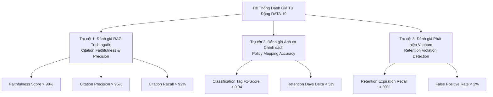
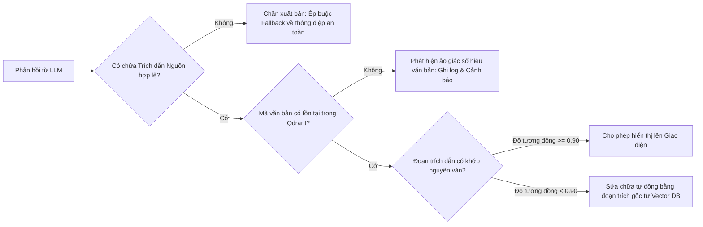
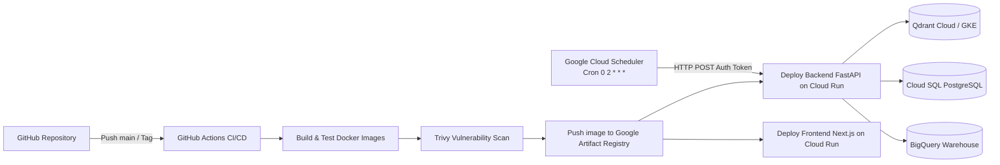
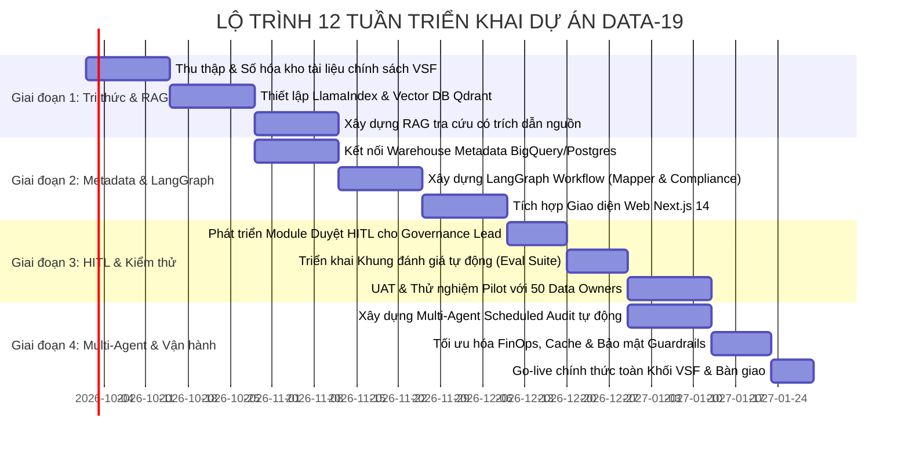

# ĐỀ TÀI DATA-19: AI AGENT TRỢ LÝ DATA GOVERNANCE & TRA CỨU CHÍNH SÁCH DỮ LIỆU
## EVALUATION, GOVERNANCE & DEPLOYMENT ROADMAP

---

## 1. KHUNG ĐÁNH GIÁ TỰ ĐỘNG CHUYÊN SÂU (AUTOMATED EVALUATION FRAMEWORK)

Một trong các tiêu chí then chốt của đề tài **DATA-19** là kiểm soát chặt chẽ độ tin cậy của mô hình, đảm bảo tính trung thực của trích dẫn và độ chính xác của việc ánh xạ chính sách dữ liệu.

Hệ thống xây dựng bộ công cụ đánh giá tự động (dựa trên chuẩn **Ragas** và **TruLens**), được chia thành 3 trụ cột đo lường độc lập:

### 1.1. Bộ chỉ số đánh giá RAG Tra cứu Chính sách có Trích dẫn (Citation RAG Metrics)

1. **Faithfulness (Độ trung thực - Chống bịa đặt):**
   - Định nghĩa: Tỷ lệ các khẳng định (claims) trong câu trả lời do LLM sinh ra có thể kiểm chứng trực tiếp từ ngữ cảnh trích xuất của văn bản quy chế.
   - Công thức:
     $$\text{Faithfulness} = \frac{|\text{Số nhận định suy ra được từ Context chính sách}|}{|\text{Tổng số nhận định trong câu trả lời}|}$$
   - Ngưỡng đạt: **$\ge 0.98$** (Tuyệt đối không suy diễn số điều khoản hoặc ngày hiệu lực).

2. **Citation Precision (Độ chính xác của trích dẫn):**
   - Đo lường mức độ chính xác của các trích dẫn (Số hiệu văn bản, Điều, Khoản, Số trang) so với vị trí thực tế của thông tin trong kho tài liệu gốc.
   - Ngưỡng đạt: **$\ge 0.95$**.

3. **Citation Recall (Độ đầy đủ của trích dẫn):**
   - Đảm bảo khi một câu trả lời đề cập đến nhiều quy định (ví dụ: vừa phân loại vừa lưu trữ), tất cả các văn bản liên quan đều được trích dẫn đầy đủ mà không bị bỏ sót.
   - Ngưỡng đạt: **$\ge 0.92$**.

### 1.2. Đánh giá Ánh xạ Chính sách cho Dataset (Policy Mapping Benchmark)
- **Tập dữ liệu chuẩn (Golden Test Dataset):** Xây dựng bộ test gồm 200 dataset mẫu điển hình tại các đơn vị thành viên (Vinhomes, Vinmec, VinFast...) được gán nhãn thủ công và phê duyệt bởi Hội đồng Data Governance Lead.
- **Tiêu chí chấm điểm:**
  - **F1-Score cho Nhãn phân loại:** Đạt $\ge 0.94$ đối với 4 nhãn (`PUBLIC`, `INTERNAL`, `CONFIDENTIAL`, `RESTRICTED`).
  - **Sai lệch Thời hạn lưu trữ ($\Delta \text{Retention}$):** Số ngày lưu trữ AI đề xuất phải trùng khớp 100% với khung thời gian quy định tại Quy chế tương ứng.

### 1.3. Đánh giá Khả năng Phát hiện Vi phạm Lưu trữ (Retention Violation Detection)
- Đo lường khả năng phát hiện các bảng vượt ngưỡng lưu trữ:
  $$\text{Recall} = \frac{\text{Số bảng vi phạm retention được phát hiện}}{\text{Tổng số bảng vi phạm thực tế trong DW}} \ge 99\%$$
- Tỷ lệ báo động giả (False Discovery Rate - FDR): $\le 2\%$, đảm bảo không làm phiền Data Owner với các cảnh báo sai.

---

## 2. KIỂM SOÁT AN TOÀN, CHỐNG ẢO GIÁC & QUẢN TRỊ BẢO MẬT (SAFETY & GUARDRAILS)

### 2.1. Lớp phòng vệ Guardrails đa tầng (NeMo Guardrails Architecture)
Trước khi câu trả lời được stream về phía người dùng, hệ thống chạy qua một lớp Guardrail kiểm tra nhanh:

### 2.2. Nguyên tắc An toàn Siêu dữ liệu (Metadata-Only Safety Principle)
- **Zero Raw Data Ingestion:** Hệ thống chỉ kết nối tới siêu dữ liệu (`INFORMATION_SCHEMA.TABLES`, `COLUMNS`, Partitioning metadata). Toàn bộ dữ liệu nghiệp vụ nhạy cảm của khách hàng nằm trong BigQuery không bao giờ bị AI Agent đọc trực tiếp, triệt tiêu rủi ro rò rỉ dữ liệu cá nhân (Data Leakage) sang các mô hình ngôn ngữ lớn.
- **Role-Based Access Control (RBAC):**
  - **Employee:** Chỉ có quyền tra cứu chính sách công khai và kiểm tra các dataset do tài khoản của mình sở hữu (`owner_email`).
  - **Governance Lead:** Toàn quyền truy cập bảng điều khiển kiểm toán tập đoàn, phê duyệt HITL, và cấu hình lịch quét.

---

## 3. TỐI ƯU CHI PHÍ FINOPS & HIỆU NĂNG RAG (PERFORMANCE OPTIMIZATION)

| Giải pháp tối ưu | Kỹ thuật áp dụng | Lợi ích mang lại |
| :--- | :--- | :--- |
| **Redis Semantic Caching** | Lưu vector câu hỏi với độ đo Cosine Similarity > 0.96. Nếu câu hỏi tương tự đã được trả lời, lấy trực tiếp kết quả đã lưu. | Giảm **45% chi phí gọi LLM API**, độ trễ giảm xuống còn **< 50ms**. |
| **Qdrant HNSW Optimization** | Cấu hình tham số `m=16`, `ef_construct=100`, kết hợp Scalar Quantization (nén vector từ FP32 xuống INT8). | Giảm **75% dung lượng RAM** trên Qdrant, tăng tốc độ truy vấn lên **300%**. |
| **Batch Scheduled Inference** | Tác vụ quét kiểm toán ban đêm gom các bảng theo cụm schema và chạy phân tích bất đồng bộ (async batching). | Tiết kiệm **60% token overhead** so với gọi đơn lẻ từng bảng. |
| **Context Compression** | Lược bỏ các phần văn bản hành chính không liên quan trong chunk trước khi truyền vào LLM context window. | Tiết kiệm **35% số lượng input token** trên mỗi request. |

---

## 4. KIẾN TRÚC TRIỂN KHAI GOOGLE CLOUD RUN & CI/CD PIPELINE

Hệ thống được đóng gói hoàn toàn dưới dạng Docker Container và triển khai tự động hóa thông qua CI/CD Pipeline:

### 4.1. Cấu hình Dịch vụ Google Cloud Run
- **Frontend Service (`vhm-gov-frontend`):**
  - Image: `asia-southeast1-docker.pkg.dev/vingroup-data/repo/frontend:latest`
  - Memory: 1 GiB, CPU: 1 vCPU, Min instances: 1, Max instances: 10.
  - Custom Domain: `https://governance.vsf.vingroup.net`.
- **Backend Service (`vhm-gov-backend`):**
  - Image: `asia-southeast1-docker.pkg.dev/vingroup-data/repo/backend:latest`
  - Memory: 4 GiB, CPU: 2 vCPU, Min instances: 1, Max instances: 20.
  - Concurrency: 40 requests/instance (tối ưu hóa cho async I/O và SSE streaming).

---

## 5. LỘ TRÌNH TRIỂN KHAI CHI TIẾT 12 TUẦN (IMPLEMENTATION ROADMAP)

### 5.1. Phân kỳ thực hiện theo từng Milestone

#### Giai đoạn 1: Nền tảng Tri thức & RAG Chính sách (Tuần 1 - Tuần 3)
- Thu thập toàn bộ các văn bản quy chế, quy chuẩn, thông tư về quản trị dữ liệu của VSF và Vingroup.
- Xây dựng pipeline phân tích văn bản phân cấp (Hierarchical Node Parser) và index lên Qdrant.
- Đạt mốc: Hoàn thiện tính năng hỏi đáp chính sách ngôn ngữ tự nhiên có trích dẫn điều khoản chính xác.

#### Giai đoạn 2: Tích hợp Siêu dữ liệu & LangGraph Core (Tuần 4 - Tuần 6)
- Kết nối API đọc schema và thông tin phân vùng của BigQuery và PostgreSQL Warehouse.
- Cài đặt LangGraph với các node chuyên biệt: `PolicyRetriever`, `DatasetMapper`, `ComplianceChecker`.
- Đạt mốc: Cho phép người dùng nhập tên dataset để nhận gợi ý gắn nhãn và cảnh báo vi phạm lưu trữ.

#### Giai đoạn 3: Cơ chế HITL & Khung Đánh giá Tự động (Tuần 7 - Tuần 9)
- Thiết lập giao diện hàng chờ phê duyệt cho `Governance Lead` với tính năng so sánh trước/sau khi gắn nhãn (Diff Viewer).
- Hoàn thiện luồng `interrupt_before` trong LangGraph, bảo đảm không nhãn nào được cập nhật nếu thiếu chữ ký số của Lead.
- Chạy thử nghiệm bộ Benchmark 200 Golden Test Cases để đo Faithfulness và Mapping Accuracy.

#### Giai đoạn 4: Multi-Agent Quét Lịch, FinOps & Go-Live (Tuần 10 - Tuần 12)
- Phát triển `Scheduled Compliance Audit Multi-Agent` tích hợp Cloud Scheduler để quét tự động toàn bộ 100% kho dữ liệu hàng đêm.
- Tự động sinh báo cáo PDF/Markdown gửi email cho lãnh đạo vào sáng thứ Hai hàng tuần.
- Tinh chỉnh hiệu năng bộ nhớ đệm Semantic Cache và hoàn thiện đóng gói triển khai trên Google Cloud Run.
- Bàn giao hệ thống cho Khối Dữ liệu tập trung (VSF).
