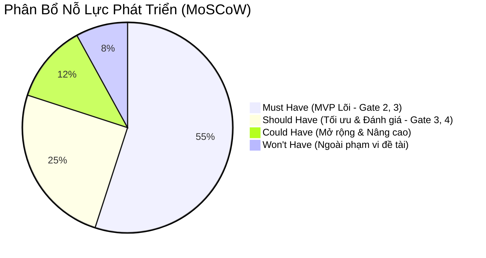
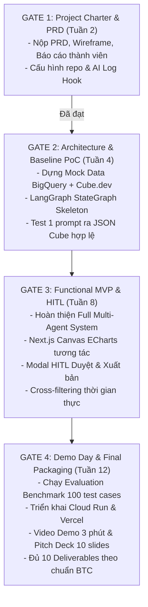

# 00. KẾ HOẠCH TRIỂN KHAI TỔNG THỂ (MASTER IMPLEMENTATION PLAN)
## ĐỀ TÀI DATA-16: AI AGENT TỰ SINH DASHBOARD TỪ NGÔN NGỮ TỰ NHIÊN
### Đội thi: P-117 | Khối nghiệp vụ: Khối Dữ Liệu Tập Trung (VSF) — Bất Động Sản (Vinhomes / Vingroup)

---

## 1. MỤC TIÊU DỰ ÁN & CHỈ SỐ THÀNH CÔNG CỐT LÕI (PROJECT GOALS & OKRs)

### 1.1. Tuyên ngôn Sứ mệnh Dự án (Project Mission)
Xây dựng một hệ thống **Autonomous Multi-Agent kết hợp Semantic Layer (Cube.dev)** cho phép các cấp quản lý và chuyên viên kinh doanh bất động sản Vinhomes gõ yêu cầu phân tích dữ liệu bằng tiếng Việt tự nhiên và nhận về một Dashboard tương tác hoàn chỉnh, bảo mật, chính xác 100% về mặt số học chỉ trong **dưới 60 giây**, loại bỏ hoàn toàn thời gian chờ 3 - 5 ngày truyền thống.

### 1.2. Mục tiêu Đo lường được (OKRs & Key Metrics)

| Mục tiêu (Objective) | Kết quả then chốt (Key Result - KR) | Chỉ số đo lường (Target Metric) |
| :--- | :--- | :--- |
| **O1: Tốc độ phản hồi vượt trội** | **KR 1.1:** Rút ngắn thời gian từ lúc gõ prompt đến khi nhận bản nháp Dashboard. | $\le 45\text{ giây}$ (P95 $\le 60\text{s}$) |
| | **KR 1.2:** Tốc độ tương tác lọc chéo (Cross-filtering) trên Dashboard. | $\le 1.0\text{ giây}$ |
| **O2: Tính chuẩn xác số học & Không ảo giác** | **KR 2.1:** Tỷ lệ truy vấn Cube.dev thực thi thành công ngay từ lượt đầu. | $\ge 95\%$ (Tự sửa lỗi đạt $\ge 99\%$) |
| | **KR 2.2:** Độ chính xác số học so với Ground Truth SQL của chuyên viên BI. | Đạt **100%** tuyệt đối |
| | **KR 2.3:** Tỷ lệ ảo giác số liệu trong văn bản tóm tắt Narrative Insight. | **0%** (Được kiểm tra bởi Hallucination Checker) |
| **O3: Chất lượng Trực quan hóa dữ liệu** | **KR 3.1:** Điểm phù hợp biểu đồ (Chart Suitability Score - CSS) theo Heuristic & LLM Judge. | $\ge 90 / 100\text{ điểm}$ |
| **O4: Tối ưu Chi phí & Bảo mật Doanh nghiệp** | **KR 4.1:** Tỷ lệ truy vấn được cache và tổng hợp trước qua Cube Pre-aggregations. | $\ge 80\%$ (Giảm tải quét Google BigQuery) |
| | **KR 4.2:** Độ tuân thủ phân quyền cấp dòng (Row-Level Security - RLS). | 100% người dùng không xem được dự án ngoài thẩm quyền |
| **O5: Hoàn thiện hồ sơ Demo Day** | **KR 5.1:** Hoàn thành đủ 10/10 Deliverables theo chuẩn VinUni AI20K. | Đạt chuẩn 10/10 Deliverables |

---

## 2. PHẠM VI SẢN PHẨM THEO PHƯƠNG PHÁP MOSCOW

### 2.1. Phân loại Tính năng chi tiết

* **MUST HAVE (Bắt buộc cho MVP — Hoàn thành tại Gate 2 & Gate 3):**
  1. Hộp thoại nhập prompt tiếng Việt chuyên ngành BĐS Vinhomes (dự án, phân khu, loại căn hộ, tiến độ cọc, doanh số, hoa hồng đại lý).
  2. Semantic Layer Cube.dev kết nối kho dữ liệu Google BigQuery, khóa cứng định nghĩa Measures và Dimensions.
  3. Đồ thị điều phối LangGraph với 3 Node chính: `intent_parser`, `cube_query_builder`, `chart_advisor`.
  4. Giao diện xem nháp (Draft Preview Canvas) hỗ trợ KPI Cards, Bar Chart, Line Chart qua Apache ECharts.
  5. Cơ chế Human-in-the-Loop (HITL) cho phép Builder xem xét giải trình metric và bấm nút "Duyệt & Xuất bản".
  6. Phân quyền RLS cơ bản theo vùng (Vùng 1 - Miền Bắc, Vùng 2 - Miền Nam).
  7. Tích hợp hook tự động ghi log AI về máy chủ Phoenix của VinUni.

* **SHOULD HAVE (Nên có để đạt điểm xuất sắc tại Gate 3 & Gate 4):**
  1. Thuật toán chấm điểm Heuristic Chart Suitability Score (CSS) tự động chọn dạng biểu đồ tối ưu theo phân bố dữ liệu.
  2. Agent sinh tóm tắt nhận xét kinh doanh (Narrative Insight) và phát hiện điểm bất thường (Anomaly Detection).
  3. Lọc chéo tương tác thời gian thực (Cross-filtering) khi nhấp chuột vào biểu đồ.
  4. Vòng lặp tự sửa lỗi truy vấn (Self-correction Loop) tối đa 3 lần khi Cube.dev báo lỗi cú pháp hoặc schema.
  5. Xuất bản dashboard thành báo cáo PDF chất lượng cao.
  6. Bộ benchmark tự động 50-100 test cases đo lường độ chính xác và độ trễ.

* **COULD HAVE (Tính năng nâng cao nếu còn thời gian ở Sprint 5-6):**
  1. Gợi ý thông minh câu hỏi tiếp theo (Follow-up suggestions) dựa trên ngữ cảnh dashboard vừa tạo.
  2. Lập lịch tự động gửi báo cáo qua Email / Slack Webhook hàng tuần.
  3. Phân quyền RBAC nâng cao kết nối dịch vụ Single Sign-On (OAuth2 / Google Workspace).

* **WON'T HAVE (Ranh giới loại trừ khỏi phạm vi nghiên cứu):**
  1. Cho phép LLM tự động sửa đổi cấu trúc bảng hoặc ghi dữ liệu ngược lại kho BigQuery.
  2. Mô hình học sâu dự báo chuỗi thời gian nhiều biến (Time-series deep learning training) — chỉ sử dụng các công thức tính xu hướng tăng trưởng (Growth rate / MoM / YoY) có sẵn trong Cube.dev.

---

## 3. LỘ TRÌNH 4 CỘT MỐC GATES (VINUNI AI20K MILESTONES)

### Chi tiết Tiêu chuẩn Nghiệm thu qua từng Gate

| Cột mốc | Thời hạn | Điều kiện cần để Vượt qua Gate (Gate Exit Criteria) | Người chịu trách nhiệm |
| :--- | :--- | :--- | :--- |
| **Gate 1** | Tuần 2 | • Hoàn thiện PRD, BRD, Wireframe, Kiến trúc sơ bộ. • Kích hoạt AI Log Hook trên repo P-117, log xuất hiện trên Phoenix. | Leader |
| **Gate 2** | Tuần 4 | • Thiết lập xong bảng Mock BigQuery (Fact Sales, Dim Project, Dim Agent). • Dựng xong Cube.dev kết nối BigQuery, truy vấn REST API trả kết quả chuẩn. • LangGraph chạy được luồng: Input Prompt tiếng Việt $\rightarrow$ Sinh Cube JSON hợp lệ $\rightarrow$ Trả kết quả số liệu thô. • Baseline unit test đạt $\ge 80\%$ code coverage. | Data Eng & Backend Dev |
| **Gate 3** | Tuần 8 | • Hoàn thiện Frontend Next.js 14 kết nối FastAPI qua SSE streaming. • Hiển thị được 3 loại widget: KPI Cards, Bar Chart, Line Chart với Apache ECharts. • Luồng HITL hoạt động mượt mà: Tạm dừng $\rightarrow$ Builder kiểm tra giải trình $\rightarrow$ Bấm Duyệt $\rightarrow$ Lưu DB PostgreSQL. • Tương tác Cross-filtering không lỗi giữa các widget. • Báo cáo tiến độ tuần liên tục trong `JOURNAL.md`. | Full Team |
| **Gate 4** (Demo Day) | Tuần 12 | • Bộ Benchmark Evaluation chạy trên 100 test cases đạt VER $\ge 98\%$, CSS $\ge 90/100$, 0% Hallucination. • Deploy Live URL hoàn chỉnh trên Google Cloud Run & Vercel. • Slide Pitch Deck thuyết trình 5 phút ấn tượng. • Video demo sản phẩm chất lượng cao (1080p, giọng đọc rõ ràng, thời lượng 3-5 phút). • Đầy đủ 10/10 Deliverables trên repo GitHub. | Full Team & Leader |

---

## 4. TỔNG QUAN 6 SPRINTS (LỘ TRÌNH 12 TUẦN)

| Sprint | Thời gian | Tên Sprint & Chủ đề | Sản phẩm chạy được ở cuối Sprint (Working Increment) |
| :---: | :---: | :--- | :--- |
| **Sprint 1** | Tuần 1 - 2 | **Foundation & Setup** | Repo P-117 chuẩn cấu hình; Kích hoạt AI Log; Thiết kế bộ dữ liệu mock BigQuery và sơ đồ lớp Cube.dev. *(Hoàn thành Gate 1)* |
| **Sprint 2** | Tuần 3 - 4 | **Semantic Layer & Baseline Agent** | Server Cube.dev chạy trên Docker kết nối BigQuery; LangGraph StateGraph tiếp nhận câu lệnh tiếng Việt sinh đúng cấu trúc Cube JSON. *(Hoàn thành Gate 2)* |
| **Sprint 3** | Tuần 5 - 6 | **Intelligence & Chart Advisor** | Agent Chart Advisor áp dụng bộ luật Data-to-Viz heuristic; Agent Narrative Insight sinh tóm tắt điểm sáng/tối; Vòng lặp Self-correction sửa lỗi query tự động. |
| **Sprint 4** | Tuần 7 - 8 | **Frontend Canvas & HITL Flow** | Giao diện Next.js 14 hiển thị ECharts/Recharts mượt mà; Modal HITL cho phép Builder xem giải trình metric và bấm duyệt; Kết nối SSE streaming hiển thị tiến độ AI. *(Hoàn thành Gate 3)* |
| **Sprint 5** | Tuần 9 - 10 | **Interactivity & Evaluation Benchmark** | Tính năng lọc chéo dữ liệu thời gian thực (Cross-filtering); Tinh chỉnh dashboard qua Chat Copilot; Xây dựng Ground Truth 100 test cases và chạy benchmark tự động. |
| **Sprint 6** | Tuần 11 - 12 | **Hardening, Cloud Deploy & Demo Day** | Đóng gói Docker, deploy Cloud Run & Vercel; Tối ưu FinOps cache và RLS; Quay video demo, làm slide pitch deck và hoàn tất 10 Deliverables. *(Hoàn thành Gate 4 / Demo Day)* |

---

## 5. TIÊU CHUẨN HOÀN THÀNH (DOD) VÀ SẴN SÀNG (DOR)

### 5.1. Tiêu chuẩn Sẵn sàng (Definition of Ready - DoR)
Một User Story hoặc Task chỉ được đưa vào Sprint Backlog khi:
1. Có mô tả nghiệp vụ rõ ràng, xác định rõ User Persona (Viewer hay Builder).
2. Có Tiêu chí chấp nhận (Acceptance Criteria - AC) có thể kiểm thử được bằng ví dụ cụ thể.
3. Các phụ thuộc kỹ thuật (Dependencies: schema bảng, API contract) đã được giải quyết hoặc phân công song song.
4. Đã được ước tính nỗ lực (Story Points) trong buổi Sprint Planning.

### 5.2. Tiêu chuẩn Hoàn thành (Definition of Done - DoD)
Một Task hoặc Tính năng chỉ được coi là hoàn thành (Done) khi:
1. **Code Quality:** Toàn bộ mã nguồn vượt qua linter `ruff check .` và `ruff format --check .` không còn lỗi hay cảnh báo.
2. **Automated Tests:** Vượt qua toàn bộ unit test và integration test (`pytest tests/`) với độ phủ mã nguồn (code coverage) tối thiểu **80%** cho các module cốt lõi (`agents/`, `services/`, `api/`).
3. **AI Log Compliance:** Các lần commit và push đều kích hoạt hook ghi nhận prompt thành công lên máy chủ Phoenix.
4. **Code Review:** Có ít nhất 1 thành viên trong đội duyệt Pull Request trên GitHub trước khi merge vào `develop`.
5. **Tài liệu hóa:** Cập nhật docstrings, chú thích kỹ thuật và ghi nhận tiến độ vào [`JOURNAL.md`](file:///Users/thai/Vinuni/BuildPhaseProject/cloneFromGitHub/P-117/JOURNAL.md) và [`WORKLOG.md`](file:///Users/thai/Vinuni/BuildPhaseProject/cloneFromGitHub/P-117/WORKLOG.md).

---

## 6. MA TRẬN QUẢN TRỊ RỦI RO & PHƯƠNG ÁN DỰ PHÒNG (RISK MATRIX)

| Mã rủi ro | Mô tả rủi ro | Xác suất | Tác động | Chiến lược giảm thiểu & Phương án ứng phó |
| :---: | :--- | :---: | :---: | :--- |
| **R-01** | **LLM sinh sai JSON Query hoặc sai tên Metric trong Cube** | Cao | Cao | **Giải pháp:** Thiết kế Self-Correction Loop trong LangGraph: Nếu Cube server trả về lỗi `Unknown measure`, Agent tự động bắt lỗi và thử lại tối đa 3 lần với prompt sửa lỗi. Nếu vẫn lỗi, chuyển câu hỏi sang trạng thái Disambiguation để hỏi lại người dùng. |
| **R-02** | **Ảo giác số liệu trong Narrative Insights** | Trung bình | Rất cao | **Giải pháp:** Xây dựng module `Hallucination Checker` đối soát toàn bộ số liệu dạng regex (`\d+`) trong đoạn văn bản với giá trị min/max/sum của tập DataFrame thực tế từ Cube trước khi hiển thị cho người dùng. |
| **R-03** | **Chi phí quét dữ liệu BigQuery vượt ngân sách (FinOps)** | Trung bình | Cao | **Giải pháp:** Cấu hình Cube Pre-aggregations lưu bảng tổng hợp sẵn vào Redis. Khóa cứng giới hạn `maximum_bytes_billed = 5 GB` trên mỗi truy vấn BigQuery. |
| **R-04** | **Độ trễ phản hồi của LLM vượt ngưỡng 60 giây** | Trung bình | Trung bình | **Giải pháp:** Sử dụng Server-Sent Events (SSE) để stream trạng thái tức thì từng node cho người dùng thấy giao diện không bị treo. Chuyển sang mô hình có độ trễ thấp như Claude 3.5 Sonnet / GPT-4o-mini cho các tác vụ phân loại đơn giản. |
| **R-05** | **Rò rỉ dữ liệu vùng miền giữa các tài khoản người dùng** | Thấp | Nghiêm trọng | **Giải pháp:** Khóa quyền từ tầng Semantic Layer bằng Cube Security Context JWT (RLS). Người dùng Vùng 1 bị ép cứng bộ lọc `dim_projects.region = 'MienBac'` trong mọi truy vấn SQL sinh ra. |
| **R-06** | **Thành viên quên bật hook AI Log dẫn đến mất điểm BTC** | Trung bình | Nghiêm trọng | **Giải pháp:** Cài đặt git pre-push hook bắt buộc kiểm tra biến môi trường `AI_LOG_API_KEY` trước khi cho phép đẩy code. Team Leader kiểm tra trang Phoenix hàng tuần. |

---

## 7. CHIẾN LƯỢC GIAO TIẾP & KÊNH THÔNG TIN DỰ ÁN

* **Kênh trao đổi hàng ngày:** Nhóm Telegram / Zalo nội bộ P-117 (phản hồi trong vòng $\le 2\text{ giờ}$ vào ban ngày).
* **Quản trị mã nguồn & Task Board:** GitHub Issues & Project Board tại repository chính thức `AI20K-Build-Phase-Cohort-4/P-117`.
* **Lưu trữ tài liệu & Báo cáo:** Thư mục `/Plan` và `docs/` trên repo `taiLieuDeTai1619`.
* **Họp định kỳ với Mentor VinUni:** Mỗi tuần 1 buổi (45 phút) để báo cáo tiến độ, xin tư vấn kiến trúc và giải đáp vướng mắc nghiệp vụ.
