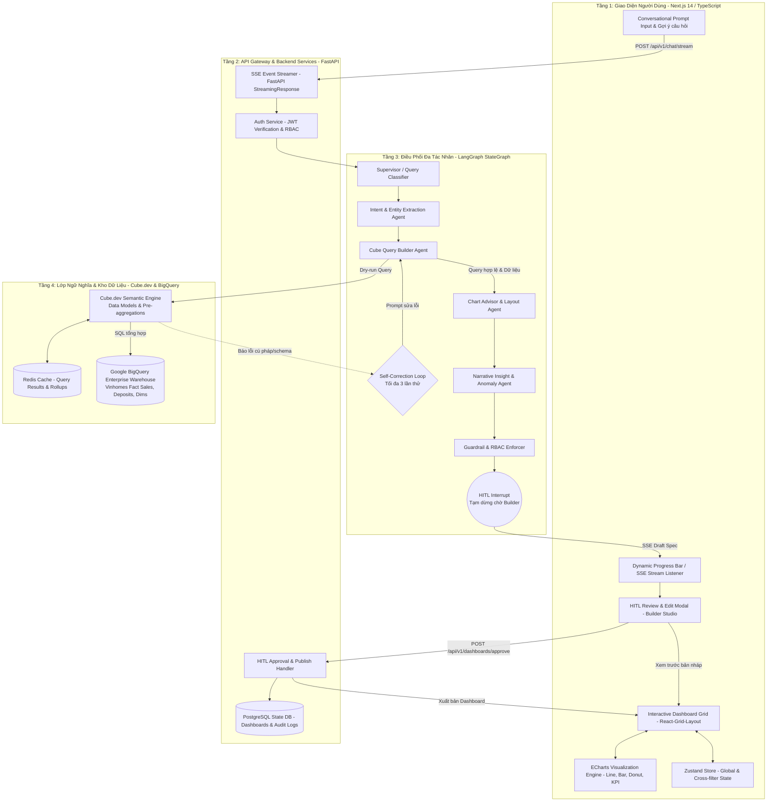

# 02. ĐẶC TẢ KIẾN TRÚC & THIẾT KẾ KỸ THUẬT CHI TIẾT
## ĐỀ TÀI DATA-16: AI AGENT TỰ SINH DASHBOARD TỪ NGÔN NGỮ TỰ NHIÊN
### Đội thi: P-117 | Chuẩn kiến trúc: Modern Data Stack & Multi-Agent Orchestration

---

## 1. SƠ ĐỒ KIẾN TRÚC TOÀN HỆ THỐNG (END-TO-END SYSTEM ARCHITECTURE)

Hệ thống tuân thủ mô hình 4 tầng tách biệt, đảm bảo tính mở rộng, bảo mật cao và chống ảo giác số liệu:



---

## 2. ĐẶC TẢ ĐỒ THỊ TRẠNG THÁI LANGGRAPH (LANGGRAPH STATEGRAPH SPECIFICATION)

### 2.1. Cấu trúc Trạng thái (Agent State Schema)

Mã nguồn định nghĩa trạng thái truyền qua các node trong `src/agents/state.py`:

```python
from typing import Annotated, Any, Dict, List, Literal, Optional
from pydantic import BaseModel, Field
from typing_extensions import TypedDict
import operator


class UserContext(BaseModel):
    user_id: str
    username: str
    role: Literal["Viewer", "Builder", "Admin"]
    region: str  # Ví dụ: "MienBac", "MienNam", "ToanQuoc"
    allowed_projects: List[str] = Field(default_factory=list)


class ExtractedEntity(BaseModel):
    projects: List[str] = Field(default_factory=list)
    zones: List[str] = Field(default_factory=list)
    metrics: List[str] = Field(default_factory=list)
    dimensions: List[str] = Field(default_factory=list)
    time_range: Optional[Dict[str, str]] = None
    granularity: Optional[Literal["day", "week", "month", "quarter", "year"]] = (
        None
    )


class WidgetSpec(BaseModel):
    widget_id: str
    title: str
    chart_type: Literal[
        "kpi_card", "line", "area", "bar", "horizontal_bar", "donut", "table"
    ]
    cube_query: Dict[str, Any]
    css_score: float = 100.0  # Chart Suitability Score (0-100)
    layout: Dict[str, int]  # {"x": 0, "y": 0, "w": 6, "h": 4}
    explanation: str  # Giải trình nguồn gốc dữ liệu và công thức metric


class DashboardSpec(BaseModel):
    dashboard_id: Optional[str] = None
    title: str
    description: str
    widgets: List[WidgetSpec] = Field(default_factory=list)
    narrative_insights: List[str] = Field(default_factory=list)
    created_by: str
    status: Literal["draft", "approved", "rejected", "published"] = "draft"


class AgentState(TypedDict):
    # Context đầu vào
    user_context: UserContext
    user_prompt: str
    conversation_history: Annotated[List[Dict[str, str]], operator.add]

    # Quá trình trích xuất & xử lý
    query_type: Literal["new_dashboard", "refine_dashboard", "clarify_intent"]
    extracted_entities: Optional[ExtractedEntity]

    # Tương tác với Cube.dev
    cube_queries: List[Dict[str, Any]]
    cube_results: Dict[str, Any]
    retry_count: int
    last_error_message: Optional[str]

    # Cấu hình đầu ra
    draft_dashboard: Optional[DashboardSpec]
    hitl_approved: bool

    # Log trạng thái phục vụ SSE
    execution_steps: Annotated[List[str], operator.add]
```

### 2.2. Hợp đồng Đầu vào/Đầu ra của từng Node trong LangGraph

| Tên Node | Chức năng chính | Đầu vào (Inputs) | Đầu ra (Outputs) |
| :--- | :--- | :--- | :--- |
| `route_intent` | Phân loại xem người dùng muốn tạo mới, sửa dashboard hay hỏi câu ngoài luồng. | `user_prompt`, `conversation_history` | `query_type` |
| `extract_entities` | Rút trích dự án, mốc thời gian, loại giao dịch, chỉ số đo lường từ tiếng Việt. | `user_prompt`, `user_context` | `extracted_entities` |
| `build_cube_query` | Ánh xạ thực thể sang mảng các Cube.dev JSON Queries hợp lệ. | `extracted_entities`, `retry_count` | `cube_queries` |
| `validate_cube_query`| Dry-run query lên Cube REST API. Nếu lỗi, kích hoạt tự sửa; nếu đúng, lưu kết quả. | `cube_queries` | `cube_results` hoặc `last_error_message` |
| `advise_charts` | Áp dụng Heuristic Heuristics CSS xác định dạng chart và lưới bố cục. | `cube_results`, `extracted_entities` | `List[WidgetSpec]` |
| `generate_insights` | Phân tích số liệu sinh 2-3 câu tóm tắt tiếng Việt và kiểm tra ảo giác số học. | `cube_results`, `widgets` | `narrative_insights` |
| `hitl_breakpoint` | Tạm dừng luồng (Interrupt), đóng gói bản nháp và chờ người dùng duyệt qua API. | Toàn bộ State hiện tại | Tạm dừng tiến trình |

---

## 3. ĐẶC TẢ GIAO DIỆN API BACKEND (FASTAPI SPECS)

### 3.1. Danh mục Endpoints chính

#### 1. Endpoint Stream Chat & Tạo Dashboard (SSE)
* **Phương thức & Đường dẫn:** `POST /api/v1/chat/stream`
* **Mô tả:** Tiếp nhận prompt từ người dùng, chạy qua LangGraph và stream từng bước suy nghĩ qua Server-Sent Events (SSE).
* **Payload đầu vào (JSON):**
```json
{
  "prompt": "So sánh doanh số thực tế và số lượng căn cọc của phân khu Sapphire và Ruby dự án Ocean Park trong Quý 3/2026",
  "conversation_id": "conv-869bd414-b85f-49f9",
  "current_dashboard_id": null
}
```
* **Dữ liệu Stream trả về (Event Stream SSE):**
```
event: step
data: {"step": "extract_entities", "message": "Đang nhận diện dự án Ocean Park, phân khu Sapphire/Ruby và mốc thời gian Quý 3/2026..."}

event: step
data: {"step": "validate_cube_query", "message": "Đang kiểm tra tính hợp lệ của chỉ số Doanh số và Số cọc trên Semantic Layer..."}

event: draft_ready
data: {
  "dashboard_id": "dash-temp-9921",
  "title": "Phân tích Doanh số & Cọc Sapphire - Ruby Ocean Park Q3/2026",
  "widgets": [ ... danh sách WidgetSpec ... ],
  "narrative_insights": [
    "Doanh số phân khu Sapphire đạt 840 tỷ VNĐ, gấp 1.45 lần phân khu Ruby trong Quý 3.",
    "Tỷ lệ chuyển đổi từ cọc sang hợp đồng mua bán của toàn dự án đạt 81.2%."
  ],
  "requires_hitl_approval": true
}
```

#### 2. Endpoint Phê duyệt và Xuất bản Dashboard (HITL Approval)
* **Phương thức & Đường dẫn:** `POST /api/v1/dashboards/approve`
* **Payload đầu vào:**
```json
{
  "dashboard_id": "dash-temp-9921",
  "approved_widgets": [ ... danh sách widget sau khi Builder có thể đã đổi loại chart ... ],
  "action": "publish",
  "comment": "Đã kiểm tra số liệu khớp với báo cáo kế toán."
}
```
* **Kết quả trả về (200 OK):**
```json
{
  "status": "success",
  "permanent_dashboard_id": "dash-prod-1048",
  "published_at": "2026-09-21T18:30:00Z",
  "viewer_url": "https://bi.vinhomes.vn/dashboards/dash-prod-1048"
}
```

#### 3. Endpoint Lấy Dữ liệu cho Widget theo Bộ lọc chéo (Cross-filtering Data Fetch)
* **Phương thức & Đường dẫn:** `POST /api/v1/analytics/query`
* **Mô tả:** Gọi trực tiếp vào Cube Server khi người dùng click tương tác trên dashboard để lọc dữ liệu cực nhanh ($\le 500\text{ms}$).
* **Payload:**
```json
{
  "cube_query": {
    "measures": ["SalesTransactions.totalAmount"],
    "dimensions": ["SalesTransactions.transactionDate"],
    "timeDimensions": [{
      "dimension": "SalesTransactions.transactionDate",
      "granularity": "week",
      "dateRange": ["2026-07-01", "2026-09-30"]
    }],
    "filters": [
      {
        "member": "Projects.zoneName",
        "operator": "equals",
        "values": ["Sapphire 1"]
      }
    ]
  }
}
```

---

## 4. THIẾT KẾ CƠ SỞ DỮ LIỆU LƯU TRỮ (POSTGRESQL SCHEMA)

Hệ thống sử dụng PostgreSQL để quản lý trạng thái phiên làm việc, lịch sử dashboard đã duyệt và ghi vết kiểm toán (Audit Trail):

```sql
-- 1. Bảng quản lý Dashboard
CREATE TABLE dashboards (
    dashboard_id VARCHAR(64) PRIMARY KEY,
    title VARCHAR(255) NOT NULL,
    description TEXT,
    created_by VARCHAR(64) NOT NULL,
    status VARCHAR(32) NOT NULL DEFAULT 'draft', -- 'draft', 'published', 'archived'
    version INT NOT NULL DEFAULT 1,
    narrative_insights JSONB,
    created_at TIMESTAMP WITH TIME ZONE DEFAULT CURRENT_TIMESTAMP,
    updated_at TIMESTAMP WITH TIME ZONE DEFAULT CURRENT_TIMESTAMP
);

-- 2. Bảng quản lý Widgets bên trong Dashboard
CREATE TABLE dashboard_widgets (
    widget_id VARCHAR(64) PRIMARY KEY,
    dashboard_id VARCHAR(64) REFERENCES dashboards(dashboard_id) ON DELETE CASCADE,
    title VARCHAR(255) NOT NULL,
    chart_type VARCHAR(32) NOT NULL, -- 'kpi_card', 'line', 'bar', 'horizontal_bar', 'donut'
    cube_query JSONB NOT NULL,
    layout_position JSONB NOT NULL, -- {"x": 0, "y": 0, "w": 6, "h": 4}
    css_score NUMERIC(5, 2),
    metric_explanation TEXT,
    created_at TIMESTAMP WITH TIME ZONE DEFAULT CURRENT_TIMESTAMP
);

-- 3. Bảng Kiểm toán Bất biến (Audit Event Logs)
CREATE TABLE audit_event_logs (
    log_id BIGSERIAL PRIMARY KEY,
    user_id VARCHAR(64) NOT NULL,
    username VARCHAR(128) NOT NULL,
    action_type VARCHAR(64) NOT NULL, -- 'PROMPT_INPUT', 'DRAFT_GENERATED', 'HITL_APPROVED', 'DASHBOARD_EXPORTED'
    dashboard_id VARCHAR(64),
    raw_prompt TEXT,
    executed_cube_query JSONB,
    ip_address VARCHAR(45),
    event_timestamp TIMESTAMP WITH TIME ZONE DEFAULT CURRENT_TIMESTAMP
);

CREATE INDEX idx_dashboards_created_by ON dashboards(created_by);
CREATE INDEX idx_audit_user ON audit_event_logs(user_id);
CREATE INDEX idx_audit_timestamp ON audit_event_logs(event_timestamp);
```

---

## 5. ĐẶC TẢ KIẾN TRÚC FRONTEND (NEXT.JS 14 & ZUSTAND)

### 5.1. Cấu trúc Thư mục Frontend
```
frontend/
├── app/
│   ├── layout.tsx              # Root Layout, Theme Provider, Inter Font
│   ├── page.tsx                # Trang chủ: Conversational Chat Canvas
│   ├── studio/                 # Builder Studio: Xem nháp & HITL Review
│   │   └── page.tsx
│   └── dashboards/             # Viewer Executive Dashboards
│       └── [id]/page.tsx
├── components/
│   ├── chat/
│   │   ├── PromptInput.tsx     # Khung gõ câu hỏi & nút Gợi ý câu hỏi nhanh
│   │   └── AgentProgress.tsx   # Thanh hiển thị tiến trình suy nghĩ của AI (SSE)
│   ├── dashboard/
│   │   ├── DashboardCanvas.tsx # React-Grid-Layout chứa các Widget
│   │   ├── WidgetContainer.tsx # Khung widget có tiêu đề, nút giải trình & đổi chart
│   │   └── FilterBar.tsx       # Bộ lọc toàn cục (Dự án, Thời gian, Vùng)
│   ├── charts/
│   │   ├── EChartsRenderer.tsx # Wrapper tối ưu cho Apache ECharts
│   │   ├── KpiCard.tsx         # Widget hiển thị số liệu lớn + % tăng trưởng
│   │   └── InsightBanner.tsx   # Hộp tóm tắt nhận xét kinh doanh
│   └── hitl/
│       └── ReviewModal.tsx     # Modal xác nhận duyệt, xem giải trình công thức
├── store/
│   └── useFilterStore.ts       # Zustand Store quản lý Active Filter & Cross-filter
└── lib/
    ├── api.ts                  # Axios / Fetch client kết nối FastAPI
    └── chartOptions.ts         # Hàm chuyển đổi dữ liệu Cube sang ECharts Option
```

### 5.2. Quản lý Bộ lọc Chéo Thời gian thực (Cross-filtering State with Zustand)
```typescript
import { create } from 'zustand';

interface FilterState {
  globalFilters: {
    projectId?: string;
    dateRange?: [string, string];
    region?: string;
  };
  crossFilter: {
    activeDimension?: string; // Ví dụ: "Projects.zoneName"
    selectedValue?: string;    // Ví dụ: "Sapphire 1"
  } | null;
  setGlobalFilter: (key: string, value: any) => void;
  setCrossFilter: (dimension: string, value: string) => void;
  clearCrossFilter: () => void;
}

export const useFilterStore = create<FilterState>((set) => ({
  globalFilters: {},
  crossFilter: null,
  setGlobalFilter: (key, value) =>
    set((state) => ({ globalFilters: { ...state.globalFilters, [key]: value } })),
  setCrossFilter: (dimension, value) =>
    set({ crossFilter: { activeDimension: dimension, selectedValue: value } }),
  clearCrossFilter: () => set({ crossFilter: null }),
}));
```
Khi người dùng click vào một phần tử trên biểu đồ ECharts:
```typescript
chartInstance.on('click', (params) => {
  const clickedName = params.name;
  useFilterStore.getState().setCrossFilter('Projects.zoneName', clickedName);
});
```
Toàn bộ các Widget khác lắng nghe `crossFilter` và tự động re-fetch dữ liệu tương ứng chỉ trong $\le 500\text{ms}$.
