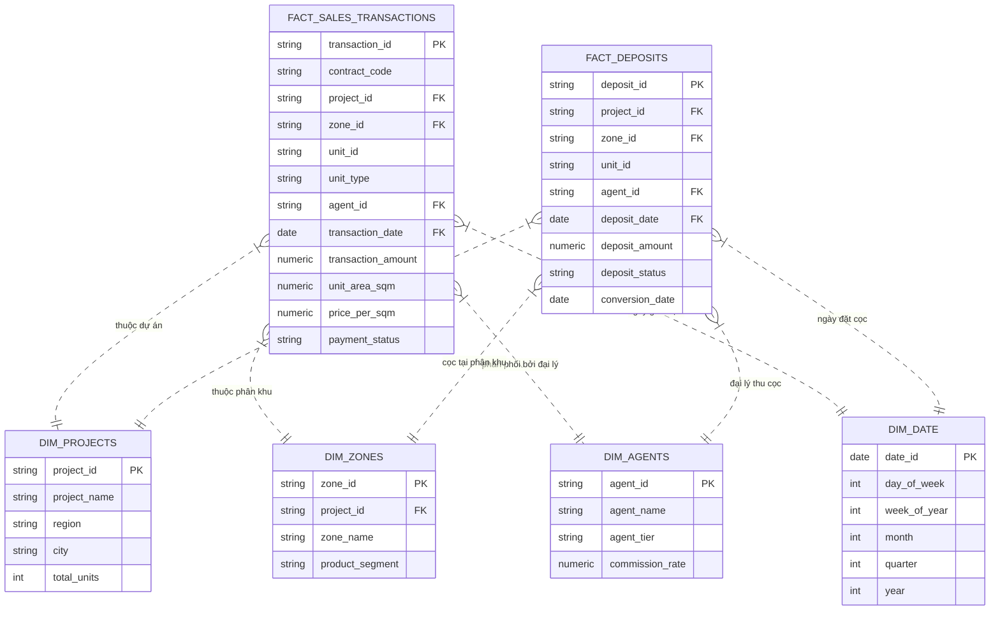

# 03. KẾ HOẠCH DỮ LIỆU & XÂY DỰNG SEMANTIC LAYER (CUBE.DEV)
## ĐỀ TÀI DATA-16: AI AGENT TỰ SINH DASHBOARD TỪ NGÔN NGỮ TỰ NHIÊN
### Đội thi: P-117 | Module: Google BigQuery Warehouse & Cube.dev Semantic Modeling

---

## 1. THIẾT KẾ KHO DỮ LIỆU MOCK TRÊN GOOGLE BIGQUERY (DATA WAREHOUSE DESIGN)

Để phục vụ bài toán đặc thù của Doanh nghiệp Bất động sản (Vinhomes / VSF), hệ thống thiết lập mô hình dữ liệu hình sao (Star Schema) tối ưu cho phân tích OLAP với 2 bảng Fact và 4 bảng Dimension.



### 1.1. Chi tiết Lược đồ Bảng (Table Schemas)

#### 1. Bảng `fact_sales_transactions` (Giao dịch Hợp đồng Mua bán chính thức)
* **Phân vùng (Partitioning):** Theo cột ngày `transaction_date` (Partition by DAY) để tối ưu chi phí quét BigQuery.
* **Cụm hóa (Clustering):** Theo `project_id, zone_id` để tăng tốc độ lọc theo dự án.

| Tên cột | Kiểu dữ liệu | Ràng buộc | Mô tả nghiệp vụ |
| :--- | :--- | :--- | :--- |
| `transaction_id` | STRING | PRIMARY KEY | Định danh duy nhất của giao dịch thành công. |
| `contract_code` | STRING | NOT NULL | Số hợp đồng mua bán chính thức (HĐMB). |
| `project_id` | STRING | NOT NULL | Khóa ngoại trỏ sang bảng `dim_projects`. |
| `zone_id` | STRING | NOT NULL | Khóa ngoại trỏ sang bảng `dim_zones` (ví dụ: Sapphire 1, Ruby 2). |
| `unit_id` | STRING | NOT NULL | Mã căn hộ/biệt thự (ví dụ: S1.02-12A08). |
| `unit_type` | STRING | NOT NULL | Loại hình: `Studio`, `1PN+1`, `2PN`, `3PN`, `Shophouse`, `Villa`. |
| `agent_id` | STRING | NOT NULL | Khóa ngoại đại lý phân phối (sàn F1, F2). |
| `transaction_date`| DATE | NOT NULL | Ngày ký hợp đồng và ghi nhận doanh thu. |
| `transaction_amount`| NUMERIC | NOT NULL | Giá trị hợp đồng chưa VAT (Đơn vị: VNĐ). |
| `unit_area_sqm` | NUMERIC | NOT NULL | Diện tích thông thủy (m2). |
| `price_per_sqm` | NUMERIC | NOT NULL | Đơn giá trên mỗi m2 thông thủy (VNĐ/m2). |
| `payment_status` | STRING | NOT NULL | Trạng thái: `Fully_Paid`, `Installment`, `Bank_Loan`. |

#### 2. Bảng `fact_deposits` (Hồ sơ Đặt cọc giữ chỗ & Tỷ lệ hấp thụ)
* **Phân vùng:** `deposit_date` (DAY).
* **Cụm hóa:** `project_id, deposit_status`.

| Tên cột | Kiểu dữ liệu | Ràng buộc | Mô tả nghiệp vụ |
| :--- | :--- | :--- | :--- |
| `deposit_id` | STRING | PRIMARY KEY | Mã biên bản đặt cọc. |
| `project_id` | STRING | NOT NULL | Dự án đặt cọc. |
| `zone_id` | STRING | NOT NULL | Phân khu đặt cọc. |
| `agent_id` | STRING | NOT NULL | Đại lý nhận cọc. |
| `deposit_date` | DATE | NOT NULL | Ngày vào tiền cọc (thường là 50 - 100 triệu VNĐ/căn). |
| `deposit_amount` | NUMERIC | NOT NULL | Số tiền cọc đã nộp vào tài khoản chủ đầu tư. |
| `deposit_status` | STRING | NOT NULL | Trạng thái: `Converted_To_Contract`, `Cancelled`, `Pending`. |
| `conversion_date`| DATE | NULLABLE | Ngày chuyển đổi thành công sang HĐMB (nếu có). |

#### 3. Bảng `dim_projects` & `dim_zones`
* Chứa danh sách các đại đô thị tiêu biểu của Vinhomes:
  * **Ocean Park 1, 2, 3** (Miền Bắc — Hà Nội, Hưng Yên)
  * **Grand Park** (Miền Nam — TP. Hồ Chí Minh)
  * **Smart City** (Miền Bắc — Hà Nội)
  * **Vũ Yên - Royal Island** (Miền Bắc — Hải Phòng)

---

## 2. KỊCH BẢN SINH DỮ LIỆU MOCK (MOCK DATA GENERATION PLAN)

* **Quy mô dữ liệu:** Tạo tối thiểu **50,000 dòng** giao dịch bán và **70,000 dòng** đặt cọc trải dài từ `2025-01-01` đến `2026-09-30`.
* **Kỹ thuật sinh dữ liệu:** Viết script Python `scripts/generate_mock_data.py` sử dụng thư viện `Faker`, `NumPy` và phân phối xác suất thực tế:
  * **Tính mùa vụ (Seasonality):** Doanh số tăng đột biến vào các tuần mở bán (Launch Weekends) và tháng cuối quý.
  * **Tỷ lệ chuyển đổi cọc (Conversion Funnel):** Trung bình $75 - 85\%$ số lượng cọc sẽ chuyển đổi thành HĐMB thành công; $10 - 15\%$ hủy cọc hoàn tiền; $5\%$ đang xử lý hồ sơ vay vốn ngân hàng.
  * **Phân cấp đại lý:** Đại lý F1 bán được $65\%$ thị phần với tỷ lệ hoa hồng $2.5\%$; Đại lý F2 bán được $35\%$ thị phần với tỷ lệ hoa hồng $3.2\%$.
* **Nạp dữ liệu:** Tự động nạp trực tiếp vào dataset `vinhomes_sales_dw` trên Google BigQuery thông qua BigQuery Client SDK.

---

## 3. THIẾT KẾ SEMANTIC DATA MODELS TRÊN CUBE.DEV

Semantic Layer hoạt động như một "Bức tường lửa ngữ nghĩa" (Semantic Guardrail) ngăn cách tuyệt đối giữa Agent và Cơ sở dữ liệu thô. Mọi công thức nghiệp vụ được khóa cứng bằng code:

### 3.1. Model `SalesTransactions.js`
```javascript
cube(`SalesTransactions`, {
  sql: `SELECT * FROM \`vinhomes_sales_dw.fact_sales_transactions\``,

  joins: {
    Projects: {
      sql: `${CUBE}.project_id = ${Projects.projectId}`,
      relationship: `belongsTo`
    },
    Agents: {
      sql: `${CUBE}.agent_id = ${Agents.agentId}`,
      relationship: `belongsTo`
    }
  },

  measures: {
    // 1. Tổng doanh số thực tế
    totalRevenue: {
      type: `sum`,
      sql: `${CUBE}.transaction_amount`,
      format: `currency`,
      title: `Tổng Doanh Số (VNĐ)`
    },

    // 2. Số lượng hợp đồng mua bán đã ký
    transactionCount: {
      type: `count`,
      title: `Số Lượng Giao Dịch Thành Công`
    },

    // 3. Đơn giá trung bình trên mỗi m2
    avgPricePerSqm: {
      type: `avg`,
      sql: `${CUBE}.price_per_sqm`,
      format: `currency`,
      title: `Đơn Giá Trung Bình (VNĐ/m2)`
    },

    // 4. Doanh số trung bình mỗi căn
    avgTicketSize: {
      type: `number`,
      sql: `${totalRevenue} / NULLIF(${transactionCount}, 0)`,
      format: `currency`,
      title: `Giá Trị Trung Bình Mỗi Căn (VNĐ)`
    }
  },

  dimensions: {
    transactionId: {
      sql: `${CUBE}.transaction_id`,
      type: `string`,
      primaryKey: true
    },

    unitType: {
      sql: `${CUBE}.unit_type`,
      type: `string`,
      title: `Loại Hình Căn Hộ`
    },

    transactionDate: {
      sql: `${CUBE}.transaction_date`,
      type: `time`,
      title: `Ngày Giao Dịch`
    }
  },

  // Tối ưu FinOps với Pre-aggregations Rollup
  preAggregations: {
    salesMonthlyRollup: {
      measures: [totalRevenue, transactionCount],
      dimensions: [Projects.projectName, Projects.region, unitType],
      timeDimension: transactionDate,
      granularity: `month`,
      partitionGranularity: `month`,
      refreshKey: {
        every: `1 hour`
      }
    }
  }
});
```

### 3.2. Model `Deposits.js` & Chỉ số Tỷ lệ Hấp thụ (Absorption Rate)
```javascript
cube(`Deposits`, {
  sql: `SELECT * FROM \`vinhomes_sales_dw.fact_deposits\``,

  joins: {
    Projects: {
      sql: `${CUBE}.project_id = ${Projects.projectId}`,
      relationship: `belongsTo`
    }
  },

  measures: {
    // Tổng số lượng cọc đã vào tiền
    totalDeposits: {
      type: `count`,
      title: `Tổng Số Căn Đặt Cọc`
    },

    // Số cọc đã chuyển thành hợp đồng
    convertedDeposits: {
      type: `count`,
      filters: [{ sql: `${CUBE}.deposit_status = 'Converted_To_Contract'` }],
      title: `Số Cọc Chuyển Thành HĐMB`
    },

    // Tỷ lệ chuyển đổi cọc thành HĐMB (%)
    conversionRate: {
      type: `number`,
      sql: `100.0 * ${convertedDeposits} / NULLIF(${totalDeposits}, 0)`,
      format: `percent`,
      title: `Tỷ Lệ Vào Hợp Đồng (%)`
    }
  },

  dimensions: {
    depositDate: {
      sql: `${CUBE}.deposit_date`,
      type: `time`
    },
    depositStatus: {
      sql: `${CUBE}.deposit_status`,
      type: `string`
    }
  }
});
```

---

## 4. PHÂN QUYỀN CẤP DÒNG (ROW-LEVEL SECURITY - RLS) TRONG CUBE.DEV

Để đảm bảo Giám đốc Kinh doanh Vùng 1 (Miền Bắc) không thể xem trộm số liệu Vùng 2 (Miền Nam) dù cố tình gõ câu hỏi thao túng prompt, Cube.dev được cấu hình ép bộ lọc theo ngữ cảnh `SECURITY_CONTEXT`:

```javascript
// cube.js (Cấu hình máy chủ Cube)
module.exports = {
  queryRewrite: (query, { securityContext }) => {
    // Nếu người dùng không phải Admin toàn quyền, bắt buộc lọc theo vùng
    if (securityContext.role !== 'Admin' && securityContext.region) {
      query.filters = query.filters || [];
      query.filters.push({
        member: 'Projects.region',
        operator: 'equals',
        values: [securityContext.region]
      });
    }

    // Nếu người dùng chỉ được phân quyền trên một số dự án cụ thể
    if (securityContext.allowed_projects && securityContext.allowed_projects.length > 0) {
      query.filters = query.filters || [];
      query.filters.push({
        member: 'Projects.projectName',
        operator: 'equals',
        values: securityContext.allowed_projects
      });
    }

    return query;
  }
};
```

---

## 5. CHIẾN LƯỢC TỐI ƯU CHI PHÍ FINOPS (COST CONTROL & PERFORMANCE)

1. **Bộ đệm Cube Pre-aggregations Rollup (Tầng 1):**
   - Các câu hỏi phổ biến dạng xu hướng (theo tuần/tháng/quý) được tính sẵn và lưu tại Redis.
   - Giảm **$\ge 80\%$** số lượng truy vấn phải chạm vào BigQuery, đưa thời gian phản hồi về dưới $300\text{ms}$.
2. **Ép Buộc Chiều Thời Gian (Partition Enforcer — Tầng 2):**
   - Trong `SalesTransactions.js`, mọi truy vấn bắt buộc phải có `timeDimensions`. Nếu Agent sinh câu hỏi không có khoảng thời gian, Cube Server lập tức từ chối thực thi và yêu cầu xác định mốc thời gian.
3. **Giới hạn Dung lượng Quét BigQuery Billed Bytes (Tầng 3):**
   - Cấu hình biến môi trường kết nối BigQuery:
     `CUBEJS_DB_BQ_MAX_BYTES_BILLED=5368709120` ($5\text{ GB}$).
   - Bất kỳ truy vấn nào dự kiến quét vượt quá 5GB sẽ tự động bị ngắt (abort), ngăn chặn rủi ro chi phí điện toán đám mây.
