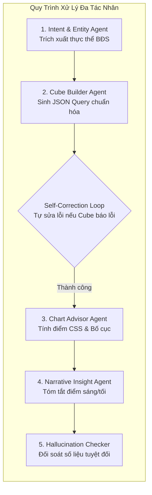
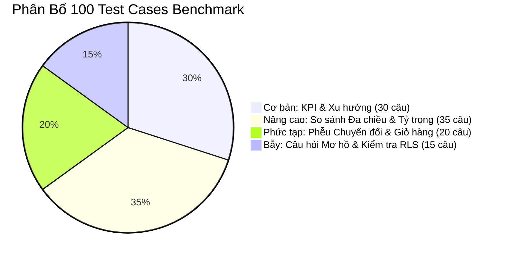

# 04. KẾ HOẠCH PHÁT TRIỂN AI AGENT & BỘ ĐO ĐÁNH GIÁ (EVAL BENCHMARK)
## ĐỀ TÀI DATA-16: AI AGENT TỰ SINH DASHBOARD TỪ NGÔN NGỮ TỰ NHIÊN
### Đội thi: P-117 | Module: LangGraph Multi-Agent & Evaluation Benchmark Suite

---

## 1. THIẾT KẾ CÁC AGENT CHUYÊN TRÁCH TRONG LANGGRAPH



### 1.1. Agent 1: Intent & Entity Extraction Agent
* **Vai trò:** Tiếp nhận câu hỏi tiếng Việt tự nhiên của người dùng, phân tích ngữ cảnh và bóc tách các thực thể BĐS Vinhomes.
* **Cấu trúc System Prompt:**
```text
Bạn là Trợ lý AI Phân tích Dữ liệu Chuyên nghiệp cho Khối Kinh doanh Bất động sản Vinhomes.
Nhiệm vụ của bạn là trích xuất chính xác các thực thể nghiệp vụ từ yêu cầu của người dùng sang cấu trúc JSON:
1. projects: Danh sách dự án (ví dụ: "Ocean Park 1", "Ocean Park 2", "Grand Park", "Smart City").
2. zones: Danh sách phân khu (ví dụ: "Sapphire 1", "The Beverly", "The Rainbow", "Ruby").
3. metrics: Các chỉ số người dùng quan tâm (ví dụ: "doanh_so", "so_can_coc", "ty_le_vao_hop_dong", "don_gia_m2").
4. dimensions: Chiều phân tích (ví dụ: "theo_thoi_gian", "theo_phan_khu", "theo_dai_ly", "theo_loai_can").
5. time_range: Khoảng thời gian (start_date, end_date) và granularity ("day", "week", "month", "quarter", "year").

Nếu câu hỏi quá mơ hồ (ví dụ: chỉ gõ "cho xem báo cáo"), hãy đặt query_type = "clarify_intent" và đưa ra câu hỏi gợi ý làm rõ.
```

### 1.2. Agent 2: Cube Query Builder Agent & Self-Correction Loop
* **Vai trò:** Ánh xạ thực thể nghiệp vụ thành payload Cube.dev JSON Queries hợp lệ dựa trên Semantic Data Models. Tuyệt đối không sinh mã SQL thô.
* **Quy trình Tự sửa lỗi (Self-Correction Loop):**
  1. Agent sinh JSON query lần 1.
  2. Hệ thống gọi phương thức Dry-run lên Cube REST API (`/cubejs-api/v1/dry-run`).
  3. Nếu Cube trả về HTTP 200 $\rightarrow$ Chuyển tiếp sang Chart Advisor.
  4. Nếu Cube báo lỗi (ví dụ: `Unknown measure: SalesTransactions.revenue` do sai tên trường) $\rightarrow$ Đưa thông báo lỗi của Cube vào ngữ cảnh và yêu cầu LLM sửa lại.
  5. Cho phép thử lại tối đa **3 lần** trước khi báo lỗi cho người dùng.

```python
async def validate_and_correct_cube_query(state: AgentState) -> AgentState:
    max_retries = 3
    for attempt in range(state["retry_count"], max_retries):
        dry_run_res = await cube_client.dry_run(state["cube_queries"])
        if dry_run_res.is_success:
            state["cube_results"] = dry_run_res.data
            return state
        # Bắt lỗi schema và đưa vào context cho lần sửa tiếp theo
        state["retry_count"] += 1
        state["last_error_message"] = dry_run_res.error_message
        state["cube_queries"] = await llm_fix_query(
            state["cube_queries"], dry_run_res.error_message
        )
    return state
```

### 1.3. Agent 3: Chart Advisor Agent & Heuristic CSS Engine
* **Vai trò:** Xác định loại biểu đồ tối ưu nhất cho từng tập dữ liệu kết quả dựa trên bộ quy tắc Heuristic chuẩn Data-to-Viz.
* **Bộ quy tắc Heuristic cốt lõi:**
  1. **Chuỗi thời gian liên tục (Continuous Time):**
     * Có $\ge 5$ mốc thời gian $\rightarrow$ Ưu tiên **Line Chart** hoặc **Area Chart** để quan sát xu hướng tăng giảm.
  2. **So sánh tỷ trọng hạng mục (Part-to-Whole):**
     * Số lượng hạng mục $\le 5$ phần tử $\rightarrow$ Ưu tiên **Donut Chart** có hiển thị nhãn %.
     * Số lượng hạng mục $> 5$ phần tử $\rightarrow$ Tuyệt đối không dùng Pie/Donut; tự động chuyển sang **Horizontal Bar Chart** (Cột ngang) có sắp xếp giảm dần.
  3. **So sánh giữa nhiều phân khu / đại lý (> 7 mục):**
     * Sử dụng **Horizontal Bar Chart** để tránh bị chéo nhãn chữ và dễ so sánh thứ hạng.
  4. **Chỉ số tổng quan đơn lẻ (Single Aggregate Value):**
     * Sử dụng **KPI Card** kèm theo tỷ lệ tăng trưởng so với kỳ trước (MoM / YoY).

### 1.4. Agent 4: Narrative Insight Agent & Hallucination Checker
* **Vai trò:** Viết 2 - 3 câu bình luận kinh doanh súc tích bằng tiếng Việt tự nhiên làm nổi bật các điểm sáng (Top performers) hoặc điểm nghẽn (Bottlenecks).
* **Cơ chế Chống ảo giác (Hallucination Checker Guardrail):**
  * Toàn bộ các con số định lượng trong đoạn văn tóm tắt được trích xuất bằng biểu thức chính quy (Regex).
  * Đối chiếu từng con số với tập giá trị thực tế trong DataFrame:
    $$\forall n \in \text{ExtractedNumbers(InsightText)}, \quad n \in \text{ToleranceRange}(\text{ActualData}) \pm 1\%$$
  * Nếu phát hiện bất kỳ con số nào không tồn tại trong kết quả truy vấn, hệ thống lập tức hủy bỏ đoạn văn và sinh lại bản tóm tắt mới theo template định sẵn, đảm bảo **0% Hallucination**.

---

## 2. KẾ HOẠCH BỘ DỮ LIỆU KIỂM THỬ GROUND TRUTH (BENCHMARK 100 TEST CASES)

Hệ thống xây dựng bộ dữ liệu benchmark chuẩn hóa gồm **100 câu hỏi tiếng Việt** chuyên ngành Bất động sản Vinhomes tại file `eval/data/ground_truth_100.json`.



### 2.1. Phân loại 4 nhóm câu hỏi kiểm thử

1. **Nhóm 1: Câu hỏi cơ bản về KPIs và Xu hướng (30 test cases):**
   * *Ví dụ:* "Tổng doanh số bán hàng của dự án Ocean Park 1 trong tháng 8/2026 là bao nhiêu?"
   * *Kỳ vọng:* 1 KPI Card + 1 Line Chart xu hướng theo ngày.
2. **Nhóm 2: So sánh đa chiều và cơ cấu tỷ trọng (35 test cases):**
   * *Ví dụ:* "So sánh doanh số của các phân khu tại Grand Park trong Quý 2/2026 và tỷ trọng nguồn khách giữa đại lý F1 và F2."
   * *Kỳ vọng:* 1 Horizontal Bar Chart phân khu + 1 Donut Chart cơ cấu đại lý.
3. **Nhóm 3: Phễu chuyển đổi cọc và tiến độ hấp thụ giỏ hàng (20 test cases):**
   * *Ví dụ:* "Tỷ lệ chuyển đổi từ cọc sang hợp đồng mua bán của các loại căn 1PN, 2PN, 3PN tại Smart City từ đầu năm 2026 đến nay."
   * *Kỳ vọng:* Bảng Bar Chart nhóm (Grouped Bar) hiển thị số cọc và số HĐMB + Metric Conversion Rate.
4. **Nhóm 4: Câu hỏi góc cạnh, mơ hồ và kiểm thử bảo mật RLS (15 test cases):**
   * *Ví dụ 1:* "Cho xem tình hình tuần này" $\rightarrow$ Agent phải hỏi lại để làm rõ dự án nào.
   * *Ví dụ 2:* Người dùng Vùng 1 hỏi "Doanh số Vinhomes Grand Park (TP.HCM)" $\rightarrow$ Hệ thống phải chặn hoặc thông báo quyền truy cập ngoài phạm vi Vùng Miền Bắc.

---

## 3. BỘ CHỈ SỐ ĐO LƯỜNG CHẤT LƯỢNG TỰ ĐỘNG (EVALUATION METRICS)

| Mã chỉ số | Tên chỉ số | Công thức & Phương pháp đo | Mục tiêu (Target) |
| :--- | :--- | :--- | :--- |
| **VER** | **Valid Execution Rate** | $\text{VER} = \frac{\text{Số truy vấn Cube hợp lệ}}{\text{Tổng số câu hỏi}} \times 100\%$ | $\ge 98\%$ (Sau Self-Correction) |
| **SVE** | **Semantic Value Equivalence** | Đối chiếu kết quả số học của Cube với Ground Truth SQL của chuyên gia BI. | **100% Khớp tuyệt đối** |
| **CSS** | **Chart Suitability Score** | $CSS = 0.35 S_{\text{type}} + 0.25 S_{\text{card}} + 0.20 S_{\text{leg}} + 0.20 S_{\text{cog}}$ | $\ge 90 / 100\text{ điểm}$ |
| **HAL** | **Hallucination Rate** | Tỷ lệ các con số trong Narrative Insight không khớp với dữ liệu thật. | **0.0%** (Zero Tolerance) |
| **LAT** | **P95 Latency** | Thời gian từ khi gửi prompt đến khi trả về bản nháp Dashboard. | $\le 45\text{s}$ (P95 $\le 60\text{s}$) |
| **FIN** | **Pre-agg Cache Hit Rate** | Tỷ lệ truy vấn lấy dữ liệu từ Redis Cache không cần quét BigQuery. | $\ge 80\%$ |

---

## 4. PIPELINE CHẠY ĐÁNH GIÁ TỰ ĐỘNG (AUTOMATED BENCHMARK PIPELINE)

Hệ thống cung cấp script chạy đánh giá tự động độc lập tại `eval/run_benchmark.py`:

```bash
# Kích hoạt môi trường và chạy bộ benchmark 100 câu hỏi
source .venv/bin/activate
python eval/run_benchmark.py --dataset eval/data/ground_truth_100.json --output eval/results/benchmark_report.json
```

Kết quả xuất ra sẽ bao gồm:
1. File `eval/results/benchmark_report.json`: Chi tiết điểm số từng câu hỏi, số lần retry của self-correction, thời gian phản hồi.
2. File `eval/results/scorecard.md`: Bảng tổng kết trực quan dùng để nhúng trực tiếp vào Báo cáo Gate 4 và Slide thuyết trình Demo Day.
