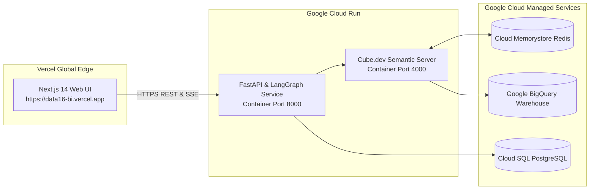

# 06. KẾ HOẠCH DEVOPS, CI/CD & CHECKLIST 10 DELIVERABLES DEMO DAY
## ĐỀ TÀI DATA-16: AI AGENT TỰ SINH DASHBOARD TỪ NGÔN NGỮ TỰ NHIÊN
### Đội thi: P-117 | Chuẩn đánh giá: VinUni AI20K Build Phase — Cohort 4

---

## 1. QUY TRÌNH QUẢN TRỊ MÃ NGUỒN (GIT WORKFLOW)

Hệ thống mã nguồn áp dụng mô hình phân nhánh **Git Flow tinh gọn (Trunk-based with Feature Branches)**:

```
[main] ──────────────────────────────────────────● [v1.0 - Demo Day]
   ▲                                              ▲
   │ (Pull Request sau kiểm duyệt)                │ (Release PR)
[develop] ──────●──────────────●──────────────●───┘
                 ▲              ▲              ▲
                 │              │              │
[feat/*] ────────┴─ (Merge PR)  │              │
[fix/*]  ───────────────────────┴─ (Merge PR)  │
[eval/*] ──────────────────────────────────────┴─ (Merge PR)
```

* **Nhánh `main`:** Mã nguồn ổn định nhất, phản ánh phiên bản triển khai chính thức trên môi trường Production (Cloud Run & Vercel). Chỉ merge thông qua Pull Request có đủ kiểm thử tự động.
* **Nhánh `develop`:** Nhánh tích hợp cho toàn bộ các tính năng hoàn thành trong từng Sprint.
* **Nhánh tính năng `feat/<tên-tính-năng>`:** Mỗi lập trình viên tạo nhánh riêng khi nhận task (ví dụ: `feat/cube-semantic-models`, `feat/chart-advisor-heuristics`, `feat/hitl-modal`).
* **Quy chuẩn Commit Message:**
  * `feat: add heuristic chart suitability scoring engine`
  * `fix: correct token extraction for multi-word project names`
  * `test: add unit tests for cube dry-run query validator`
  * `docs: update master execution plan for sprint 2`

---

## 2. TỰ ĐỘNG HÓA TÍCH HỢP & KIỂM THỬ LIÊN TỤC (CI/CD PIPELINE)

Hệ thống cấu hình GitHub Actions Workflow tại `.github/workflows/ci.yml` tự động kích hoạt mỗi khi có lệnh Push hoặc mở Pull Request vào `main` hoặc `develop`:

```yaml
name: Continuous Integration (CI)

on:
  push:
    branches: [ main, develop ]
  pull_request:
    branches: [ main ]

jobs:
  test-and-lint:
    runs-on: ubuntu-latest
    steps:
      - name: Checkout Code
        uses: actions/checkout@v4

      - name: Setup Python 3.11
        uses: actions/setup-python@v5
        with:
          python-version: '3.11'
          cache: 'pip'

      - name: Install Dependencies
        run: |
          python -m pip install --upgrade pip
          pip install -r requirements.txt
          pip install ruff pytest pytest-cov

      - name: Lint with Ruff
        run: |
          ruff check .
          ruff format --check .

      - name: Run Unit & Integration Tests
        run: |
          pytest tests/ --cov=src --cov-report=term-missing --cov-fail-under=80

      - name: Build Docker Image Check
        run: |
          docker build -t data16-backend:test .
```

---

## 3. THIẾT LẬP VÀ GIÁM SÁT AI USAGE LOGGING (PHOENIX LOGS)

Theo quy định nghiêm ngặt của Ban tổ chức VinUni AI20K, toàn bộ quá trình sử dụng trợ lý AI (Antigravity, Cursor, Claude Code, GitHub Copilot) phải được ghi nhận và nộp về máy chủ tự động để tính điểm minh bạch kỹ thuật.

### 3.1. Hướng dẫn thiết lập cho thành viên mới
1. Đăng nhập hệ thống Phoenix Dashboard bằng tài khoản GitHub:  
   `https://phoenix.note.transformerlabs.ai/api-keys`
2. Tạo khóa API cá nhân và điền vào file `.env` tại máy phát triển:
   ```bash
   AI_LOG_API_KEY=ak_live_your_actual_key_here
   ```
3. Chạy script cài đặt hook tự động:
   * Trên macOS / Linux:
     ```bash
     bash scripts/setup_hooks.sh
     ```
   * Trên Windows (PowerShell):
     ```powershell
     powershell -ExecutionPolicy Bypass -File scripts\setup_hooks.ps1
     ```

### 3.2. Cơ chế Hoạt động & Kiểm tra (Verification)
* Script `setup_hooks.sh` sẽ cài đặt hook `pre-push` vào `.git/hooks/pre-push`.
* Mỗi khi thực hiện `git push`, script `scripts/submit_log.py` tự động nén toàn bộ bản ghi tương tác prompt trong thư mục `.ai-log/` và đẩy lên server chấm điểm của VinUni.
* **Quy định kỷ luật:** Team Leader kiểm tra bảng điều khiển Phoenix vào Chủ nhật hàng tuần. Bất kỳ thành viên nào có hoạt động commit mã nguồn mà không có log AI tương ứng sẽ phải cấu hình lại môi trường ngay lập tức.

---

## 4. KẾ HOẠCH ĐÓNG GÓI DOCKER & TRIỂN KHAI ĐÁM MÂY (CLOUD DEPLOYMENT)



1. **Frontend (Next.js 14):**
   * Triển khai lên **Vercel** thông qua GitHub Integration.
   * Cấu hình biến môi trường `NEXT_PUBLIC_API_BASE_URL` trỏ tới Google Cloud Run.
2. **Backend & Multi-Agent (FastAPI):**
   * Đóng gói Docker container multi-stage tối ưu kích thước:
     ```dockerfile
     FROM python:3.11-slim as builder
     WORKDIR /app
     COPY requirements.txt .
     RUN pip install --no-cache-dir -r requirements.txt
     COPY src/ ./src
     EXPOSE 8000
     CMD ["uvicorn", "src.main:app", "--host", "0.0.0.0", "--port", "8000"]
     ```
   * Triển khai lên **Google Cloud Run** với chế độ tự động giãn nở (Auto-scaling 1 - 10 instances).
3. **Semantic Layer (Cube.dev):**
   * Triển khai container Cube.dev độc lập trên Cloud Run, kết nối Cloud Memorystore (Redis) để cache dữ liệu pre-aggregations.

---

## 5. BẢNG CHECKLIST CHI TIẾT 10 DELIVERABLES DEMO DAY VINUNI AI20K

| STT | Deliverable (Sản phẩm bắt buộc) | Đường dẫn tệp / Địa chỉ | Trạng thái hiện tại | Tiêu chí hoàn thành (DoD) | Người phụ trách |
| :---: | :--- | :--- | :---: | :--- | :---: |
| **1** | **Source Code** | `src/` trên repo GitHub P-117 | 🟡 Đang phát triển | Kiến trúc 4 tầng chuẩn, code clean, pass linter `ruff` và unit test coverage $\ge 80\%$. | Backend Dev & Frontend Dev |
| **2** | **README hoàn chỉnh** | `README.md` (root repo) | 🟡 Bản khung mẫu | Cập nhật từ `README_boilerplate.md`, đầy đủ Problem, Solution, Tech stack, Quickstart, API docs. | Leader |
| **3** | **Architecture Diagram** | `docs/architecture_diagram.md` | 🟢 Đã hoàn thành | Bản vẽ sơ đồ kiến trúc hệ thống 4 tầng chi tiết bằng Mermaid rõ nét. | AI Architect |
| **4** | **AI Usage Logs** | Cấu hình Phoenix + LangSmith | 🟢 Đã kích hoạt | Đầy đủ log prompt của tất cả thành viên trên hệ thống Phoenix; LangSmith tracing luồng Agent. | Toàn đội |
| **5** | **Live URL Deploy** | Vercel & Google Cloud Run | ⚪ Dự kiến Sprint 6 | Đường link công khai hoạt động 24/7, có HTTPS, tải trang $\le 2\text{s}$, không lỗi kết nối. | Leader & DevOps |
| **6** | **Video Demo Sản phẩm** | `presentation/demo_video.mp4` | ⚪ Dự kiến Sprint 6 | Độ phân giải 1080p, thời lượng 3 - 5 phút, kịch bản thuyết minh mạch lạc kịch bản Text-to-Dashboard và HITL. | Leader & Frontend |
| **7** | **Pitch Deck (Slide thuyết trình)** | `presentation/pitch_deck.pdf` | ⚪ Dự kiến Sprint 6 | 10 - 12 slides thiết kế chuyên nghiệp, trình bày rõ Pain point, Giải pháp Cube.dev, Kiến trúc AI và Demo. | Leader |
| **8** | **Development Journal** | `JOURNAL.md` (root repo) | 🟢 Đã khởi tạo | Cập nhật định kỳ hàng tuần: ghi nhận các quyết định kỹ thuật, thử thách và kết quả giải quyết. | Leader |
| **9** | **Worklog Phân công Chi tiết** | `WORKLOG.md` (root repo) | 🟢 Đã khởi tạo | Bảng theo dõi phân công công việc cụ thể của 4 thành viên theo từng tuần và từng task. | Toàn đội |
| **10**| **Evaluation Evidence** | `eval/results/scorecard.md` | 🟡 Đang dựng | Báo cáo benchmark chạy trên 100 test cases: VER $\ge 98\%$, CSS $\ge 90/100$, 0% Hallucination. | AI Architect |

*Ghi chú trạng thái: 🟢 Hoàn thành | 🟡 Đang thực hiện | ⚪ Kế hoạch Sprint tới.*

---

## 6. KỊCH BẢN THUYẾT TRÌNH BẢO VỆ TẠI DEMO DAY (5 PHÚT PITCHING)

* **Phút 1 — Mở đầu & Nỗi đau (Problem Statement):** Giới thiệu bài toán phân tích kinh doanh tại Vinhomes: Lãnh đạo cần số liệu ngay lập tức nhưng quy trình BI truyền thống mất 3 - 5 ngày; Text-to-SQL tự do gây ảo giác số liệu nguy hiểm.
* **Phút 2 — Giải pháp Đột phá (The Solution):** Trợ lý AI Agent kết hợp Semantic Layer Cube.dev — "Zero Hallucination", rút ngắn chu kỳ từ 5 ngày xuống dưới 60 giây.
* **Phút 3 — Live Demo Thực tế (Product Demonstration):**
  1. Gõ câu hỏi tiếng Việt: *"So sánh doanh số thực tế và số lượng cọc các phân khu Ocean Park trong Quý 3"*.
  2. Xem luồng Agent suy nghĩ qua SSE và hiển thị bản nháp tức thì.
  3. Thao tác lọc chéo tương tác (Cross-filtering) mượt mà dưới 1 giây.
  4. Trình diễn cơ chế Human-in-the-Loop xem giải trình công thức và bấm duyệt xuất bản.
* **Phút 4 — Kiến trúc & Khung Đánh giá (Architecture & Eval):** Trình bày ngắn gọn LangGraph StateGraph, Self-correction loop và kết quả Benchmark 100 câu hỏi (CSS 94/100, VER 99%).
* **Phút 5 — Kết luận & Kế hoạch Tương lai:** Tóm tắt giá trị mang lại cho doanh nghiệp, cảm ơn Ban giám khảo và sẵn sàng phần Q&A.
