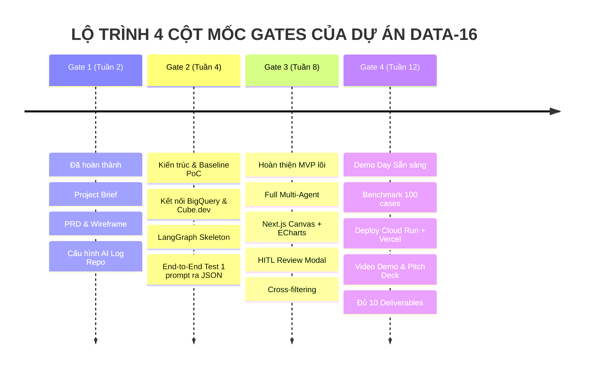

# THƯ MỤC KẾ HOẠCH & TÀI LIỆU TRIỂN KHAI DỰ ÁN
## ĐỀ TÀI DATA-16: AI AGENT TỰ SINH DASHBOARD TỪ NGÔN NGỮ TỰ NHIÊN
### Đội thi: P-117 | Chương trình: VinUni AI20K Build Phase — Cohort 4

---

## 📌 GIỚI THIỆU TỔNG QUAN

Thư mục `/Plan` là trung tâm tài liệu quản trị, thiết kế kỹ thuật, phân rã công việc (WBS), kế hoạch kiểm thử đánh giá và cẩm nang vận hành cho toàn bộ vòng đời phát triển sản phẩm **DATA-16 — AI Agent Tự Sinh Dashboard Từ Ngôn Ngữ Tự Nhiên** trong khuôn khổ VinUni AI20K Build Phase.

Mục tiêu của bộ tài liệu này là cung cấp lộ trình thực thi rõ ràng, chi tiết, đo lường được và định hướng hành động (actionable) cho từng thành viên trong đội P-117, đảm bảo vượt qua xuất sắc cả **4 Cột mốc Gate** và hoàn thiện trọn vẹn **10 Deliverables** bắt buộc tại **Demo Day**.

---

## 📂 DANH MỤC TÀI LIỆU KẾ HOẠCH CHI TIẾT

| Mã tài liệu | Tên tài liệu | Nội dung trọng tâm | Đối tượng chính |
| :--- | :--- | :--- | :--- |
| [`README.md`](file:///Users/thai/Vinuni/BuildPhaseProject/Plan/README.md) | **Tổng quan & Điều hướng** | Bản đồ tài liệu, nguyên tắc làm việc, ma trận trách nhiệm RACI. | Toàn đội, Mentor |
| [`00_MASTER_EXECUTION_PLAN.md`](file:///Users/thai/Vinuni/BuildPhaseProject/Plan/00_MASTER_EXECUTION_PLAN.md) | **Kế Hoạch Triển Khai Tổng Thể** | Lộ trình 12 tuần (4 Gates & 6 Sprints), tiêu chuẩn hoàn thành DoD, quản trị rủi ro & FinOps. | Team Leader, Mentor |
| [`01_SPRINT_ROADMAP_AND_WBS.md`](file:///Users/thai/Vinuni/BuildPhaseProject/Plan/01_SPRINT_ROADMAP_AND_WBS.md) | **Phân Rã Công Việc (WBS) & Sprint Backlog** | Chi tiết nhiệm vụ từng tuần/sprint cho 4 thành viên, Story Points, KPIs và tiêu chí nghiệm thu. | Toàn bộ thành viên dev |
| [`02_TECHNICAL_ARCHITECTURE_AND_SPECS.md`](file:///Users/thai/Vinuni/BuildPhaseProject/Plan/02_TECHNICAL_ARCHITECTURE_AND_SPECS.md) | **Đặc Tả Kỹ Thuật & Kiến Trúc Hệ Thống** | Sơ đồ luồng dữ liệu, LangGraph StateGraph, FastAPI SSE endpoints, PostgreSQL Schema, RBAC. | AI Architect, Backend Dev |
| [`03_DATA_AND_SEMANTIC_MODELING_PLAN.md`](file:///Users/thai/Vinuni/BuildPhaseProject/Plan/03_DATA_AND_SEMANTIC_MODELING_PLAN.md) | **Kế Hoạch Dữ Liệu & Semantic Layer** | BigQuery Mock Data (Vinhomes schema), Cube.dev Data Models, Pre-aggregations, RLS. | Data & Semantic Engineer |
| [`04_AI_AGENT_AND_EVALUATION_PLAN.md`](file:///Users/thai/Vinuni/BuildPhaseProject/Plan/04_AI_AGENT_AND_EVALUATION_PLAN.md) | **Kế Hoạch AI Agent & Benchmark Eval** | Prompt Engineering, Heuristic Chart Advisor, Ground Truth 100 cases, CSS/Accuracy Benchmarks. | AI Architect, AI Developer |
| [`05_FRONTEND_AND_HITL_UIUX_PLAN.md`](file:///Users/thai/Vinuni/BuildPhaseProject/Plan/05_FRONTEND_AND_HITL_UIUX_PLAN.md) | **Kế Hoạch Frontend & HITL UI/UX** | Next.js 14 App Router, Apache ECharts, React-Grid-Layout, Zustand Cross-filtering, Review Modal. | Frontend & UI/UX Designer |
| [`06_DEVOPS_CI_CD_AND_DEMODAY_CHECKLIST.md`](file:///Users/thai/Vinuni/BuildPhaseProject/Plan/06_DEVOPS_CI_CD_AND_DEMODAY_CHECKLIST.md) | **Kế Hoạch DevOps, CI/CD & Demo Day** | Docker, GCP Cloud Run, Vercel, Phoenix AI Log hook, Checklist 10 Deliverables Demo Day. | DevOps, Toàn đội |

---

## 👥 PHÂN CÔNG VAI TRÒ & MA TRẬN RACI

| Vai trò | Phụ trách chính | Nhiệm vụ nòng cốt |
| :--- | :--- | :--- |
| **Team Leader & AI Architect** | Thành viên 1 | Quản trị tiến độ, liên hệ Mentor/BTC; Thiết kế LangGraph StateGraph, Human-in-the-Loop breakpoint, Eval Benchmark Suite. |
| **Data & Semantic Engineer** | Thành viên 2 | Xây dựng bộ dữ liệu mock BigQuery BĐS Vinhomes; Thiết lập Semantic Layer Cube.dev, cấu hình RLS & Pre-aggregations. |
| **Backend & AI Developer** | Thành viên 3 | Lập trình FastAPI, kết nối LLM (GPT-4o/Claude 3.5), SSE streaming, Prompt Intent Parser, Cube Query Builder & Self-correction. |
| **Frontend & UI/UX Designer** | Thành viên 4 | Phát triển Next.js 14, ECharts/Recharts canvas, Zustand cross-filtering, UI xem nháp & duyệt HITL, xuất file PDF. |

### Ma trận Trách nhiệm RACI (Responsible, Accountable, Consulted, Informed)
* **R (Responsible):** Người trực tiếp thực hiện công việc.
* **A (Accountable):** Người chịu trách nhiệm cuối cùng về chất lượng và tiến độ.
* **C (Consulted):** Người được tham vấn chuyên môn trước khi đưa ra quyết định.
* **I (Informed):** Người được thông báo kết quả sau khi hoàn thành.

| Hạng mục công việc lớn | AI Architect | Data Engineer | Backend Dev | Frontend Dev |
| :--- | :---: | :---: | :---: | :---: |
| Quản lý dự án, Sprint & Báo cáo Gates | **A / R** | I | I | I |
| Xây dựng Mock Data BigQuery | C | **A / R** | C | I |
| Xây dựng Semantic Layer Cube.dev | C | **A / R** | C | I |
| Xây dựng Multi-Agent LangGraph | **A / R** | C | R | I |
| Xây dựng FastAPI Streaming & SSE | C | I | **A / R** | C |
| Xây dựng Next.js Canvas & ECharts | I | I | C | **A / R** |
| Cơ chế HITL Review & Duyệt | A | I | R | R |
| Benchmark Eval (CSS, Accuracy, Latency) | **A / R** | C | R | I |
| CI/CD, Docker & Deploy Cloud | A | I | **R** | R |
| Hồ sơ Demo Day (Slide, Video, Journal) | **A** | R | R | R |

---

## 🎯 CỘT MỐC GATES & DEMO DAY VINUNI AI20K

---

## ⚙️ QUY TẮC LÀM VIỆC & KỶ LUẬT ĐỘI THI (TEAM WORKING AGREEMENT)

1. **Tuân thủ quy định AI Log của VinUni:**
   - Bắt buộc kích hoạt hook ghi log AI (`scripts/setup_hooks.sh` hoặc `.ps1`) trước khi viết bất kỳ dòng code nào.
   - Mỗi thành viên dùng đúng `AI_LOG_API_KEY` cá nhân lấy từ Phoenix Dashboard.
   - Tuyệt đối không tắt hook hoặc bỏ qua `git push` qua pre-push hook.
2. **Quy chuẩn Git & Code Review:**
   - Nhánh `main`: Chỉ chứa code đã kiểm thử, sẵn sàng triển khai demo.
   - Nhánh `develop`: Nhánh tích hợp chính của các sprint.
   - Mỗi tính năng tạo nhánh riêng theo cú pháp: `feat/<tên-tính-năng>`, `fix/<tên-lỗi>`.
   - Mỗi Pull Request (PR) phải có ít nhất 1 thành viên review và pass toàn bộ CI (`ruff` + `pytest`).
3. **Kỷ luật Sprint & Họp đội:**
   - **Daily Standup (15 phút online lúc 21h00 mỗi tối thứ 2, 4, 6):** 3 câu hỏi (Hôm qua làm gì? Hôm nay làm gì? Đang vướng gì?).
   - **Sprint Review & Planning (Chủ nhật 20h00):** Đánh giá sản phẩm chạy được của tuần và phân rã task cho tuần tiếp theo.
   - Cập nhật nhật ký tuần vào [`JOURNAL.md`](file:///Users/thai/Vinuni/BuildPhaseProject/cloneFromGitHub/P-117/JOURNAL.md) và phân công chi tiết vào [`WORKLOG.md`](file:///Users/thai/Vinuni/BuildPhaseProject/cloneFromGitHub/P-117/WORKLOG.md).
