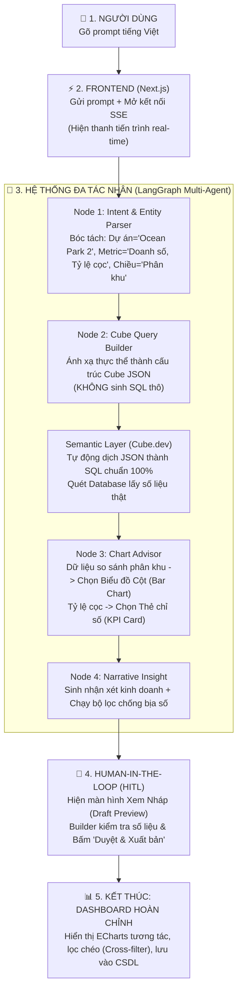

# SƠ ĐỒ LUỒNG HOẠT ĐỘNG (END-TO-END FLOW)

```mermaid
flowchart TD
    A["👤 1. NGƯỜI DÙNG<br/>Gõ prompt tiếng Việt"] --> B["⚡ 2. FRONTEND (Next.js)<br/>Gửi prompt + Mở kết nối SSE<br/>(Hiện thanh tiến trình real-time)"]
    
    subgraph AI_BRAIN ["🧠 3. HỆ THỐNG ĐA TÁC NHÂN (LangGraph Multi-Agent)"]
        C1["Node 1: Intent & Entity Parser<br/>Bóc tách: Dự án='Ocean Park 2', Metric='Doanh số, Tỷ lệ cọc', Chiều='Phân khu'"]
        C2["Node 2: Cube Query Builder<br/>Ánh xạ thực thể thành cấu trúc Cube JSON<br/>(KHÔNG sinh SQL thô)"]
        C3["Semantic Layer (Cube.dev)<br/>Tự động dịch JSON thành SQL chuẩn 100%<br/>Quét Database lấy số liệu thật"]
        C4["Node 3: Chart Advisor<br/>Dữ liệu so sánh phân khu -> Chọn Biểu đồ Cột (Bar Chart)<br/>Tỷ lệ cọc -> Chọn Thẻ chỉ số (KPI Card)"]
        C5["Node 4: Narrative Insight<br/>Sinh nhận xét kinh doanh + Chạy bộ lọc chống bịa số"]
        
        C1 --> C2 --> C3 --> C4 --> C5
    end

    B --> C1
    C5 --> D["👀 4. HUMAN-IN-THE-LOOP (HITL)<br/>Hiện màn hình Xem Nháp (Draft Preview)<br/>Builder kiểm tra số liệu & Bấm 'Duyệt & Xuất bản'"]
    D --> E["📊 5. KẾT THÚC: DASHBOARD HOÀN CHỈNH<br/>Hiển thị ECharts tương tác, lọc chéo (Cross-filter), lưu vào CSDL"]
```
